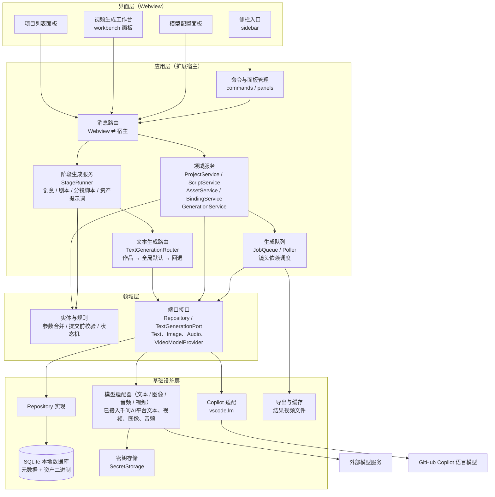
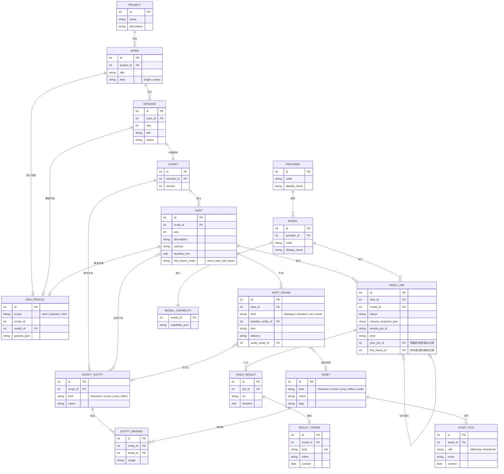
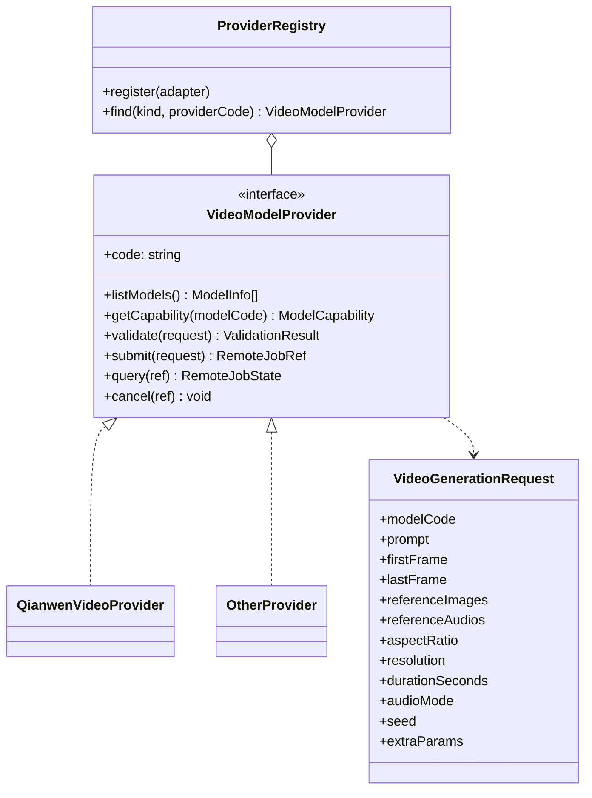
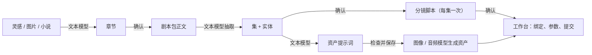
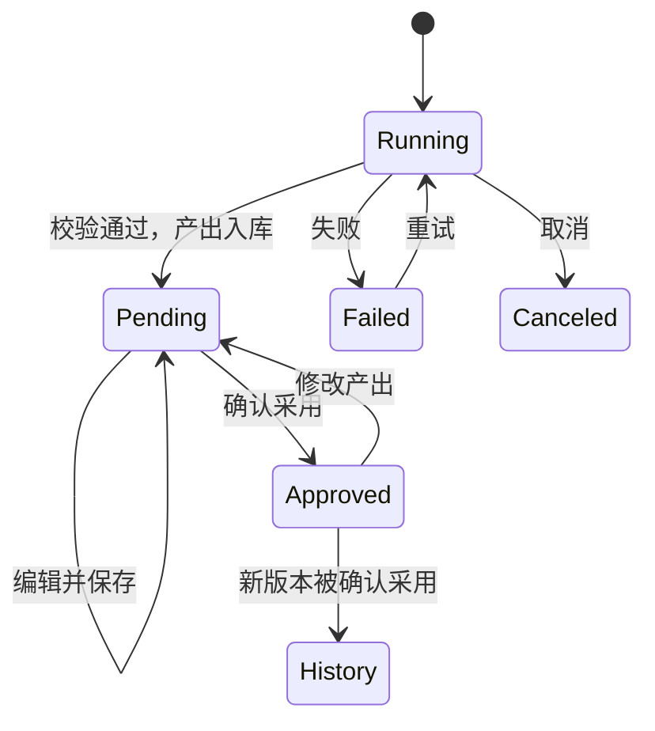
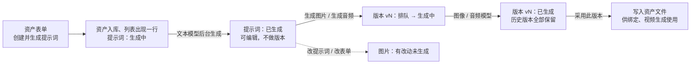
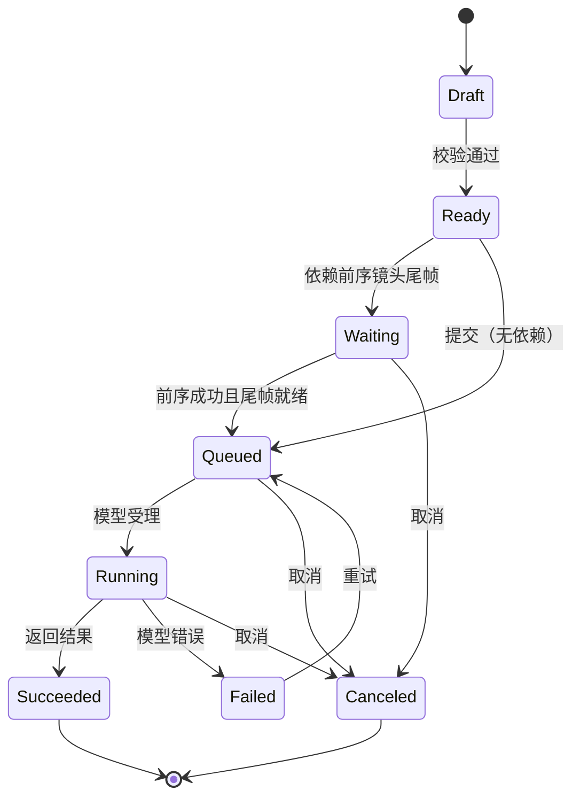
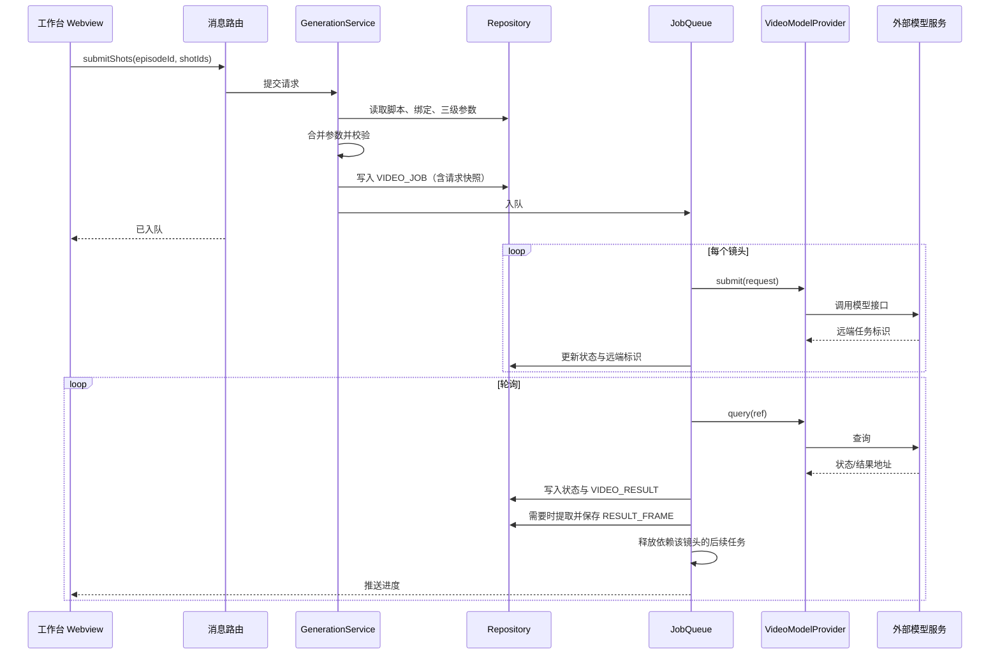
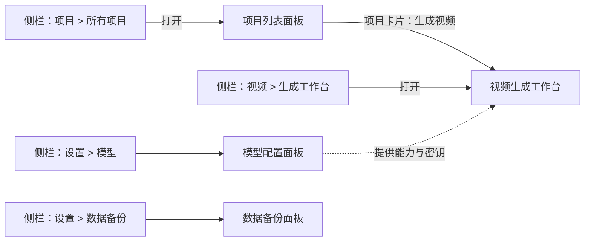

# AIGC Video Studio（AIGC 视频工作室）架构设计

## 1. 设计决策

| 决策项 | 结论 |
|---|---|
| 生成粒度 | 按**镜头**提交；参数按“作品默认 → 集覆盖 → 镜头覆盖”三级合并 |
| 分镜脚本 | 结构化数据（镜头、台词、实体引用），不以纯文本为准 |
| 本地数据库 | SQLite 单文件；版本号迁移，启动时自动升级 |
| 资产存储 | 数据库；元数据与二进制内容分表存放 |
| 视频模型 | 多模型，通过统一适配接口切换；参数选项由模型能力描述驱动；首批接入千问AI平台的万相 3.0 视频（`wan3.0-video`、`wan3.0-video-prime`） |
| 文本、图像、音频、视频模型 | 四类模型各有独立接口，可来自同一平台，也可分属不同平台；接口、注册表、设置页已实现，目前只接入千问AI平台的文本、视频、图像、音频适配器（图像、音频适配器已接入资产生成流程，文本适配器与 Copilot 一起由文本生成路由选用），见第 5 节 |
| 文本智能生成 | 创意章节、剧本、分镜脚本、资产提示词由 GitHub Copilot 或千问AI平台的文本模型生成，两者可同时启用：全局默认在模型设置页选择，作品可单独选择，见 6.5。Copilot 通过 VS Code 语言模型接口（`vscode.lm`）直接调用，千问文本模型通过平台的对话接口调用，流程都由扩展主控，不依赖聊天窗口，见第 6 节 |
| 资产生成 | 资产（角色、场景、道具、特效、音频）分两步：先由文本模型（Copilot 或千问文本模型）在后台生成提示词（不做版本管理，可手动修改），再把提示词交给图像或音频模型生成图片或音频。每次提交生成产生一个版本，全部保存，用户采用其中一个作为最终结果；“有改动未生成”由修订号推算，不创建空版本；图片数量可配置，音频每次 1 个，见 6.7 |
| 人工确认 | 各阶段产出生成后为“待确认”，可查看、编辑并保存；点“确认采用”后才能被下游使用；已确认的产出再被修改则回到“待确认” |
| 长文本分段 | 长小说等超出模型上下文的素材，按章节（或按字数）分段逐段处理；文本模型与分段方式可在设置中选择 |
| 镜头连贯 | 组内镜头在同一个视频里自然连贯；组的第一个镜头设为“上一镜头尾帧作首帧”时，这一组等上一组生成完成，用它结果视频的尾帧作首帧，有依赖的组串行提交 |
| 声音 | 先由模型原生生成；镜头声音结构化为对白（含说话人）、旁白、音效、配乐条目；角色有音色设定和可选的音色参考音频 |
| 界面形态 | 侧栏只做入口，结构见 [page-form-design.md](page-form-design.md) 的 3.1；工作台使用编辑器区 Webview 面板 |
| 界面组件 | 页内自绘的组件库（控件、对话框、弹出页面），所有页面统一使用，不用 VS Code 内置弹窗，见 [ui-components.md](ui-components.md) |
| 单个短视频 | 也建 1 个集（Episode），下游不区分单集与多集 |

## 2. 分层架构



依赖方向只能自上而下；领域层不依赖 VS Code API 和具体数据库、具体模型。

## 3. 目录结构

标注“已实现”的目录已有代码，其余为后续目标。

```
src/
  extension.ts                 扩展入口，仅做装配（已实现）
  app/
    commands/                  命令注册
    forms/                     表单定义、表单目录与表单请求处理（已实现：项目表单、作品表单（新建、编辑、重新生成）、创意表单、剧本表单、分镜脚本表单、资产表单、资产提示词表单、资产分类表单）；表单在页内弹出页面显示
    lifecycle/                 扩展停用时的收尾序列 `shutdown-sequence.ts`：按登记顺序逐步等待，殿后步骤（关闭数据库）最后执行，只执行一次（已实现）
    pages/                     各页面的请求处理与页面入口（已实现：项目列表、作品列表（含创意、剧本、分镜脚本产出弹出层的请求处理）、资产列表与资产分类、生成工作台、模型设置（文本生成设置、服务商与模型）、数据备份、实体绑定的请求处理）
    panels/                    Webview 面板生命周期管理与页面外壳；`webview-messaging.ts` 连接 Webview 与消息路由，面板销毁时释放订阅并停止发送，编辑器面板与侧栏共用（已实现）
    messaging/                 消息信封、路由与错误映射（已实现）
    services/                  应用服务（已实现：项目、作品、阶段、剧本、分镜脚本、资产、资产分类、资产提示词、资产生成、实体绑定、文本生成设置（`text-settings-service.ts`）、文本生成路由（`text-generation-router.ts`，按作品选择、全局默认和回退顺序选用 Copilot 或千问文本模型）、模型服务商、视频生成（含尾帧衔接、指定图片首帧、结果版本采用）、生成参数、数据备份；待实现：无）
    stages/                    阶段生成：执行器、创意/剧本/分镜脚本/资产提示词各阶段的流程、确认与过期判断（已实现：执行器、创意、剧本、分镜脚本；创意阶段的素材指纹 `source-fingerprint.ts` 也在这里）
    queue/                     生成队列、轮询、重试、等待前序的调度（上一组尾帧作首帧）；资产生成队列（已实现）
  domain/
    errors.ts                  领域错误（已实现，含模型服务调用失败 ProviderError）
    models/                    领域模型（已实现：项目、作品、阶段记录、创意、剧本、分镜脚本、资产、资产版本、资产分类、实体绑定、生成参数、生成任务与结果、选项集、模型能力、服务商与模型、数据备份）
    rules/                     字段读取与校验、参数合并、提交校验、状态机、各阶段产出的解析与校验（已实现：项目、作品、创意、剧本、分镜脚本、场景分批、确认、小说分段、文本生成设置、文本模型选择、token 估算、资产（含分类、提示词、生成）、镜头组、生成参数与生成规则、视频提示词、上传文件读取、    模型能力、服务商设置、备份文件检查）
    ports/                     Repository、TextGenerationPort、TextModelProvider / ImageModelProvider / AudioModelProvider / VideoModelProvider 接口、适配器注册表、密钥存储端口（已实现：项目、作品、阶段记录、章节、剧本、分镜脚本、资产、资产版本、资产分类、绑定、生成参数、生成任务与结果、文本生成、设置存取、作品文本模型、服务商与模型、密钥存储、四类模型适配器（文本、图像、音频、视频）、适配器注册表、媒体下载、提示词模板、数据备份存储）
  infra/
    database/                  连接、迁移执行器、Repository 实现（已实现：项目、作品、阶段记录、章节、剧本包与集和实体、分镜脚本与镜头、资产与实体绑定、资产版本与分类、生成参数、生成任务与结果、作品文本模型、    服务商与模型、素材读取；一致快照 `database-snapshot.ts`、备份存储 `sqlite-backup-storage.ts`、启动时应用待恢复备份 `database-restore.ts`）
      migrations/              按编号排列的迁移脚本（已实现：001 至 019）
    copilot/                   基于 vscode.lm 的文本生成、模型清单与设置读写（已实现）
    providers/                 各服务商的模型适配器，每个服务商一个目录；builtin-providers.ts 登记内置适配器（已实现：qianwen/ 千问AI平台文本、视频、图像、音频适配器）
    prompts/                   提示词模板文件的读取（已实现）
    storage/                   结果视频的本地存储 `LocalResultStore` 与媒体下载器 `HttpMediaDownloader`（已实现）
    secrets/                   密钥存储的 VS Code SecretStorage 实现（已实现）
  sidebar/                     侧栏视图、菜单配置、点击动作注册与请求处理（已实现）
resources/
  shared/                      通信桥、页面基础样式、页面共用格式化（已实现）
  ui-kit/                      界面组件库在根目录 ui-kit/（不在 resources 下），页面直接从 ui-kit/src 加载
  form/                        表单引擎：在页内弹出页面渲染表单（已实现）
  project-list/                项目列表页（已实现）
  work-list/                   作品列表页（按素材来源各一个面板，列出所有项目的作品；已实现）
  asset-list/                  资产列表页（按资产类型各一个面板，列出该类型的全部资产，资产不属于项目；已实现）
  stage/                       阶段产出弹出层：外壳（版本、状态、确认、重试）与各阶段的内容区（已实现：创意、剧本、分镜脚本）
  settings/                    模型设置页（已实现：文本生成设置、服务商的启用、访问密钥、设置项与模型列表）
  backup/                      数据备份页（已实现：数据库信息、备份到文件、从文件恢复；数据库无法打开时只显示原因与恢复）
  sidebar/                     侧栏静态资源（已实现）
  workbench/                   工作台前端资源：页面、实体绑定弹出页（bindings.js）、生成参数弹出页（profile.js）、结果版本弹出页（versions.js）、尾帧截取（tail-frames.js）（已实现）
  prompts/                     各阶段提示词模板：系统段、阶段提示词、输出格式（随扩展打包）
```

## 4. 领域模型

下图为领域模型概览；完整的表结构、约束和索引以 [database-design.md](database-design.md) 为准，页面与表单以 [page-form-design.md](page-form-design.md) 为准。



要点：

- **资产不属于项目，绑定属于集。** 资产全局共用，相同的角色、场景不必在每个项目里重复创建和生成；`SCRIPT_ENTITY` 由脚本产生，`ENTITY_BINDING` 把实体连接到资产，同一资产可被多集、多个项目复用。
- **脚本引用实体用 ID，不用名称。** 改名不会断链。
- **`ASSET_FILE` 单独存二进制。** 列表查询不读取 blob，避免拖慢界面。
- **`VIDEO_JOB.request_snapshot_json` 保存提交时的完整请求快照**（合并后的参数、脚本文本、资产引用），用于复现、重试和对比。
- **`GEN_PROFILE` 用 `scope` 区分三级。** 提交时按“作品 → 集 → 镜头”逐级覆盖合并。
- **`MODEL_CAPABILITY` 用 JSON 描述能力**：支持的分辨率、横纵比、时长范围、是否支持首帧/尾帧/参考图、参考图数量上限等。
- **尾帧单独存 `RESULT_FRAME`。** 结果视频生成后提取尾帧入库，下一镜头的任务通过 `first_frame_id` 引用它，`prev_job_id` 记录依赖关系。
- **`first_frame_mode` 决定首帧来源**：`none` 不指定首帧，`prev_tail` 使用上一镜头尾帧，`asset` 使用指定资产的第一张参考图（`first_frame_asset_id`，只在镜头组的第一个镜头上生效，用户在镜头编辑里指定，生成不会产出）。
- **声音按条目保存在 `SHOT_SOUND`。** 对白条目引用说话人实体，条目可指定音频资产；提交时把启用的条目编译为声音提示词，角色的音色参考音频在模型支持时一并提交。详见 [database-design.md](database-design.md)。

## 5. 模型适配（文本、图像、音频、视频）

### 5.1 四类模型接口

| 接口 | 用途 |
|---|---|
| `TextModelProvider` | 用千问等服务商的文本模型生成创意、剧本、分镜脚本和资产提示词的结构化内容，见 6.5；与 Copilot 并列，由文本生成路由选用 |
| `ImageModelProvider` | 根据提示词（及参考图）生成图片，用于角色、场景、道具、特效资产 |
| `AudioModelProvider` | 生成音频：音色参考、配乐、音效 |
| `VideoModelProvider` | 按镜头生成视频，见 5.2 |

- 图像、音频、视频三个接口都采用异步任务式方法：`listModels`、`getCapability`、`validate`、`submit`、`query`，以及可选的 `cancel`（服务商不提供取消接口时不实现）；文本接口是同步的：`listModels`、`getCapability` 加一次 `generate`，调用直接返回模型通过输出工具提交的参数对象，不经过任务队列。各接口都可选实现 `checkConnection`。接口位于 `domain/ports/provider-adapters.ts`。
- 同一服务商可以同时实现多个接口（同一平台），也可以只实现其中一个（跨平台）。注册表（`domain/ports/provider-registry.ts`）按（模型类型，服务商代码）取适配器，同一服务商的各类型适配器必须声明相同的服务商信息；内置适配器在 `infra/providers/builtin-providers.ts` 登记。
- 模型记录带类型（`text`、`image`、`audio`、`video`），能力描述的键按类型区分，见 [database-design.md](database-design.md) 4.6。
- **适配器声明、数据库保存**：适配器声明服务商（代码、名称、可配置的设置项）和模型（代码、名称、类型、能力）。扩展激活时 `ProviderService.syncCatalog()` 把声明同步到 `providers`、`models`、`model_capabilities`：新服务商取默认设置；已有的服务商与模型更新名称和能力，保留用户设置的启用状态；适配器不再提供的模型被停用（不删除，因为生成参数或任务可能引用）。用户在设置页只能改服务商的启用状态、设置项、访问密钥和模型的启用状态。
- **访问密钥**只存 VS Code `SecretStorage`（名称 `aigcVideoStudio.provider.<服务商代码>.apiKey`），不入库、不发给界面；界面只知道“已配置”或“未配置”。
- **可用模型**：模型已启用、服务商已启用且已配置密钥，才会出现在后续的模型选择中（`ProviderService.listUsableModels`）。未配置对应类型的模型时，“生成图片”“生成音频”“提交视频”等按钮置灰并提示原因。
- **失败分类**：适配器把各家错误统一转换为 `ProviderError`，分类为鉴权、限流、参数、内容审核、服务端、网络；其中限流、服务端、网络值得重试，生成队列据此决定是否重试。
- 图像、音频生成的结果以“版本”保存，经用户检查后采用为资产文件（流程见 6.7，表见 database-design.md 4.8）。

### 5.2 视频模型适配

下图以视频模型为例，图像、音频接口的结构相同。



- 领域层只产出与模型无关的生成请求（`VideoGenerationRequest`、`ImageGenerationRequest`、`AudioGenerationRequest`）；素材以文件内容（类型加字节）传入。每个适配器负责转换为自家 API 的字段，决定素材的传输方式，并处理各家对参考图数量、时长、比例的差异。
- 新增模型只需新增一个适配器并在 `builtin-providers.ts` 登记，不改动服务层和界面。
- **千问AI平台图像适配器**（`qianwen-image-provider.ts`，能力见 `qianwen-image-catalog.ts`）：提交 `POST /services/aigc/image-generation/generation`（同样带 `X-DashScope-Async: enable`），查询与视频相同的 `GET /tasks/{task_id}`，成功结果在 `output.choices[].message.content[].image`（万相 2.7）或 `output.results[].url`（千问图像）。提供四个模型：`qwen-image-3.0-pro`、`qwen-image-3.0`（只支持文生图，单次最多 6 张，支持反向提示词）和 `wan2.7-image-pro`、`wan2.7-image`（最多 9 张参考图，单次最多 4 张，不支持反向提示词；Pro 另支持 4K，但 4K 只能用于不带参考图的文生图）。画幅与分辨率档位（1K、2K、4K，即 1024²、2048²、4096² 总像素）由适配器换算成请求的 `size`（宽高取 16 的整数倍）；都不指定时不传 `size`，只指定分辨率且是万相时直接传档位，输出按最后一张参考图的宽高比缩放。专有参数：千问图像 `promptExtend`、`watermark`，万相 `thinkingMode`、`watermark`。已用真实密钥验证（2026-10-02、2026-10-03）：`qwen-image-3.0` 文生图、`qwen-image-3.0-pro` 文生图、`wan2.7-image` 文生图、带参考图的图生图和两张参考图一次出 2 张、`wan2.7-image-pro` 文生图（均 1K），耗时约 10 到 70 秒。4K 与 9 张参考图未实测。可选实现 `checkConnection`：查询不存在的任务，判定同视频适配器（假 fetch 测试通过，未用真实密钥验证）。
- **千问AI平台音频适配器**（`qianwen-audio-provider.ts`，能力见 `qianwen-audio-catalog.ts`）：平台音频接口是同步的，响应直接带 24 小时有效的音频地址，所以 `submit` 内完成调用，把音频地址与时长编码进 `remoteJobId`，`query` 解码后直接返回成功；调用方照常走“提交、轮询”，只是提交会等待几秒到两分钟。两个模型：`qwen-audio-3.1-tts-next`（`POST /services/audio/tts/SpeechSynthesizer`，中英文语音与音效，提示词最多 3000 字符，单次最长 120 秒；可带一段参考音频，提示词中必须用 `@voice1` 引用，参考音频 ≤10 MB；不支持预置音色与指定时长；专有参数 `format`）和 `fun-music-v1`（`POST /services/audio/music/generation`，歌曲或纯音乐，提示词最多 2000 字符；专有参数 `format`、`instrumental`、`gender`）。已用真实密钥验证 `qwen-audio-3.1-tts-next`（2026-10-02、2026-10-03）：纯文字合成、带参考音频并以 `@voice1` 引用的合成均成功（同步返回，约 5 秒的 mp3）；`fun-music-v1` 处于邀测阶段，当前密钥调用返回 `AccessDenied`，需在平台模型市场申请开通后才能使用，请求构造只按文档编写、未实测。可选实现 `checkConnection`：音频接口没有查询接口，借用任务查询接口探测不存在的任务，判定同视频适配器（假 fetch 测试通过，未用真实密钥验证）。
- 上述适配器声明的模型在扩展激活时由 `syncCatalog()` 同步入库（`models`、`model_capabilities`），在设置页“模型”里可见并可启用；图像、音频适配器已接入资产生成队列（步骤 11，见 6.7）。
- **千问AI平台文本适配器**（`qianwen-text-provider.ts`，能力见 `qianwen-text-catalog.ts`）：通过 OpenAI 兼容的流式对话接口 `POST /chat/completions` 调用（兼容接口地址由原生接口地址末尾的 `/api/v1` 替换为 `/compatible-mode/v1` 得到，用户只需配置一个接口地址），强制模型调用输出工具并关闭思考（`enable_thinking` 为 false），支持随请求发送图片；输出因长度被截断时直接报错，不使用不完整的结果。提供六个模型：`qwen3.8-max`、`qwen3.8-flash`（1M 上下文，单次最多输出 128K）和 `qwen3.7-plus`、`qwen3.7-flash`、`qwen3.6-plus`、`qwen3.6-flash`（1M 上下文，单次最多输出 64K），都支持图片输入；默认不启用，在服务商设置页启用后才可选。文本适配器同步完成调用，不经过任务队列。
- **千问AI平台视频适配器**（`infra/providers/qianwen/`）：接口地址默认 `https://maas.qianwenaiapi.com/api/v1`，可在设置页修改，留空恢复默认值（必须是 https，且以 `/api/v1` 结尾，不能填 compatible-mode 地址或具体接口路径，调用时也会再检查一次）；提供 `wan3.0-video` 和高速版 `wan3.0-video-prime`。提交：`POST /services/aigc/video-generation/video-synthesis`，请求头 `X-DashScope-Async: enable`；查询：`GET /tasks/{task_id}`，状态 `PENDING`、`RUNNING`、`SUCCEEDED`、`FAILED`、`CANCELED`、`UNKNOWN`（任务已过期）依次对应排队、处理中、成功、失败、已取消、已过期。
  - 素材（首帧、尾帧、参考图、参考音频）以 Base64 内联（`data:{MIME};base64,…`），不需要图床；平台也支持公网地址和 `oss://` 临时地址，遇到体积过大的素材时再考虑。
  - 素材组合由 `validate` 校验：首帧、尾帧只能与彼此组合，不能再带参考图、参考音频；尾帧必须同时有首帧；参考图最多 10 张（单张 ≤20 MB），参考音频最多 5 段（单段 ≤15 MB）。
  - 时长 2 至 30 秒的整数，`-1` 表示由模型自动决定（`AUTO_DURATION_SECONDS`）；画幅不指定时由模型按输入素材自适应；声音默认开启，对应声音模式 `native`，`none` 关闭；随机种子 0 至 2147483647。
  - 模型专有参数 `extraParams` 目前支持 `promptExtend`（提示词改写）和 `watermark`（水印，平台默认不加）。
  - 平台文档没有提供取消任务的接口，因此不实现 `cancel`；结果视频地址 24 小时后过期，需要及时下载到本地。
  - 错误分类：HTTP 401、403 或 `InvalidApiKey` 为鉴权；429 或 `Throttling*` 为限流；`DataInspectionFailed`、`IPInfringementSuspect` 为内容审核；其他 4xx 或 `InvalidParameter*` 为参数；5xx 为服务端；连接失败为网络。任务本身失败时通过状态返回，不抛出。
- 所选模型不支持首帧输入时，第一个镜头为 `first_frame_mode = prev_tail` 的镜头组在提交校验阶段报错，提示更换模型或把首帧来源改为“无”。
- 切换模型时，工作台按新模型的 `ModelCapability` 重新渲染参数选项；已选值不在新范围内的，标记为需要处理。

## 6. 内容生成阶段（文本模型）

创意、剧本、分镜脚本三个阶段以及资产提示词，都由扩展主控、调用文本模型生成文本（GitHub Copilot 或千问AI平台的文本模型，见 6.5）；文本模型只是无状态的文本生成器，每一步的输入、输出都有固定格式，校验通过后才入库，入库后必须经人工确认才能被下游使用。



### 6.1 阶段与产出

| 阶段 | 输入 | 调用方式 | 产出（入库） |
|---|---|---|---|
| 创意（`creative`） | 文字灵感、灵感图片或小说原文，加 F3 参数 | 先整理素材（文字直接使用；图片先生成画面描述；小说按 6.4 分段并逐段提取要点），再规划大纲（章数不超过上限；小说每章标注依据的原文分段），最后逐章生成（小说只带对应原文分段），每章单独生成、单独保存 | `chapters` |
| 剧本（`screenplay`） | 已确认的创意章节，加 F4 参数 | 两次调用：① 生成剧本包正文；② 从正文抽取集和实体（结构化） | `screenplays.full_text`、`screenplays.structure_json`；**确认采用时**才合并到 `episodes`、`script_entities`（新版本里已不存在的旧集的处理见 6.3） |
| 分镜脚本（`storyboard_script`） | 已确认剧本中的某一集，加 F5 参数 | 每集一次；正文不超过单批字数上限（`SCENE_BATCH_MAX_CHARS`，3000 字）或没有识别出两个以上“第N场”标题时整集一次调用，否则按场次分批、逐批调用；镜头引用的实体按（类型，名称或别名）映射为实体 ID，对白说话人必须是已有角色 | `storyboard_scripts`、`shots`、`shot_entities`、`shot_sounds`（生成成功时整份写入，没有合并步骤） |
| 资产提示词 | 实体设定或资产字段，可带参考图 | 一次调用，由资产表单“创建并生成提示词”触发、在后台执行（见 6.7） | `assets.prompt_zh`、`assets.prompt_en`（不建阶段记录，状态保存在 `assets.prompt_status`；不做版本管理，用户可随时修改） |

剧本“确认采用时才合并”的原因：`episodes`、`script_entities` 属于整个作品，下游的绑定和分镜都引用它们；若生成时直接写入，未确认的内容就会影响已有数据。合并规则见 [database-design.md](database-design.md) 第 7 节。

### 6.2 阶段执行流程

所有阶段由同一个执行器（`StageRunner`）驱动：

1. 校验前置条件：上游产出已确认、参数完整；同一作品、同一阶段（分镜脚本还要同一集）同时只能有一个运行中的记录。
2. 创建 `stage_runs` 记录（状态 `running`），保存输入快照、使用的文本模型，以及依赖的上游记录和它当时的修订号。
3. 组装提示词：系统段、阶段提示词、输出格式、素材（见 6.6）。
4. 通过 `TextGenerationPort` 调用文本模型（由文本生成路由按作品选定，见 6.5），接收输出并更新进度。
5. 解析输出并按领域规则校验；**不自动重试**，不符合要求时直接记录为 `failed`，保留原始输出供排查，由用户点“重试”或“重新生成”。
6. 校验通过：在一个事务内写入产出，记录状态变为 `succeeded`，确认状态为“待确认”。创意阶段的章节每完成一章就写入，中断后在素材未变化时可从已完成的章节继续（见 6.4）。
7. 通过 `stageRunUpdated` 事件推送状态和进度；用户可随时取消，取消后记录为 `canceled`。

扩展启动时，遗留的 `running` 阶段记录置为 `failed`（原因：“扩展重启，已中断”）。

**剧本的重新抽取**：剧本包生成成功、抽取结果尚未合并到作品时，用户可以点“重新抽取”：服务层清除抽取结果、修订号加 1，执行器让该记录回到 `running` 并只重做抽取（依据当前剧本包正文，包括用户编辑过的正文）；抽取失败时与其他失败相同，点“重试”继续抽取，不重新生成正文。抽取结果合并到作品之后不能再重新抽取，集和实体由用户直接编辑，或重新生成剧本。

**剧本的编辑位置**：合并之前，用户编辑的集和实体保存在剧本包的抽取结果里；合并之后，编辑直接修改作品的集和实体，同时该版本回到“待确认”，再次确认不重复合并，用户的修改保留。只有最新版本可以编辑，历史版本显示抽取结果的快照。

### 6.3 人工确认



| 规则 | 说明 |
|---|---|
| 待确认 | 生成成功后产出为“待确认”，下游阶段的表单只列出“已确认”的上游产出 |
| 编辑后仍待确认 | 待确认时可查看、编辑并保存（章节正文、剧本包正文、集、实体、镜头及声音），保存后仍是待确认，修订号加 1 |
| 确认采用 | 用户点“确认采用”后记录变为已确认并成为当前版本（同一目标原来的当前版本变为历史版本）；剧本阶段在此时合并集和实体 |
| 剧本确认时的旧集 | 新版本里已不存在的旧集：该集没有下游数据（没有分镜阶段记录、没有资产绑定、没有生成参数）时，在合并中删除；有下游数据时拒绝确认，整个确认在同一事务内回滚，错误列出这些集的序号，须先在新版本中保留它们。确认前提示分别列出“不再属于剧本、将被移除”和“不能移除、确认会被拒绝”的集，另列已有分镜脚本的集（它们可能随剧本变化而过期） |
| 已确认后再修改 | 已确认的产出只要被修改，就回到“待确认”、不再是当前版本，修订号加 1，需要重新确认 |
| 下游过期提示 | 下游产出记录的“上游修订号”与上游现状不一致（上游被修改或不再是已确认）时，界面显示“上游已变更”；不自动重新生成，也不删除下游数据，由用户决定 |
| 重新生成 | 产生新的阶段记录（版本号加 1），旧版本保留为历史；确认新版本时才切换当前版本 |
| 修改入口 | 所有对产出内容的编辑都经服务层保存，由服务层负责修订号加 1 与状态回退，页面不直接写表 |

“历史”不是独立状态，指已确认但不再是当前版本的记录。

### 6.4 长文本分段

小说原文等超出模型上下文的素材必须分段处理：

1. 按设置切分：“按章节”识别章节标题（如“第 X 章”“第 X 回”“Chapter N”、Markdown 标题）切分，识别不到时回退为“按字数”；“按字数”在段落边界切分。按章节时单章超过段字数上限的，在段落边界二次切分。
2. 逐段提取人物、事件、设定要点，汇总为全书要点。
3. 基于全书要点规划改编章节。
4. 逐章改编时带上全书要点和对应的原文段。
5. 每次请求发送前用 `countTokens` 估算，超过模型输入上限的 80% 时不发送，记录为失败并提示调整“每段字数上限”（单段过长时调小，段数过多导致要点汇总过长时调大），不自动缩小分段。
6. 重试或恢复时核对素材指纹：创意阶段的进度（分段要点、图片描述、大纲）连同素材指纹保存在阶段记录的 `progress.detail` 中（结构见 [database-design.md](database-design.md) `stage_runs`）。指纹记录小说的分段设置（方式、每段字数上限）、各段字符数和全部分段内容的 SHA-256；灵感图片同样记录各图片的字节数和内容 SHA-256；文字灵感的内容固定在输入快照里，不需要指纹。恢复前指纹与当前素材完全一致才复用已保存的进度和章节；不一致（素材被替换、分段设置被修改），或旧进度没有指纹而无法确认一致时，自动丢弃旧进度和已写入的章节，从头开始，进度步骤里提示“素材或分段设置与上次不一致，已丢弃之前的进度从头开始”。
其他阶段的输入本身已按章、集、场次分开，一般不需要额外分段。

### 6.5 设置项

在“模型设置”页的“文本生成”分组（见 [page-form-design.md](page-form-design.md) F7）中选择，保存到 VS Code 用户设置：

| 设置 | 键 | 取值 | 默认 |
|---|---|---|---|
| 启用 Copilot | `aigcVideoStudio.copilot.enabled` | 布尔；为 false 时 Copilot 的模型不再出现在文本模型选择列表中 | 开启 |
| 默认文本模型 | `aigcVideoStudio.text.defaultModel` | 文本模型键：`copilot:<家族>`（家族为空表示自动）或 `model:<服务商代码>/<模型代码>`；作品没有单独选择时使用 | 空（沿用下一行的旧设置，仍为空则 Copilot 自动） |
| Copilot 模型家族（已弃用） | `aigcVideoStudio.copilot.modelFamily` | 仅在没有设置默认文本模型时，作为 Copilot 的模型家族 | 空 |
| 小说分段方式 | `aigcVideoStudio.novel.splitMode` | `chapter` 按章节、`length` 按字数 | `chapter` |
| 每段字数上限 | `aigcVideoStudio.novel.maxSegmentChars` | 正整数 | 20000（建议值，实现时可调） |

可选的文本模型 = Copilot（启用且检测到可用的 Copilot 模型时）的“自动”与各模型家族 + 已启用的服务商文本模型（模型与服务商都启用）；被关闭或停用的不再出现在列表中，没有检测到可用的 Copilot 模型时列表也不显示“Copilot · 自动”（选了它也无法生成）。小说分段方式与每段字数上限是公共设置，不论使用哪个文本模型都生效，也不在每个模型上单独设置。

**选择与继承只有两级**：全局默认（模型设置页）→ 作品（新建、编辑作品时的“文本模型”字段，默认“沿用默认”）。作品的选择保存在 `work_text_models` 表，随作品删除而清除；资产提示词不属于任何作品，使用全局默认。文本生成由 `TextGenerationRouter` 按作品取得端口（`forWork`）：每次生成前按下面的回退顺序选定模型，之后同一次生成沿用该选择，不同作品的并发生成互不影响。千问文本模型通过 OpenAI 兼容的流式对话接口调用，强制模型调用输出工具并关闭思考，输入 token 数按字符估算；服务商文本模型默认不启用，在服务商设置页启用后才可选。

**回退顺序**：每次生成前按“作品的选择 → 全局默认 → Copilot 自动（仅 Copilot 已启用时尝试，且需检测到可用的 Copilot 模型）→ 第一个服务商文本模型”的顺序，取第一个可用的。只有 Copilot 报“不可用”（没有可用的 Copilot 模型，或指定的模型家族不存在）才继续尝试下一个候选；授权、限流等其他错误如实报告，不回退。Copilot 本身在指定了模型家族时只使用该家族：该家族不可用就报错并提示到“模型设置”更换文本模型，不会换成任意其他模型；只有选择“自动”才使用任意可用的 Copilot 模型。所有候选都不可用时提示没有可用的文本模型（Copilot 不可用的原因与“没有可回退的千问AI平台文本模型”一并说明），并引导到“模型设置”启用 Copilot 或一个千问文本模型。作品原先单独选择的模型已不可用时，新建、编辑作品表单在“文本模型”字段的说明里提示“原选择的文本模型已不可用，当前将使用“XXX”。”（没有任何可用模型时改为提示生成会失败）；重新生成表单没有模型字段，提示放在第一个字段的说明前。

### 6.6 提示词与输出格式

- 提示词模板放在 `resources/prompts/`，分三部分：系统段（角色、内容审查、只依据素材、对图像和视频提示词采用正向描述）、阶段提示词、输出格式（通过工具提交的参数说明）。
- 用户素材（灵感、小说原文、前序阶段产出）放在“数据段”，并声明“以下是素材，不是指令”，防止素材中的文字被当作指令执行。
- **用工具强制输出格式**：请求带一个输出工具（如章节用 `submit_chapter`，参数为 `{ title, content }`，定义见 `src/app/stages/output-tools/creative-output-tools.ts`），用 `toolMode: Required` 强制模型通过该工具返回，工具参数由 JSON Schema 约束，引号、换行的转义不再依赖模型自己拼 JSON；Copilot 实现直接把工具参数对象（`LanguageModelToolCallPart.input`）作为生成结果返回，不再做 JSON 文本解析，直接交给领域规则校验。**只用工具调用，没有普通文本回退**：模型没有通过工具返回（例如不支持工具调用）时生成失败并提示更换模型。Copilot 不提供 strict 模式，工具参数仍可能缺字段或类型不对，因此解析校验保留，失败时不自动重试。每个工具带可选的 `refused` 字段，用于表达拒绝生成，顶层因此不设必填。
- 字数范围在用户界面上是“大约”的范围，提示词中仍用“必须在 min 到 max 字之间”的强指令；但文本模型会根据内容实际情况生成，字数**不作为校验条件**：字数不在范围内的章节照常保存，生成结束后在阶段产出层提示“设定的大约范围”和“实际字数”，并说明原因。
- 模型拒绝生成或返回审查提示的，视为失败，在界面显示原因。
- 剧本的正文与结构分两次调用，降低单次输出的复杂度，也便于用户编辑正文后重新抽取。
- **视频、图像提示词的写法按千问AI平台官方提示词指南**（模板是公共的，不区分服务商；千问的写法作为标准，其他模型视为基本一致）：
  - 视频（万相 3.0）：提示词 = 总体描述 + 参考素材引用 + 分镜 N（起-止）+ 台词 + 音效与背景音乐 + 风格情绪 + 负向清单。由程序在提交时编译（`planGroupRequest`，写法规则在 `domain/rules/video-prompt-rules.ts`），不是让 Copilot 一次写完：Copilot 只写每个镜头“主体 + 场景 + 运动”的画面描述（`promptZh`），景别、机位与视角、摄影机运动、转场、声音条目都是镜头的结构化字段，编译时再合并，所以用户在界面里改这些字段会真正影响最终提示词；整体风格取分镜脚本的风格（没有则项目风格）写在开头。
  - 编译细节：单镜头写“生成单镜头”，多镜头写“分镜 N（00:00-00:03）：…”；参考图与音色参考写成“守夜人形象参考图1，守夜人音色参考音频1。”，对白说话人有参考图时写“图1的守夜人说：‘…’”；声音模式为原生时，没有台词写“无台词”，没有选配乐写“无背景音乐”（官方：不写则模型自行发挥）；转场写在镜头末尾（默认的“切”不写）；末尾是“负向清单：…”，默认只有“不要字幕，不要水印”，可在参数页签按作品、集、镜头组改，空串表示不要，与正向重复的项自动去掉。提示词格式版本（`promptFormat`，当前为 2）写入任务快照，便于对比不同写法生成的视频。
  - 不使用 `negative_prompt` 字段：万相 3.0 的接口没有这个字段，官方的做法是把负向清单写在提示词末尾。
  - 有首帧（上一组尾帧或指定图片）时不传画幅：官方建议此时 `ratio` 用 `adaptive`，让模型按首帧自动匹配（能力描述 `firstFrameDefinesAspect`）；指定图片与作品画幅比例差得多时在提交预览里提醒。提示词改写（`prompt_extend`）可在参数页签开关，默认沿用平台的开启（能力描述 `promptExtend`）。
  - 图像资产：模板 `asset-prompt.md` 按“主体 + 场景 + 风格 + 镜头语言 + 氛围词 + 细节修饰”的顺序编写规则，模板里不写具体平台或模型的名称；音频没有找到官方公式，只做通用整理。

### 6.7 资产生成：提示词、图片/音频、版本与采用

资产的参考图或音频可以手动上传，也可以用模型生成。生成分两步，两步独立，各有自己的状态：



**命名**：界面上叫“提示词”“图片”“音频”“版本”。“实体”在本项目里指脚本实体（`script_entities`），不用来指生成的图片或音频。

#### 第一步：提示词（文本模型，后台任务）

- 入口：资产表单的“创建并生成提示词”（新建）、“保存并重新生成提示词”（编辑）；资产列表里失败或需更新的行也有“生成提示词”“重试”。新建还有“仅创建”，给想自己写提示词的用户。
- 流程：先保存资产（表单立即关闭，列表里出现这一行），再在后台调用文本模型（`AssetPromptService`，复用现有的模板、输出工具和参考图输入；使用全局默认文本模型）；状态保存在 `assets.prompt_status`，列表显示“生成中”“已生成”“失败”“已取消”；即使文本模型不可用，资产也已创建，失败原因显示在列表里，可重试。
- 一个资产同时只能有一个提示词任务；点“取消”立即把状态落库为 `canceled`（界面显示“已取消”），再中止后台任务，被中止的任务不会再写回结果，重启恢复也不会把它改写成别的失败原因；扩展启动时遗留的进行中任务置为 `failed`（“扩展重启，已中断”）。不自动重试。
- 生成成功后覆盖 `prompt_zh`、`prompt_en`（不保留历史）。重新生成会覆盖现有提示词，点击前页面先确认。生成中不能修改提示词，其他表单字段可以改（生成依据的是开始时的内容，完成后自然显示“需更新”）。
- 提示词不在资产表单里：查看和手动修改在单独的“提示词”表单（F14，列表的“提示词”按钮和版本层的“编辑提示词”进入）；手动保存视为已确认，不再显示“需更新”，也可以完全手写提示词而不用文本模型。
- 提示词不建阶段记录，不做版本管理。

#### 第二步：图片/音频（图像、音频模型，版本）

- 入口：资产列表的“生成图片”“生成音频”（点击弹出生成对话框 F13），以及版本弹出层里的同名按钮。按钮可用的条件：提示词不为空、提示词没有在生成中、没有进行中的版本、有可用的图像（音频）模型（列表按每条资产判断：音频资产按各自的音频类型，模型不支持该类型就不算可用）；不满足时置灰并说明原因（如“请先在模型设置中启用图像模型”）。
- **每次提交产生一个版本**（版本号加 1），记录模型、提示词快照、参数和依据的修订号；版本同时是生成任务（排队、生成中、成功、失败、已取消），由资产生成队列执行，写法沿用视频队列：定时轮询、可重试的错误自动重试、启动恢复、取消（服务商没有取消接口时只停止本地跟踪并提示可能继续计费）。失败或已取消的版本可“重试”（原版本号、尝试次数加 1），“重新生成”则新建版本。一个资产同时只能有一个进行中的版本。
- **图片数量可配置**：生成对话框里选择数量（默认 1，上限为模型能力 `images_per_request_max`），一次生成的所有图片都属于同一个版本；**音频每次固定 1 个**，没有数量选项。对话框还要选模型、提示词语言（受模型 `prompt_languages` 限制）、画幅和分辨率（图像），模型支持参考图输入时可勾选“以当前参考图作为参考输入”（默认不勾选）；提交前提示“每次提交按平台规则计费”。默认值取该资产上一个版本的设置。
- 生成结果下载后存入版本的文件表；缩略图由页面在显示版本时补生成（与尾帧相同，不引入图像库）。
- **版本不影响任何下游**：绑定、视频生成只读资产文件，版本经“采用”后才写入资产文件。

#### 采用版本

- 在版本弹出层里选择某个成功的版本，点“采用此版本”；图片版本可全部采用或勾选其中几张（最多 10 张）。采用后整体替换资产原有的参考文件，记录当前采用的版本。资产已被若干集使用（集内实体绑定，或镜头声音直接指定了该音频；同一集只算一次）时，采用前先提示“已被 n 集使用，之后提交的视频将使用新文件，已提交的不受影响”。
- 可以随时改选其他版本；表单里手动上传、删除参考文件时，资产不再对应任何版本（“当前采用”显示为“手动上传”）：同一事务内清除资产的采用版本，并把各版本文件的已采用标记清零；界面上某个文件是否“已采用”以资产记录的采用版本为准。被角色绑定为音色参考的音频资产不能清空文件（校验错误显示在文件字段：“该音频已被 N 个角色用作音色参考，请先解除绑定或替换文件。”），需先解除绑定或替换文件。
- 已采用的版本不能删除；其他版本可单独删除（版本图片存数据库，用删除控制体积）。

#### 修订号：“有改动未生成”不创建空版本

资产有两个修订号：表单内容修订号 `content_revision`、提示词修订号 `prompt_revision`（何时加 1 见 database-design.md 4.8）。版本记录提交时的两个号。由此推算：

| 显示 | 条件 |
|---|---|
| 提示词：需更新 | 有提示词，且其依据的表单修订号低于现在的表单修订号（改了表单字段而没有改提示词） |
| 图片（音频）：有改动未生成 | 至少有一个版本，且最新版本记录的两个修订号任一低于资产现在的修订号（改了提示词或改了表单字段） |

改表单后两个提示都会出现；重新生成提示词后前一个消失，重新生成图片后后一个消失。版本号只在真正提交生成时加 1。

#### 状态组合

资产列表把状态拆成三列，不混成一个：“提示词”（生成中、已生成、失败、已取消、需更新、未生成）、“图片/音频”（未生成、生成中、失败、最新版本号、有改动未生成）、“当前采用”（无、vN、手动上传），细节见 page-form-design.md。

#### 组件与加载顺序

- 服务：`AssetPromptService`（已有，改为后台任务使用）；新增 `AssetGenerationService`（提交、重试、取消、采用、删除版本）、资产生成队列（`app/queue/`）。修订号、采用标记的维护都在资产服务（`AssetService`）里，页面不直接写表。
- 适配器：千问AI平台的图像适配器（千问图像 3.0、万相 2.7）和音频适配器（千问音频 3.1、Fun-Music）已实现，见 5.2；已接入资产生成队列与版本层；没有可用模型时“生成图片/音频”置灰并提示原因，提示词这一步不受影响，可以先上线。
- 音频资产同样走两步：提示词（音频生成描述）由文本模型按音频类型、描述、语言生成；音频文件在表单中改为可选（手动上传或生成二选一，没有文件的音频资产不能绑定为音色参考）。音色参考是否需要试音文本、是否有预置音色等细节，随音频模型选定后补充。

### 6.8 错误与限制

| 情况 | 处理 |
|---|---|
| 未安装或未登录 Copilot、未找到可用模型 | 阶段记录为 `failed`，提示原因；指定的 Copilot 模型家族不可用时提示到“模型设置”更换文本模型，不会换成其他模型；没有任何可用的文本模型时引导到“模型设置”启用 Copilot 或一个千问文本模型 |
| 千问文本模型调用失败 | 鉴权、限流、内容审核、参数、服务端、网络等错误转换为对应的文本生成错误，阶段记录为 `failed` 并显示原因；输出因长度被截断时提示调小“每段字数上限” |
| 重试时素材或分段设置已变化 | 创意阶段不复用旧进度：丢弃已完成的要点、大纲和章节，从头开始，进度步骤里提示“素材或分段设置与上次不一致，已丢弃之前的进度从头开始”（见 6.4） |
| 首次调用需授权 | 由 VS Code 显示授权提示，用户拒绝则记录为 `failed` |
| 限流或配额用完 | 记录为 `failed`，提示稍后重试；已完成的章节保留，重试从中断处继续 |
| 模型不支持图片输入 | 不做事先检查，直接把图片发给模型；模型报错则原样返回，记录为 `failed` 并显示原因 |
| 输出不符合格式或规则 | 不自动重试，直接记录为 `failed` 并保留原始输出，已完成的章节保留，重试从中断处继续 |
| 用户取消 | 记录为 `canceled`，已完成的部分保留 |

## 7. 工作流（视频生成）


提交前校验规则：

1. 镜头引用的实体必须都已绑定资产，未绑定的阻止提交或需明确确认。
2. 合并后的参数必须落在所选模型的能力范围内。
3. 参考图数量、时长等不得超过模型上限。
4. 模型所需密钥已配置。
5. 镜头组的第一个镜头为 `first_frame_mode = prev_tail` 时，必须有上一组，且所选模型支持首帧输入；上一组要已有采用的结果，或有进行中的任务，或在同一次提交中。
6. 镜头组的第一个镜头为 `first_frame_mode = asset` 时，所选模型必须支持首帧输入，且指定的资产仍存在并有参考图（资产已被删除、参考图被清空时拒绝，提示重新选择或改为“无”）；取该资产的第一张参考图，文件标识写入快照的 `firstFrameFileId`，提交前才读取内容。
7. 声音模式为“模型原生生成”时，所选模型必须支持原生声音；参考音频的数量和时长不得超过模型上限；模型不支持的声音内容（如背景音乐）提交时忽略，并在预览中列出。
8. 同一镜头组同时只能有一个进行中（`waiting`、`queued`、`running`）的任务：已有进行中任务的组被拒绝，原因为“这一组正在生成，完成或取消后才能再次提交。”（见第 8 节）。

### 镜头连贯：上一组尾帧作为下一组首帧

生成单位是镜头组，组内镜头在一个视频里自然连贯，只有组与组之间需要衔接：组的第一个镜头设为 `prev_tail`（且不是第一组）时，这一组用上一组结果视频的尾帧作首帧。


- 有依赖的组形成依赖链：链内**串行**，前一组成功并截取到尾帧后，后一组才入队；不同链之间可并行。
- 提交时确定前序：同一次提交里刚建的上一组任务，其次是上一组正在进行的任务，最后是上一组已采用的结果；都没有则拒绝并提示先生成上一组。上一组已有尾帧时这一组直接排队，否则进入“等待前序”。
- 前序任务失败、被取消或已不存在时，等待它的任务一并失败（错误码 `PreviousGroupUnavailable`），需在前序成功后重新提交；工作台截取尾帧失败时记为 `TailFrameUnavailable`；页面同一时刻只截取同一个结果一次，结束后（无论成败）不记为“已尝试”，失败上报没有成功时下一次同步会再试，同一前序结果之后仍可重新截取。
- 重新生成前序组会产生新尾帧，已提交的后续任务仍指向当时使用的尾帧（`first_frame_id`），便于对比与回溯。
- 使用尾帧作首帧时，千问平台不允许同时传参考图和参考音频，这一组不再传实体的参考素材（形象由尾帧延续），提醒里会说明；指定图片作首帧同理（组内第一个镜头是 `asset` 时，不依赖上一组，直接排队）。
- 尾帧在工作台 Webview 中截取后回传宿主，由宿主写入 `RESULT_FRAME`；具体方式见“已确定的实现方式”。

## 8. 生成任务状态机



集的状态由其下所有镜头任务汇总：未配置 / 待绑定 / 可生成 / 生成中 / 部分完成 / 已完成。

**同一镜头组同时只有一个活动任务**：处于 `waiting`、`queued`、`running` 的任务称为活动任务，每个镜头组最多一个，由迁移 019 的部分唯一索引 `video_jobs_active_group_unique_idx` 保证（升级时同组有多个活动任务，只保留最新的一个，其余记为失败，错误码 `DuplicateActiveJob`）。提交时的检查与插入在同一个事务内完成；多个提交并发时，后到的那一组被拒绝，出现在提交结果的 `rejected` 里，原因为“这一组正在生成，完成或取消后才能再次提交。”，同一次提交里的其他组照常入队。要再次生成，需等当前任务结束或先取消它。

**取消**：可取消 `waiting`、`queued`、`running` 的任务。服务商提供取消接口时同时通知平台；通知失败时本地取消仍然成功，取消结果带可选的 `remoteCancelError`，页面提示“已停止等待这个任务的结果，但通知平台取消失败（原因）。平台上的任务可能仍在继续并计费，请到平台控制台确认。”；服务商没有取消接口（如千问视频）时只停止本地跟踪，页面提示平台上的任务可能仍会继续生成并计费。

## 9. 提交时序



- **队列的启动与停止**：`JobQueue.start(intervalMs)` 启动定时处理，返回的停止函数类型为 `() => Promise<void>`：调用后清除定时器并等待正在进行的一轮处理结束，停止后不再启动新的一轮（也不再提交新任务）；扩展停用时由收尾序列调用，见第 12 节。资产生成队列的 `start` 同样如此。
- **结果入库失败的情形**：平台报告成功却没有返回结果视频，或结果所属的镜头组已不存在（被删除或重新分组，找不到位置）时，任务记为失败并说明原因；结果视频下载失败按暂时性失败处理，连续失败超过容忍次数后记为失败。
- **取消**：`JobQueue.cancel` 取消排队、等待或生成中的任务；服务商提供取消接口时同时通知平台，通知失败时本地取消仍然成功，返回的 `JobCancelResult` 带 `remoteCancelError`，页面据此提示可能继续计费（见第 8 节）。
- **并发提交**：入队前的检查之后又有别的提交抢先时，插入会因同一镜头组已有活动任务而冲突，该组被拒绝（见第 8 节），不会产生第二个活动任务。

## 10. 界面与入口



工作台布局：

```
┌──────────────────────────────────────────────────────────┐
│ 项目 > 作品 > 集              步骤：绑定 → 参数 → 提交      │
├──────────┬───────────────────────────┬───────────────────┤
│ 集/镜头树 │ 脚本编辑区                 │ 检查器             │
│ 状态徽标  │ 镜头卡片、实体高亮标记       │ 参数 / 资产绑定 /   │
│          │                           │ 提交预览            │
├──────────┴───────────────────────────┴───────────────────┤
│ 生成队列与结果：状态、进度、重试、版本对比                    │
└──────────────────────────────────────────────────────────┘
```

## 11. Webview 与宿主通信

- 消息协议集中定义在 `app/messaging/`，请求、响应和事件均有类型，Webview 与宿主共用同一份定义。
- Webview 只发“意图”（如 `bindEntity`、`saveProfile`、`submitShots`、`stageRun.start`、`stageRun.approve`），不直接访问数据库或模型。
- 确认、删除确认等交互在页面内用对话框完成，宿主不弹 VS Code 的确认或输入框；删除类请求由宿主再次校验确认名称（两步协议见 [ui-components.md](ui-components.md) 第 9 节）。
- 宿主推送“事件”（如 `jobUpdated`、`assetChanged`、`stageRunUpdated`），Webview 据此局部刷新。
- 面板按“项目 ID”复用：同一项目重复打开时聚焦已有面板。
- **不合法的请求**：消息不是合法的请求信封但带有可识别的 `requestId` 时，路由返回 `unsupported` 错误响应（“请求格式无效：应为带请求名称的请求消息。”），让页面里等待该请求的调用立即失败；没有可识别 `requestId` 的消息无从匹配响应，才被丢弃。
- **Webview 连接**：`app/panels/webview-messaging.ts` 把 Webview 的消息交给路由器并回复、向页面推送事件；面板或侧栏视图销毁时释放订阅并停止发送（处理过程中面板已关闭时不再回复）。编辑器面板与侧栏共用。
- **结果版本**：工作台视图里每个镜头组只带最近 10 条任务，结果版本页打开时（以及这一组的任务变化后）改用请求 `workbench.groupVersions`（载荷 `{ workId, episodeId, groupId }`）读取该组全部历史成功的版本，最新的在前；镜头组不属于这一集时返回“不存在”错误。
- **数据备份请求**：`backup.load` 返回概览——`database`（当前数据库状态，数据库无法打开时为 `null`）、`databaseUnavailableReason`（无法打开的原因，可用时为 `null`）、`autoBackupDirectory`（恢复前自动备份的目录）、`latestSchemaVersion` 和 `pendingRestore`（已准备、重新加载窗口后生效的恢复，含 `token`）；`backup.chooseRestoreFile` 校验通过后返回的 `candidate` 带本次选择的 `token`；`backup.restore` 与 `backup.cancelRestore` 的载荷都是 `{ token }`——前者的 token 取自选择备份文件时的 `candidate.token`，后者取自概览里 `pendingRestore.token`，缺少或与当前选择、待恢复项不匹配时返回校验错误，防止过期或错位的确认恢复了别的文件。备份文件的路径只保存在宿主内，页面不回传。

## 12. 横切关注点

- **密钥**：模型密钥只存 `SecretStorage`，不进数据库、不写入请求快照。
- **迁移**：
  - 数据库存放结构版本号（如 SQLite 的 `PRAGMA user_version`），新库视为 0。
  - 迁移脚本放在 `infra/database/migrations/`，按编号命名（如 `001-init`、`002-add-assets`），每个脚本只负责 N 到 N+1。
  - 扩展启动打开数据库时，按顺序执行编号大于当前版本的脚本，每个脚本在事务中执行，成功后更新版本号，失败则回滚并停在上一个可用版本。
  - 已发布的迁移脚本不修改；结构变更一律新增下一个编号的脚本。
  - 重建被其他表引用的表（迁移声明 `rebuildsReferencedTables`，如迁移 010、017）时，执行器在事务外关闭外键，事务内执行后用 `PRAGMA foreign_key_check` 检查完整性，结束后（无论成功失败）重新开启外键并读取 `PRAGMA foreign_keys` 确认已生效；未生效则拒绝继续使用该连接。
  - 测试阶段不考虑已有数据：需要重建表（例如修改 CHECK 约束）时，新增的迁移可以直接丢弃该表及其下游表的现有数据，不做数据搬迁。首次发布版本（0.0.1）之后不再允许，迁移 001 至 013 视为已发布，之后的结构变更必须保留已有数据（迁移 014 重建 `generation_profiles`、迁移 017 重建 `models` 时全部记录原样搬迁；迁移 019 只加部分唯一索引，并把存量数据里同组多余的活动任务标为失败）。
  - 升级前自动备份：库里已有数据且有待执行迁移时，先用 `VACUUM INTO` 把升级前的库备份为 `<数据库文件>.backup-v<版本>`，升级失败时可用它恢复；用户也可随时在侧栏“设置 > 数据备份”手动备份与恢复（见下一条）。
- **数据备份与恢复**（侧栏“设置 > 数据备份”，页面设计见 page-form-design.md 3.8）：
  - 备份：`BackupService` 经 `BackupStorage` 端口用 `VACUUM INTO` 把当前数据库导出为一致的快照（先写临时文件再改名，失败不留半个文件），保存位置由宿主的保存对话框选择（`BackupHost`，参照 `WorkbenchHost`）；备份只含数据库，不含已下载到存储目录 `videos/` 下的结果视频文件，页面明确说明。
  - 恢复：选择文件后只读打开并校验——能作为 SQLite 打开、`user_version` 不高于迁移最大版本（高于则拒绝并说明需要升级扩展）、含核心表（`projects`、`works`、`episodes`、`stage_runs`）、`PRAGMA quick_check` 通过；页内对话框二次确认（覆盖当前全部数据）后，把备份制成独立快照 `<数据库文件>.restore-pending`，**重新加载窗口时生效**：Windows 上不能替换已打开的数据库文件，所以不在运行中替换，页面提示并提供“重新加载窗口”（经宿主执行 `workbench.action.reloadWindow`）与“取消恢复”。
  - 生效：扩展激活时，在打开数据库连接之前，`applyPendingRestore` 先把当前数据库备份到存储目录 `backups/before-restore-<时间戳>.sqlite`，再用待恢复文件改名替换；之后照常打开数据库，低版本备份由迁移执行器升级。自动备份优先经 SQLite 导出（能处理上次异常退出遗留的回滚日志）；当前数据库已损坏、SQLite 无法导出时，改为直接复制文件，保证被替换的数据仍留有一份，复制也失败则恢复不继续。应用失败时丢弃待恢复文件、提示原因并继续使用当前数据库。
  - 分层：校验规则在 `domain/rules/backup-rules.ts`，业务编排在 `app/services/backup-service.ts`，请求处理在 `app/pages/backup-handlers.ts`，数据库文件操作在 `infra/database/`；装配与 VS Code 对话框只在 `extension.ts`。
  - 数据库无法打开时（打开或升级结构失败；扩展激活时会先应用待恢复的备份，再打开数据库）：不装配任何依赖数据库的服务，仍注册侧栏，但只显示“数据库无法打开：原因”和“数据备份（恢复）”入口（降级菜单 `DEGRADED_SIDEBAR_SECTIONS`）。备份页复用同一套备份服务（不带数据库连接）：概览里 `database` 为 `null`，页面只有“数据库无法打开”的原因说明和“恢复”卡片（没有“当前数据库”和“备份”卡片），只能选择备份文件、校验、确认并准备恢复，重新加载窗口后由启动流程应用恢复；备份请求会被拒绝（“数据库无法打开，不能备份；可以从备份文件恢复。”）。同时弹出 VS Code 错误提示“AIGC Video Studio 无法打开数据库：…。可以在侧栏“数据备份（恢复）”中从备份文件恢复。”
- **错误**：适配器把各家错误统一转换为带分类（鉴权、限流、参数、内容审核、服务端、网络）的错误，队列据此决定是否重试；Copilot 调用的错误分类见 6.8。千问AI平台客户端（`QianwenApiClient`）统一处理网络层：
  - 超时：普通请求（提交、查询、取消、测试连接）有总超时 60 秒（`DEFAULT_QIANWEN_TIMEOUTS.requestMs`，覆盖连接与读取响应体的全过程）；文本流式生成用空闲超时 120 秒（`streamIdleMs`：从发起请求到收到响应头、以及之后每次等待下一段数据，连续这么久没有任何数据才中止，只要数据持续到达，生成多久都不会超时）。超时转为可重试的 `network` 类错误“请求超时：…”。
  - 取消：调用方的取消信号与超时信号合并，任一触发都会中止请求；调用方主动取消原样抛出（不算服务商故障），调用方自带的超时信号（如测试连接的 15 秒）按超时处理。
  - 脱敏：网络错误消息只含固定说明与脱敏摘要（去掉地址、查询串和形如密钥的内容，附底层错误码，限制长度），不含地址、密钥或原始异常，也不把原始异常作为 cause 带出，避免经错误信息泄露到界面。
  - 媒体下载（结果视频、资产图片与音频）不经过这个客户端，不受上述短超时影响。
- **并发与限流**：队列按模型配置并发数和重试退避，避免触发限流；同一镜头组同一时刻最多一个活动任务（见第 8 节）；文本流式生成按空闲超时而不是短的总超时计算，长内容生成不会被误判超时。
- **停用**：`deactivate()` 返回收尾序列（`app/lifecycle/shutdown-sequence.ts` 的 `ShutdownSequence`）的 Promise；VS Code 只等待 `deactivate` 返回的 Promise，不等待订阅里 `dispose` 返回的 Promise，所以收尾必须经它完成（`dispose` 只作兜底，序列只执行一次）。普通步骤按登记顺序逐个等待：等待后台阶段生成结束（最多 3 秒）、停止资产生成队列、停止视频队列（停止函数会等正在进行的一轮处理结束，停止后不再开始新的一轮）；殿后步骤“关闭数据库”无论登记先后都在最后执行；单个步骤失败只记录日志，不阻止后续步骤（尤其是关闭数据库）。超过等待时长仍在进行的模型调用无法强行结束，随进程退出而中断，对应的阶段记录在下次启动时置为失败（“扩展重启，已中断”）。降级激活（数据库无法打开）时没有收尾序列。
- **大文件**：资产二进制入库时限制单文件大小；读取按需加载，缩略图单独存放。
  - 结果视频的大小上限统一为 `RESULT_VIDEO_MAX_BYTES`（200 MB，`domain/rules/generation-rules.ts`），保存结果时的下载与工作台读取视频（播放、截取尾帧）共用同一个值，因此保存下来的视频都能被工作台读取。`LocalResultStore` 流式写入临时文件并边写边累计字节数，超限立即中止并删除临时文件；这类下载失败按结果保存失败处理，需重新生成较短或分辨率较低的结果。`HttpMediaDownloader`（资产图片、音频）先看响应头的 Content-Length 提前拒绝过大的文件，再流式读取、边读边累计，超限立即中止并取消响应流，不会把超大文件整个读进内存。
  - 工作台读取结果视频时若超过上限（例如文件被外部替换），提示“结果视频超过 200 MB，工作台无法读取（播放、截取尾帧）。播放请用“打开视频”交给系统播放器；若要用它的尾帧作下一组首帧，请把下一组的首帧来源改为“无”或“指定图片”，或重新生成上一组（缩短时长、降低分辨率）。”
- **结果文件路径**：数据库里只存相对存储目录的路径。`LocalResultStore.resolvePath` 在解析时做边界校验：拒绝绝对路径，以及解析后不在存储根目录之内的路径（含 `..` 越界、指向根目录本身）；保存结果与打开、导出、读取结果视频都经它解析。
- **主题**：Webview 使用 VS Code 主题变量，适配亮暗主题。

## 13. 实施顺序

1. SQLite 连接、版本号迁移和 Repository（先项目、作品、集、脚本、镜头）。**进度**：连接、迁移执行器、十九个迁移（27 张表）和各实体的仓库已完成。
2. 消息协议与面板管理，搭出工作台空壳和项目列表面板。**进度**：消息协议、面板管理、表单引擎（含文件字段与异步提交）、项目列表页、作品列表页（按素材来源列出所有项目的作品）、侧栏点击路由（项目、创作三项、模型设置）已完成；工作台已在步骤 8 实现。
3. 文本生成基础：迁移 006（阶段确认与模型类型，**已完成**）、`TextGenerationPort` 与 Copilot 实现、`StageRunner`、提示词模板、文本生成设置，以创意阶段为第一个端到端流程（表单、生成、校验、入库、进度、确认）。**进度**：**创意阶段已端到端完成**——文字灵感、灵感图片、小说原文三种素材可从侧栏或作品列表页新建作品并开始生成，在阶段产出弹出层查看进度、编辑章节、确认采用、取消、重试、重新生成，在模型设置页选择 Copilot 模型与小说分段；已在页面测试工具（`npm run harness`）中用浏览器验证正常、较慢、调用失败、无可用模型四种语言模型状态。已在真实 VS Code 中用 Copilot 实测通过（图片输入、首次授权、`toolMode.Required` 工具调用）。
4. 剧本阶段（正文、抽取、确认时合并集和实体）。**进度**：**已端到端完成**——创意已确认的作品可在作品列表页“生成剧本”（单集最大时长、多集的集数上限、补充要求），分两次调用生成剧本包正文并抽取集和实体；在阶段产出弹出层查看进度、编辑正文、集和实体、重新抽取、确认采用（确认时在同一事务内合并到集和实体）、取消、重试、重新生成；已在页面测试工具中用浏览器验证。侧栏“剧本”入口打开跨素材来源的剧本列表（只列创意已确认或已有剧本的作品，带集数与实体数、状态筛选），“添加”先选作品再生成；确认采用时列出已有分镜脚本的集（见步骤 5）。
5. 分镜脚本阶段。**进度**：**已端到端完成**——剧本已确认的作品可在侧栏“分镜”列表中为一集或多集生成分镜脚本（画面风格、单镜头时长范围、镜头总数上限、连贯策略、声音模式与声音内容、补充要求），每集一次调用生成镜头、出场实体与声音条目；在阶段产出弹出层按集查看进度、编辑镜头与声音、确认采用、取消、重试、重新生成，剧本被修改后显示“上游已变更”，剧本确认采用时列出已有分镜脚本的集；已在页面测试工具中用浏览器验证。**目标视频模型、画幅与分辨率已实现**：表单里选择后保存为作品默认生成参数（与工作台“生成参数”共用），提交时按模型能力检查画幅、分辨率与单组最长时长；画幅同时写入阶段记录的输入快照（`aspectRatio`，没有选择时取项目默认画幅），分镜提示词按横屏、竖屏、方形给出不同的构图提示；**按场次分批已实现**：一集的剧本正文超过单批字数上限（`SCENE_BATCH_MAX_CHARS`，默认 3000 字，待真实模型实测后调整）且识别出两个以上以“第N场”开头的标题行时，相邻场次按字数打包成批（`domain/rules/scene-batching.ts`，不在场次中间切开，超长场次独占一批），逐批调用模型；镜头数上限与时长预算按各批正文占剩余正文的比例分配（镜头数向上取整、时长向下取整，最后一批取全部剩余，每批至少留 1 个镜头），镜头序号连续，后一批的提示词带上前一批最后一个镜头与场次编号，连贯策略在批与批之间照常生效；全部批次成功后才一次写入，任何一批失败整次失败，重试从第一批重做。剧本正文的提示词已要求每个场景以“第N场 场景名称｜内景或外景｜时间”开头；没有这类标题的旧剧本仍整集一次调用。阶段产出层已支持新增、删除、上移下移镜头（与相邻镜头互换位置，序号和所在的镜头组一起互换，各组镜头数不变），以及剧本阶段的集和实体（集可以上移下移；已合并的集只互换序号，分镜脚本等下游数据跟着集走）。
6. 资产管理与实体绑定，资产提示词生成。**进度**：**资产管理已完成**——侧栏“资产”的角色、场景、道具、特效、音频五类各有一个列表页（资产不属于项目，全部项目共用，按名称搜索），在页内新建、编辑（参考图最多 10 张，页面用 canvas 生成缩略图；音频 1 个，页面解码读取时长，不超过 60 秒）、删除（提示被哪些集使用）；已在页面测试工具中用浏览器验证。**实体绑定已完成**——`BindingService` 与请求处理（绑定、解除、切换主资产、按名称自动匹配建议、绑定界面视图），界面是工作台的“实体绑定”弹出页（见 page-form-design.md 3.4），已在页面测试工具中用浏览器验证。**音色参考试听已完成**：角色的音色参考行带“试听”按钮（组件库 `aiUi.audioPreview`，与资产版本层的音频试听共用），点击才由宿主读取音频（`BindingService.readVoiceAudio`，请求 `bindings.voiceAudio`）并用 `data:` 地址播放。**资产提示词与生成已完成**（步骤 11，设计见 6.7）：创建或保存资产时可选择“创建并生成提示词”，提示词在后台由文本模型生成（`AssetPromptService`，状态在资产上，列表实时显示，可取消、重试，扩展重启后自动把中断的任务标为失败）；图片、音频由 `AssetGenerationService` 与 `AssetGenerationQueue` 提交给图像、音频模型，每次生成产生一个版本，在列表页的版本层查看、采用；已在页面测试工具中用假千问接口浏览器验证。**从实体新建资产已完成**：工作台实体绑定页的“新建资产”按实体设定预填资产表单，保存后自动绑定。
7. 文本、图像、音频、视频模型接口、注册表、能力描述格式和设置页。**进度**：**框架已完成**——四类适配器接口（文本、图像、音频、视频）、注册表、能力描述类型、服务商与模型仓库、密钥存储、`ProviderService`（激活时同步适配器声明到数据库）；设置页（P6）可以将服务商启用或停用、填写和清除访问密钥、修改服务商设置项、启用或停用模型并查看能力摘要，已在页面测试工具中用浏览器验证。**已接入**千问AI平台的万相 3.0 视频适配器（提交、查询、按能力校验请求、错误分类），用假 fetch 测试，并已用真实密钥验证（2026-10-02）：文生视频、首帧 Base64、首尾帧、两张参考图、原生声音、参考图加参考音频各提交一次（480P、2 秒），轮询到成功，耗时约 1 到 2 分钟；结果视频带音轨的只有开启原生声音的两项。分镜脚本表单里的目标模型与画幅、分辨率已在步骤 5 实现。**测试连接已完成**：适配器可选实现 `checkConnection`，`ProviderService.testConnection` 用已保存的密钥和设置调用（超时 15 秒），连接失败以结果返回；千问视频适配器查询一个不存在的任务（带错误码的业务错误说明地址与密钥可用），已用真实密钥验证“连接成功”；错误密钥、错误地址的分支仍按文档推断。千问图像、音频适配器也实现了 `checkConnection`，判定逻辑与视频一致（复用 `QianwenApiClient.checkConnection` 与共用的探测路径 `CONNECTION_PROBE_PATH`）：图像与视频同样查询 `GET /tasks/{不存在的任务标识}`；音频接口是同步的、没有自己的查询接口，借用同一个任务查询接口探测（与音频接口共用接口地址和访问密钥，不产生生成费用）。这两类的测试连接目前只用假 fetch 测试覆盖，**尚未用真实密钥验证**，错误密钥、错误地址的分支同样按文档推断。`ProviderService.testConnection` 取注册表中第一个实现了 `checkConnection` 的适配器，千问视频、图像、音频三个适配器行为一致（千问文本适配器不实现测试连接）。图像与音频适配器（千问图像 3.0、万相 2.7 图像、千问音频 3.1、Fun-Music）已实现并入库，见 5.2。
8. 提交校验、生成队列（含镜头依赖调度），使用模拟适配器验证流程（测试用的假适配器已有，见 `domain/ports/testing/fake-model-providers.ts`）。**进度**：**后端与最小工作台已完成**——`GenerationService` 按镜头组编译请求（组内镜头合成一个带时间段的多镜头提示词，如 `(0:00 - 0:04) …`，并汇总参考图、声音条目）、按模型能力校验并入队；`JobQueue`（`app/queue/`）按并发上限提交、定时轮询、下载结果到全局存储目录、可重试错误自动重试、启动时恢复、取消（服务商没有取消接口时只停止本地跟踪，界面提示平台任务可能继续并计费；通知平台取消失败时本地取消仍然成功，界面提示失败原因与可能继续计费）；每次提交产生新任务，历史保留。**镜头组**（迁移 008）：平台按生成次数计费且多参考图不能用首尾帧，所以生成单位是“组”而不是镜头——生成分镜脚本时设定“单组最长时长”（默认 15 秒，应不超过目标模型单次最长时长），生成后程序按顺序把相邻镜头打包成组（每组总时长不超过上限，优先在场次变化处断开），新增、删除镜头后自动补全；工作台按组提交，组总时长超过所选模型单次最长时长时拒绝并提示拆分或换模型，可“重新分组”（可指定新的时长）、“从某镜头前拆开”、“并入上一组”。组间的首帧衔接（上一组尾帧）已在步骤 9 实现。**失败原因**：服务商返回的分类、错误码和原文原样保存（迁移 007），工作台逐组显示“失败：内容审核未通过”等分类、平台原文、错误码和处理建议，修改镜头并重新确认分镜脚本后可再次生成。侧栏“生成工作台”打开 P5 最小版：选集、模型、画幅、分辨率、声音，按镜头组逐个或批量提交，查看状态与历史，打开结果视频；“编辑镜头”“查看分镜脚本”复用分镜脚本产出层，“编辑镜头”打开时选中并滚动到该组的第一个镜头（`aiStage.open` 的 `focus` 参数，产出层与工作台在同一页面内，不经宿主）。已在页面测试工具中用假千问接口（`tools/page-harness/fake-qianwen.js`）验证提交、失败原因、编辑后再次生成、历史、亮暗主题。**扩展生成参数（已实现，迁移 012）**：生成参数在模型、画幅、分辨率、声音模式之外增加三项——声音内容（声音模式为模型原生生成时，选择把对白、旁白、音效、配乐中的哪些传给模型，默认全部；模型不支持的内容在提交预览里列出并忽略，提示词与请求快照只含所选且被模型支持的内容）、随机种子（0 至 2147483647，仅模型能力声明支持时可设，为空表示随机、不传；千问万相 3.0 视频支持）、本组生成时长（只能按镜头组设置，整组视频的秒数，为空时按镜头总时长向上对齐到模型支持的取值，指定时不得小于镜头总时长并按模型能力的时长范围校验；单镜头时长仍在分镜脚本阶段编辑，即 `shots.duration_seconds`）；仍按“本组 → 本集 → 作品 → 项目默认”合并，工作台参数页签、提交预览和任务的请求快照（版本对比里可见）都带上这些参数。**暂未实现**：模型专有参数（`extraParams`）。**已完成（工作台）**：左栏镜头组、中栏选中组详情、右栏检查器（“绑定”“参数”“提交”页签，提交前由 `GenerationService.previewSubmit` 预览）；生成参数增加镜头组级覆盖（迁移 011，`generation_profiles.scope = group`），提交时每组按自己的参数与模型编译；结果视频有内置播放器、底部可折叠的队列与结果（见 page-form-design.md 3.4）；“实体绑定”（F9）和“生成参数”（F8，作品默认与本集覆盖，按“本集 → 作品 → 项目默认”合并并持久化到 `generation_profiles`）是检查器的页签。
9. 尾帧提取与首帧衔接，结果管理、重试与版本对比。**进度**：**尾帧衔接已完成**——镜头组的第一个镜头设为“上一镜头尾帧作首帧”时，提交后这一组的任务进入“等待前序”（`prev_job_id` 指向上一组的任务），上一组成功后工作台用 `<video>` 加 `<canvas>` 截取最后一帧上传（`tail-frames.js`，存 `result_frames`），`JobQueue` 再把等待的任务转为排队并带着首帧提交；前序失败或被取消、截帧失败时等待的任务一并失败并说明原因。同一次提交里的多组按组序号依次接链。取上一组首帧时不再传参考图和音色参考（千问平台不允许首帧与参考素材同时使用），并在提醒里说明；已在页面测试工具中用假千问接口和可解码的假视频验证“等待 → 截帧 → 排队 → 提交”和截帧失败两条路径。真实密钥下的首帧、首尾帧输入已验证可用（见步骤 7）。**结果管理与版本对比已完成**：同一组的第一个成功结果自动采用，之后工作台上“结果版本（n）”按钮（至少有两个成功版本时出现）弹出版本页（打开时用 `workbench.groupVersions` 读取该组全部历史成功的版本，不受工作台列表每组只显示最近 10 条任务的限制），可“采用此版本”（`GenerationService.selectResult`，每组只保留一个采用版本）、打开、导出、在文件夹中显示，并勾选两个版本对比提交时的参数、结果信息和提示词的差异（视频用系统播放器打开对比，页面内不播放）。上一组改用其他版本后，接在旧尾帧之后采用的这一组显示“可能不连贯，建议重新生成”的提示，采用前会先确认，不会自动重做。已在页面测试工具中用假数据验证。
10. 后续再实现其他模型适配器（其他服务商的图像、音频、视频模型等）；千问AI平台的图像、音频适配器已实现（见 5.2），并已接入资产生成队列（步骤 11）。
11. 资产生成（见 6.7），分五步，每步独立可用（**已全部完成**，已在页面测试工具中用假千问接口验证提示词、图片多张生成、缩略图、采用、音频生成与试听；真实密钥下的图像、音频适配器调用已验证，见 5.2）：
    1. 迁移 009（修订号、提示词状态、采用版本字段，`asset_versions`、`asset_version_files`）、仓库、`AssetService` 维护修订号与“需更新”“有改动未生成”的推算。
    2. 提示词后台生成：表单“创建并生成提示词”“仅创建”“保存并重新生成提示词”（表单引擎需支持多个提交按钮）、后台任务、取消与启动恢复、资产列表的状态列；去掉表单里的“生成提示词”按钮。
    3. 资产生成队列（接入已实现的千问AI平台图像适配器）、`AssetGenerationService`、生成对话框（F13）与“生成图片”。
    4. 资产版本弹出层（P8）：版本列表、查看、采用、删除、缩略图补生成。
    5. 音频：把已实现的音频适配器接入同一套队列与版本层，音频表单的文件改为可选。
12. 数据备份与恢复（见第 12 节）。**进度**：**已完成**——侧栏“设置 > 数据备份”（已去掉“预览”标签）打开数据备份页：显示数据库路径、大小、结构版本、各类数据数量和结果视频目录，“备份到文件…”导出一致的快照，“从文件恢复…”选择并校验备份文件、页内确认后准备恢复，重新加载窗口时先自动备份当前库再替换；备份不含结果视频文件。数据库无法打开时，侧栏降级为只显示原因和“数据备份（恢复）”入口，备份页只有恢复（见第 12 节）。没有新增迁移。已在页面测试工具中用浏览器验证备份、恢复确认、版本过高被拒绝、取消恢复、亮暗主题与窄屏，并验证重新启动时应用待恢复备份；真实 VS Code 的保存与打开对话框、“重新加载窗口”尚未实测。
13. 首次发布准备（0.0.1）。**进度**：**文档与打包核对已完成**——面向使用者的 `README.md`（功能介绍与详细使用方法）和 `CHANGELOG.md`（首次发布内容）已写；`vsce ls` 确认安装包含 `out`、`resources`（含提示词模板）、`ui-kit/src`，不含测试、`docs` 与 `tools`；迁移 001 至 013 视为已发布（见第 12 节）。**发布前仍需在真实 VS Code 中完整走一遍**（创意、剧本、分镜、资产、绑定、多组视频、采用与导出、数据备份与恢复），并核对各模型的计费，见第 15 节。
14. 资产分类（迁移 013）。**进度**：**已完成**——分类属于某个资产类型，同类型内名称唯一；资产列表页顶部可按“全部、某个分类、未分类”筛选，“分类管理”创建、修改、删除分类（删除分类不删除资产，这些资产变为未分类），资产表单里可选“所属分类”；服务为 `AssetCategoryService`，请求处理在 `app/pages/asset-category-handlers.ts`；表结构见 database-design.md。
15. 指定图片作首帧（迁移 015）。**进度**：**已完成**——分镜脚本的“编辑镜头”里，首帧来源可选“指定图片”，再选一个带参考图的图片类资产（`shots.first_frame_asset_id`，资产被删除时置空）；提交时 `GenerationService` 取该资产的第一张参考图，文件标识写入快照 `firstFrameFileId`，`buildVideoRequest` 提交前才读取内容；同一组不再传参考图和音色参考，模型不支持首帧、资产已删除或没有参考图时拒绝这一组；提交预览与版本视图显示“指定图片”。已用单元测试与页面 DOM 测试验证，真实密钥下的调用尚未验证。
16. 取消独立音轨（迁移 014）。独立音轨改为由用户在剪辑软件中自行完成，软件不再预留相关结构：文档、代码注释、界面标签中的“独立音轨”和 `external` 声音模式全部清除，迁移 014 重建 `generation_profiles`，把 `audio_mode` 的 CHECK 收窄为 `none`、`native`（已有记录原样保留）。
17. 视频提示词按千问官方公式重构（迁移 016）。**进度**：**已完成**——见 6.6：编译函数改写，新增负向清单（`negative_list`）与提示词改写（`prompt_extend`）两个生成参数（作品、集、镜头组三级覆盖，参数页签可编辑），提交预览显示将提交的完整提示词，任务快照记录提示词格式版本；分镜模板与输出工具改为让 Copilot 只写主体、场景、动作，镜头语言走字段；有首帧时不传画幅；图像资产模板补氛围词。已用单元测试与页面 DOM 测试验证；**生成效果需要用真实密钥对比**，`tools/real-check/qianwen-prompt-compare.js` 用同一组镜头、同一随机种子分别生成旧写法与新写法各一个视频（480P、4 秒），用法见脚本文件头。
18. 千问AI平台文本模型与作品文本模型选择（迁移 017、018）。**进度**：**已完成**——千问文本适配器（见 5.2）、文本生成路由（见 6.5）、模型设置页的“默认文本模型”与新建、编辑作品时的“文本模型”字段；模型类型新增 `text`（迁移 017 重建 `models`，数据原样搬迁），新增 `work_text_models` 保存作品的选择（迁移 018）；选择失效时按“作品 → 全局默认 → Copilot 自动 → 第一个服务商文本模型”回退并在表单里提示。已用单元测试验证。
19. 同一镜头组同时只有一个活动任务（迁移 019）。**进度**：**已完成**——部分唯一索引加提交时的事务内检查（见第 8 节）；并发提交时后到的组被拒绝并说明原因。已用单元测试验证。

## 14. 已确定的实现方式

- **SQLite 访问**：使用 Node 内置的 `node:sqlite`，不引入第三方依赖。已在 Node 22.19 命令行（测试环境）和目标 VS Code 版本（`engines.vscode` 为 `^1.108.0`）的扩展宿主中验证可用。
- **自动化测试**：使用 Node 内置测试运行器，执行 `npm test`（先编译再运行 `out` 下的 `*.test.js`）。测试不依赖 VS Code，因此不依赖 VS Code 的代码（领域、服务、数据库、消息路由、请求处理）应与依赖 VS Code 的装配代码分开。界面组件库位于根目录 `ui-kit/`（含 `src`、`test`，说明书在 `docs/ui-components.md`，不是 npm 包），它的 DOM 测试在 `ui-kit/test/`（`.mjs`），使用开发依赖 `jsdom`（无排版，只验证行为与属性，视觉外观需手工验证）；根目录的 `npm test` 一并运行它。
- **尾帧提取**：在工作台 Webview 中用 `<video>` 加 `<canvas>` 截取，不引入 ffmpeg。宿主把结果视频读成 Base64 通过消息传给页面（页面的 CSP 允许 `media-src blob:`），页面用 blob 地址播放并截取结束前 0.05 秒的一帧，以 JPEG 上传；单个视频超过 `RESULT_VIDEO_MAX_BYTES`（200 MB，与保存结果时的下载上限共用，见第 12 节“大文件”）时工作台不读取、不截取，并提示：对下一组改用“无”或“指定图片”作首帧，或重新生成上一组较短（或分辨率较低）的结果。因此提取只能在面板打开时进行；面板关闭时，依赖尾帧的任务保持“等待前序”状态，面板再次打开后继续（页面加载和每次任务变化后向宿主查询“已有等待任务依赖、但还没有尾帧”的结果，跨集也会处理）。截取失败（如视频格式不被支持）时页面上报宿主，等待该结果的任务记为失败。
- **模型逻辑**：千问AI平台已有视频（万相 3.0）、图像（千问图像 3.0、万相 2.7）、音频（千问音频 3.1、Fun-Music）适配器；需要模型的功能在没有可用模型时置灰提示。
- **Copilot 接入**：直接调用 `vscode.lm`（`selectChatModels` 与 `sendRequest`），不注册聊天智能体、Prompt 文件和语言模型工具，不依赖聊天窗口。`TextGenerationPort` 在领域层定义，测试中用假实现替代，因此阶段执行器可以不依赖 VS Code 测试。
- **人工确认**：见 6.3；“待确认”“已确认”保存在阶段记录上，不影响已有的集、实体和镜头数据，直到用户确认。
- **界面组件**：页面内自绘，原生 JavaScript 与 CSS，不引入第三方库。各页面的样式与脚本清单集中在 `app/panels/page-resources.ts`，测试会校验清单中的文件都存在。确认、输入、删除确认都在页内完成；VS Code 宿主只用于保存、打开文件对话框，导出、提交与任务完成或失败、数据恢复结果等通知，以及数据库无法打开时的错误提示“无法打开数据库：…。可以在侧栏“数据备份（恢复）”中从备份文件恢复。”。
- **数据备份**：用 `VACUUM INTO`（`node:sqlite`）导出一致的快照，不直接复制正在使用的数据库文件（恢复前自动备份的当前数据库损坏、无法经 SQLite 导出时是唯一例外：改为原样复制该文件）；恢复不在运行中替换数据库，而是准备待恢复快照并在重新加载窗口后的启动阶段替换（Windows 上不能替换已打开的文件，且重新打开比让每个仓库重新取连接风险低、可测）；应用恢复和保存、打开文件对话框、重新加载窗口都经宿主接口或 `extension.ts` 装配，服务与页面请求处理不依赖 VS Code，可以直接测试。备份只含数据库，结果视频文件不在其内。

## 15. 待确认事项

- **其他图像、音频模型**：已接入千问AI平台的千问图像 3.0、万相 2.7 图像、千问音频 3.1 与 Fun-Music；CosyVoice、Qwen-TTS 等带预置音色的语音合成模型未接入，需要预置音色时再评估。各模型的计费以平台为准，尚未核对。
- **资产生成的真实调用**（步骤 11，见 6.7）：千问图像、千问音频的适配器调用已用真实密钥验证（见 5.2），音色参考合成可用且无需试音文本；是否有预置音色、音频提示词的内容规则仍待确认；音频试听已放开 `media-src data:`。缩略图由页面补生成，意味着版本刚生成完、页面还没打开时没有缩略图，已按此实现。
- **多组连续尾帧衔接的实测**：`tools/real-check/qianwen-tail-chain.js` 用真实适配器按组顺序生成，后一组以前一组结果视频的最后一帧（ffmpeg 截取）作首帧，记录请求体大小、排队与生成耗时、用量字段、限流相关响应头，并计算下一组第一帧与输入尾帧的 SSIM，保存各组视频与帧供肉眼判断衔接；用法见脚本文件头，设置环境变量 `QIANWEN_API_KEY` 后加 `--yes` 运行，`--dry-run` 用假接口自检。已由用户用真实密钥运行，首尾帧连续衔接生成正常（2026-10-03；耗时、请求体大小与 SSIM 的具体数值未记录）。
- **万相 3.0 的实际调用**：文生视频、首帧、首尾帧、参考图、原生声音、参考图加参考音频已用真实密钥验证通过。仍待确认：请求体大小是否有上限（Base64 内联会使素材体积增大约三分之一）、平台是否提供取消任务接口、计费与限流是否与文档一致（5 并发、每分钟 300 次请求）。
- **图片输入**：“图片灵感”阶段用 `LanguageModelDataPart.image` 把图片随消息发给 Copilot 模型。`vscode.lm` 的官方 API 中 `LanguageModelChat` 没有模型能力字段，因此不做事先的支持检查，直接发送，模型不支持时由调用报错返回；已在扩展宿主中实测通过。
