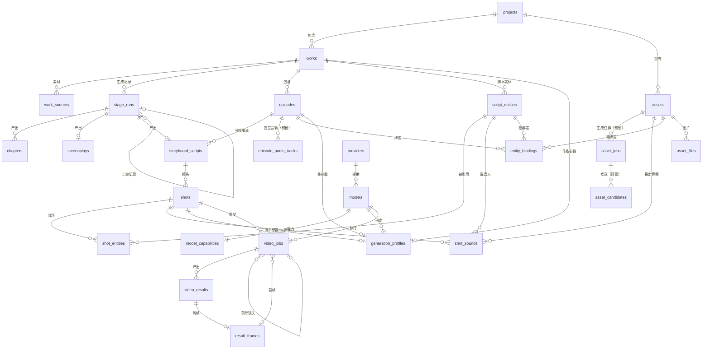

# 数据库设计

本文是 AI Video Studio（智影）的本地数据库设计说明，与 [ARCHITECTURE.md](ARCHITECTURE.md) 配套；页面与表单如何写入这些数据，见 [page-form-design.md](page-form-design.md)。

## 1. 总体约定

| 项 | 约定 |
|---|---|
| 数据库 | SQLite 单文件，位于扩展全局存储目录；使用 Node 内置的 `node:sqlite` 访问 |
| 版本管理 | 用 `PRAGMA user_version` 记录结构版本；迁移脚本放在 `infra/database/migrations/`，启动时自动升级 |
| 外键 | 每次打开连接都执行 `PRAGMA foreign_keys = ON` |
| 主键 | 每表一个 `id`，整数自增 |
| 表名、字段名 | 小写下划线，表名用复数 |
| 时间 | 文本，ISO 8601 UTC，例如 `2026-09-30T08:00:00.000Z`；字段名以 `_at` 结尾 |
| 布尔 | 整数 0 或 1，字段名用 `is_` 开头 |
| 枚举 | 文本，用 CHECK 约束限定取值 |
| JSON | 文本，用 `json_valid()` 校验；只存无需查询和关联的内容 |
| 二进制 | 只存图片和音频（资产图、资产音频、尾帧）；视频结果存文件，库中只存相对路径 |
| 密钥 | 不入库，存 VS Code `SecretStorage` |
| 空值 | 参数类字段为空表示“沿用上一级”，不表示 0 或空串 |

## 2. 表总览

| 分组 | 表 | 作用 |
|---|---|---|
| 项目与作品 | `projects` | 项目及项目级默认值 |
| | `works` | 作品，一个作品是单个短视频或一部多集短片 |
| | `work_sources` | 创意阶段的素材附件（图片、小说原文） |
| | `stage_runs` | 各阶段的每次生成记录，保存输入快照、版本、进度和人工确认状态 |
| | `chapters` | 创意阶段产出的章节正文 |
| 剧本 | `screenplays` | 剧本包 |
| | `episodes` | 集 |
| | `script_entities` | 脚本实体（角色、场景、道具、特效） |
| 分镜脚本 | `storyboard_scripts` | 某一集的分镜脚本 |
| | `shots` | 镜头 |
| | `shot_entities` | 镜头与出场实体的关系 |
| | `shot_sounds` | 镜头的声音条目：对白、旁白、音效、配乐 |
| 资产 | `assets` | 项目资产 |
| | `asset_files` | 资产图片 |
| | `entity_bindings` | 集内“脚本实体与资产”的绑定 |
| 模型与参数 | `providers` | 模型服务商 |
| | `models` | 模型 |
| | `model_capabilities` | 模型能力描述 |
| | `generation_profiles` | 三级生成参数（作品、集、镜头） |
| 生成 | `video_jobs` | 镜头生成任务 |
| | `video_results` | 生成结果视频 |
| | `result_frames` | 结果视频的尾帧图片 |
| | `episode_audio_tracks` | 集的独立音轨（预留，本阶段不开发） |
| | `asset_jobs` | 图片、音频资产的生成任务（预留，接入图像、音频模型时新增） |
| | `asset_candidates` | 资产生成结果候选，检查后才采用为资产文件（预留） |

共 25 张表，其中 `episode_audio_tracks`、`asset_jobs`、`asset_candidates` 为预留，实际创建 22 张。

## 3. 关系图

## 4. 表结构

以下“必填”指列定义为 NOT NULL。“默认”栏为空表示无默认值。

### 4.1 项目与作品

#### `projects` 项目

| 字段 | 类型 | 必填 | 默认 | 说明 |
|---|---|---|---|---|
| `id` | 整数 | 是 | 自增 | 主键 |
| `name` | 文本 | 是 | | 项目名称，唯一 |
| `description` | 文本 | 是 | 空串 | 项目描述 |
| `visual_style` | 文本 | 否 | | 项目视觉风格，资产和分镜脚本默认沿用 |
| `default_aspect_ratio` | 文本 | 否 | | 默认画幅，如 `16:9` |
| `default_resolution` | 文本 | 否 | | 默认分辨率，如 `1080p` |
| `created_at` | 文本 | 是 | | 创建时间 |
| `updated_at` | 文本 | 是 | | 更新时间 |

#### `works` 作品

| 字段 | 类型 | 必填 | 默认 | 说明 |
|---|---|---|---|---|
| `id` | 整数 | 是 | 自增 | 主键 |
| `project_id` | 整数 | 是 | | 所属项目，外键 `projects.id`，级联删除 |
| `name` | 文本 | 是 | | 作品名称，同一项目内唯一 |
| `kind` | 文本 | 是 | | `single` 单个短视频、`series` 多集短片 |
| `source_type` | 文本 | 否 | | 创意素材来源：`text`、`image`、`novel` |
| `created_at` | 文本 | 是 | | |
| `updated_at` | 文本 | 是 | | |

约束：`(project_id, name)` 唯一。

#### `work_sources` 素材附件

| 字段 | 类型 | 必填 | 默认 | 说明 |
|---|---|---|---|---|
| `id` | 整数 | 是 | 自增 | |
| `work_id` | 整数 | 是 | | 外键 `works.id`，级联删除 |
| `kind` | 文本 | 是 | | `image`、`novel_text` |
| `file_name` | 文本 | 是 | | 原始文件名 |
| `mime` | 文本 | 是 | | 如 `image/png`、`text/plain` |
| `size_bytes` | 整数 | 是 | | 文件大小 |
| `content` | 二进制 | 是 | | 文件内容 |
| `sort_order` | 整数 | 是 | 0 | 图片顺序，影响“按上传顺序展开” |
| `created_at` | 文本 | 是 | | |

#### `stage_runs` 阶段生成记录

每次生成创意、剧本或分镜脚本，都产生一条记录，保存当时的输入、进度和人工确认状态，便于重新生成与追溯。产出写在各阶段自己的表（`chapters`、`screenplays`、`storyboard_scripts`）中，确认流程见 [ARCHITECTURE.md](ARCHITECTURE.md) 6.3。

| 字段 | 类型 | 必填 | 默认 | 说明 |
|---|---|---|---|---|
| `id` | 整数 | 是 | 自增 | |
| `work_id` | 整数 | 是 | | 外键 `works.id`，级联删除 |
| `episode_id` | 整数 | 否 | | 外键 `episodes.id`，级联删除；仅分镜脚本阶段使用 |
| `stage` | 文本 | 是 | | `creative`、`screenplay`、`storyboard_script` |
| `version` | 整数 | 是 | | 同一作品、阶段、集下的序号，从 1 递增 |
| `input_json` | 文本（JSON） | 是 | | 表单输入快照，见“提示输入”字段 |
| `status` | 文本 | 是 | `running` | 生成状态：`running`、`succeeded`、`failed`、`canceled` |
| `review_status` | 文本 | 是 | `pending` | 确认状态：`pending` 待确认、`approved` 已确认；只有 `status = succeeded` 时才可为 `approved` |
| `is_current` | 整数 | 是 | 0 | 是否为当前采用的版本；为 1 时必须已确认 |
| `revision` | 整数 | 是 | 1 | 修订号，产出内容每被编辑保存一次加 1，用于判断下游是否过期 |
| `source_run_id` | 整数 | 否 | | 依赖的上游阶段记录，外键 `stage_runs.id`，删除时置空；创意阶段为空 |
| `source_revision` | 整数 | 否 | | 生成时上游记录的修订号 |
| `model_info` | 文本 | 否 | | 使用的 Copilot 模型标识（家族与版本） |
| `progress_json` | 文本（JSON） | 否 | | 进度：当前步骤、总步数、已完成数、创意大纲等，供页面显示与中断后继续 |
| `raw_output` | 文本 | 否 | | 最近一次模型原始输出，仅在失败时保留，便于排查 |
| `error_message` | 文本 | 否 | | 失败或取消原因 |
| `created_at` | 文本 | 是 | | |
| `finished_at` | 文本 | 否 | | 生成结束时间 |
| `approved_at` | 文本 | 否 | | 最近一次确认时间 |
| `applied_at` | 文本 | 否 | | 仅剧本阶段使用：结构已合并到 `episodes`、`script_entities` 的时间，空表示尚未合并 |

约束：

- 同一 `(work_id, stage, episode_id)` 下最多一条 `is_current = 1`（部分唯一索引，`episode_id` 为空时按 0 处理）。
- 同一 `(work_id, stage, episode_id)` 下最多一条 `status = running`（部分唯一索引），避免同时生成。
- CHECK：`is_current = 0` 或（`status = succeeded` 且 `review_status = approved`）；`review_status = approved` 时 `status = succeeded`。
- `stage = storyboard_script` 时 `episode_id` 必须有值，其他阶段必须为空（CHECK）。
- `source_run_id` 与 `source_revision` 是否成对出现由业务层保证。

#### `chapters` 章节正文

| 字段 | 类型 | 必填 | 说明 |
|---|---|---|---|
| `id` | 整数 | 是 | |
| `run_id` | 整数 | 是 | 外键 `stage_runs.id`，级联删除 |
| `seq` | 整数 | 是 | 章节序号，从 1 开始，上限 100 |
| `title` | 文本 | 是 | |
| `content` | 文本 | 是 | 正文 |
| `created_at` | 文本 | 是 | |

约束：`(run_id, seq)` 唯一。

### 4.2 剧本、集与脚本实体

#### `screenplays` 剧本包

| 字段 | 类型 | 必填 | 说明 |
|---|---|---|---|
| `id` | 整数 | 是 | |
| `run_id` | 整数 | 是 | 外键 `stage_runs.id`，级联删除，唯一 |
| `title` | 文本 | 是 | 作品标题 |
| `overview` | 文本 | 是 | 作品信息与改编梗概 |
| `full_text` | 文本 | 是 | 完整剧本包正文，用户可编辑，原地更新 |
| `structure_json` | 文本（JSON） | 是 | 从正文抽取的集和实体，见下方说明；确认采用前只存在这里，确认时合并到 `episodes`、`script_entities` |
| `updated_at` | 文本 | 是 | |

#### `episodes` 集

单个短视频也建 1 条，下游不区分单集与多集。

| 字段 | 类型 | 必填 | 默认 | 说明 |
|---|---|---|---|---|
| `id` | 整数 | 是 | 自增 | |
| `work_id` | 整数 | 是 | | 外键 `works.id`，级联删除 |
| `seq` | 整数 | 是 | | 集序号，从 1 开始 |
| `title` | 文本 | 是 | | 集标题 |
| `synopsis` | 文本 | 是 | 空串 | 本集梗概 |
| `screenplay_text` | 文本 | 是 | 空串 | 本集剧本正文 |
| `target_duration_seconds` | 整数 | 否 | | 本集目标时长 |
| `created_at` | 文本 | 是 | | |
| `updated_at` | 文本 | 是 | | |

约束：`(work_id, seq)` 唯一。集的进度状态（未配置、待绑定、可生成、生成中、部分完成、已完成）由绑定和镜头任务实时汇总，不存库。

#### `script_entities` 脚本实体

由剧本的设定清单产生，属于整个作品，在各集之间共用。

| 字段 | 类型 | 必填 | 默认 | 说明 |
|---|---|---|---|---|
| `id` | 整数 | 是 | 自增 | 脚本和镜头通过它引用实体，改名不断链 |
| `work_id` | 整数 | 是 | | 外键 `works.id`，级联删除 |
| `kind` | 文本 | 是 | | `character`、`scene`、`prop`、`effect` |
| `name` | 文本 | 是 | | 稳定名称 |
| `aliases_json` | 文本（JSON） | 是 | `[]` | 别名列表 |
| `description` | 文本 | 是 | 空串 | 设定摘要 |
| `attributes_json` | 文本（JSON） | 是 | `{}` | 按类型区分的设定，见 4.5 |
| `is_active` | 整数 | 是 | 1 | 重新生成剧本后不再出现的实体置 0，不删除 |
| `created_at` | 文本 | 是 | | |
| `updated_at` | 文本 | 是 | | |

约束：`(work_id, kind, name)` 唯一。

### 4.3 分镜脚本与镜头

#### `storyboard_scripts` 分镜脚本

| 字段 | 类型 | 必填 | 说明 |
|---|---|---|---|
| `id` | 整数 | 是 | |
| `episode_id` | 整数 | 是 | 外键 `episodes.id`，级联删除 |
| `run_id` | 整数 | 是 | 外键 `stage_runs.id`，级联删除，唯一 |
| `created_at` | 文本 | 是 | |

说明：分镜脚本、镜头、出场实体和声音在生成成功时由一次事务整份写入（重试会覆盖该阶段记录原有的分镜脚本）；它们直接引用 `script_entities.id`，没有“合并”步骤，确认采用只改 `stage_runs` 的确认状态。阶段记录的 `input_json` 保存 `{ workName, projectStyle, params }`，`params` 为规范化后的生成参数（画面风格、单镜头时长范围、镜头总数上限、连贯策略、声音模式与声音内容、补充要求）。用户编辑镜头时，出场实体与声音整体替换，镜头序号不变。

#### `shots` 镜头

| 字段 | 类型 | 必填 | 默认 | 说明 |
|---|---|---|---|---|
| `id` | 整数 | 是 | 自增 | |
| `storyboard_script_id` | 整数 | 是 | | 外键 `storyboard_scripts.id`，级联删除 |
| `seq` | 整数 | 是 | | 集内镜头序号，从 1 开始 |
| `scene_label` | 文本 | 是 | 空串 | 所属场次，如“第01场” |
| `shot_size` | 文本 | 是 | 空串 | 景别，如远景、中景、特写 |
| `camera_angle` | 文本 | 是 | 空串 | 机位与视角 |
| `action` | 文本 | 是 | | 画面与主体动作 |
| `camera_movement` | 文本 | 是 | 空串 | 摄影机运动 |
| `duration_seconds` | 实数 | 是 | | 请求时长，初始取脚本建议值，可在工作台调整 |
| `transition` | 文本 | 是 | 空串 | 转场 |
| `continuity_note` | 文本 | 是 | 空串 | 连续性要求 |
| `first_frame_mode` | 文本 | 是 | `none` | `none`、`prev_tail`、`asset` |
| `first_frame_asset_file_id` | 整数 | 否 | | `asset` 模式下的首帧图，外键 `asset_files.id`，删除时置空 |
| `prompt_zh` | 文本 | 是 | 空串 | 中文视频提示词 |
| `prompt_en` | 文本 | 是 | 空串 | 英文视频提示词 |
| `created_at` | 文本 | 是 | | |
| `updated_at` | 文本 | 是 | | |

约束：

- `(storyboard_script_id, seq)` 唯一。
- 对白、旁白、音效、配乐不在镜头表中，由 `shot_sounds` 保存。
- `first_frame_mode = 'asset'` 时 `first_frame_asset_file_id` 必须有值，由业务层校验；不做数据库 CHECK，因为删除资产文件时该列会被置空。
- `first_frame_mode = 'prev_tail'` 时该镜头不能是集内的第 1 个镜头（由业务校验，不做 CHECK）。

#### `shot_entities` 镜头出场实体

| 字段 | 类型 | 必填 | 说明 |
|---|---|---|---|
| `shot_id` | 整数 | 是 | 外键 `shots.id`，级联删除 |
| `entity_id` | 整数 | 是 | 外键 `script_entities.id`，级联删除 |

主键：`(shot_id, entity_id)`。

#### `shot_sounds` 镜头声音

一个镜头可有多条声音条目，按顺序排列。提交时，启用的条目会被编译为声音提示词，交给支持原生声音的模型。

| 字段 | 类型 | 必填 | 默认 | 说明 |
|---|---|---|---|---|
| `id` | 整数 | 是 | 自增 | |
| `shot_id` | 整数 | 是 | | 外键 `shots.id`，级联删除 |
| `seq` | 整数 | 是 | | 镜头内顺序，从 1 开始 |
| `kind` | 文本 | 是 | | `dialogue` 角色对白、`narration` 旁白、`sfx` 音效、`music` 背景音乐 |
| `speaker_entity_id` | 整数 | 否 | | 说话人，仅 `dialogue` 使用，外键 `script_entities.id`，删除时置空 |
| `text` | 文本 | 是 | | 对白或旁白的台词；音效、配乐的描述 |
| `delivery` | 文本 | 是 | 空串 | 说话方式或声音质感，如“低声、急促”“清脆的玻璃破碎声”“紧张的弦乐” |
| `start_offset_seconds` | 实数 | 否 | | 相对镜头起点的开始时间，空表示由模型自行安排 |
| `duration_seconds` | 实数 | 否 | | 持续时长，空表示由模型自行安排 |
| `audio_asset_id` | 整数 | 否 | | 指定使用的音频资产（现成配乐、音效、音色参考），外键 `assets.id`，删除时置空 |
| `is_enabled` | 整数 | 是 | 1 | 是否参与提交，用于临时关掉某条声音 |

约束：

- `(shot_id, seq)` 唯一。
- `kind = 'dialogue'` 时 `speaker_entity_id` 必须有值且为角色类实体；其他类型时为空（业务校验）。
- `audio_asset_id` 指向的资产必须是音频类型，且与条目类型匹配：`music` 对应配乐，`sfx` 对应音效，`dialogue`、`narration` 对应音色参考（业务校验）。

### 4.4 资产与绑定

#### `assets` 资产

资产属于项目，可在多个作品、多集中复用。

| 字段 | 类型 | 必填 | 默认 | 说明 |
|---|---|---|---|---|
| `id` | 整数 | 是 | 自增 | |
| `project_id` | 整数 | 是 | | 外键 `projects.id`，级联删除 |
| `kind` | 文本 | 是 | | `character`、`scene`、`prop`、`effect`、`audio` |
| `name` | 文本 | 是 | | 资产名称 |
| `source_entity_id` | 整数 | 否 | | 由哪个脚本实体创建，外键 `script_entities.id`，删除时置空 |
| `attributes_json` | 文本（JSON） | 是 | `{}` | 按类型区分的描述字段，见 4.5 |
| `composition` | 文本 | 是 | 空串 | 视角与构图 |
| `style` | 文本 | 否 | | 画面风格；为空表示沿用项目风格 |
| `background` | 文本 | 是 | 空串 | 背景 |
| `reference_aspect_ratio` | 文本 | 否 | | 参考图画幅，仅表示参考图尺寸比例 |
| `extra_requirements` | 文本 | 是 | 空串 | 补充要求 |
| `prompt_zh` | 文本 | 是 | 空串 | 中文图像生成提示词 |
| `prompt_en` | 文本 | 是 | 空串 | 英文图像生成提示词 |
| `created_at` | 文本 | 是 | | |
| `updated_at` | 文本 | 是 | | |

约束：`(project_id, kind, name)` 唯一。

音频类型的资产不使用 `composition`、`style`、`background`、`reference_aspect_ratio`，这些字段保持空；它的描述字段见 4.5。

#### `asset_files` 资产图片

| 字段 | 类型 | 必填 | 默认 | 说明 |
|---|---|---|---|---|
| `id` | 整数 | 是 | 自增 | |
| `asset_id` | 整数 | 是 | | 外键 `assets.id`，级联删除 |
| `role` | 文本 | 是 | `reference` | `reference` 参考图或参考音频、`thumbnail` 缩略图；音频资产只用 `reference` |
| `file_name` | 文本 | 是 | | |
| `mime` | 文本 | 是 | | 图片仅允许 `image/png`、`image/jpeg`、`image/webp`；音频仅允许 `audio/mpeg`、`audio/wav`、`audio/mp4` |
| `width` | 整数 | 否 | | 图片像素宽，音频为空 |
| `height` | 整数 | 否 | | 图片像素高，音频为空 |
| `duration_seconds` | 实数 | 否 | | 音频时长，图片为空 |
| `size_bytes` | 整数 | 是 | | |
| `content` | 二进制 | 是 | | 图片或音频内容 |
| `sort_order` | 整数 | 是 | 0 | 同一资产内的顺序 |
| `created_at` | 文本 | 是 | | |

列表查询只读取缩略图，不读取参考图的 `content`。

#### `entity_bindings` 实体与资产绑定

绑定属于集：同一实体在不同集可以绑定不同资产（例如不同造型）。

| 字段 | 类型 | 必填 | 默认 | 说明 |
|---|---|---|---|---|
| `id` | 整数 | 是 | 自增 | |
| `episode_id` | 整数 | 是 | | 外键 `episodes.id`，级联删除 |
| `entity_id` | 整数 | 是 | | 外键 `script_entities.id`，级联删除 |
| `asset_id` | 整数 | 是 | | 外键 `assets.id`，级联删除 |
| `purpose` | 文本 | 是 | `visual` | `visual` 形象绑定、`voice` 音色绑定（仅角色实体可用） |
| `is_primary` | 整数 | 是 | 1 | 是否为该实体在本集、该用途下的主资产 |
| `note` | 文本 | 是 | 空串 | 备注，如“雨天造型” |
| `created_at` | 文本 | 是 | | |

约束：

- `(episode_id, entity_id, asset_id)` 唯一。
- 同一 `(episode_id, entity_id, purpose)` 下最多一条 `is_primary = 1`（部分唯一索引）。
- `purpose = 'visual'` 时，资产的类型必须与实体的类型一致；`purpose = 'voice'` 时，实体必须是角色，资产必须是音频类型且 `audio_kind = 'voice'`（业务校验）。

### 4.5 按类型区分的 JSON 内容

**`script_entities.attributes_json`**

| 类型 | 键 |
|---|---|
| `character` | `identity` 身份与目标、`relations` 主要关系、`appearance` 稳定外观、`outfit` 服装或状态、`voice` 音色设定 |
| `scene` | `interior_exterior` 内外景、`layout` 布局与出入口、`fixtures` 固定陈设、`time_light` 时间与光线 |
| `prop` | `appearance` 外观、`usage` 用途、`states` 初始与变化状态 |
| `effect` | `trigger` 来源或触发条件、`appearance` 视觉表现、`targets` 影响对象、`changes` 变化过程 |

**`assets.attributes_json`**

| 类型 | 键 |
|---|---|
| `character` | `character_type` 角色类型、`appearance` 角色外观、`clothing` 装束、`expression_pose` 神态与姿态、`voice_description` 音色描述 |
| `scene` | `place_type` 地点类型、`layout` 空间布局、`environment` 环境与光线 |
| `prop` | `appearance` 外观特征、`state` 当前状态 |
| `effect` | `source` 特效来源、`appearance` 视觉表现、`motion` 触发与变化、`environment_interaction` 环境交互 |
| `audio` | `audio_kind` 音频类型（`voice` 音色参考、`music` 配乐、`sfx` 音效）、`description` 风格、情绪或适用场景、`language` 语言（仅音色参考） |

### 4.6 模型与生成参数

#### `providers` 模型服务商

| 字段 | 类型 | 必填 | 默认 | 说明 |
|---|---|---|---|---|
| `id` | 整数 | 是 | 自增 | |
| `code` | 文本 | 是 | | 唯一标识，如 `wanxiang` |
| `display_name` | 文本 | 是 | | 显示名称 |
| `settings_json` | 文本（JSON） | 是 | `{}` | 非机密设置，如地域、接口地址；**不含密钥** |
| `is_enabled` | 整数 | 是 | 1 | 是否启用 |
| `created_at` | 文本 | 是 | | |
| `updated_at` | 文本 | 是 | | |

#### `models` 模型

| 字段 | 类型 | 必填 | 默认 | 说明 |
|---|---|---|---|---|
| `id` | 整数 | 是 | 自增 | |
| `provider_id` | 整数 | 是 | | 外键 `providers.id`，级联删除 |
| `code` | 文本 | 是 | | 服务商侧的模型标识 |
| `display_name` | 文本 | 是 | | |
| `is_enabled` | 整数 | 是 | 1 | 是否可选 |
| `kind` | 文本 | 是 | `video` | 模型类型：`image` 图像、`audio` 音频、`video` 视频；同一服务商可以有多种类型的模型 |
| `created_at` | 文本 | 是 | | |

约束：`(provider_id, code)` 唯一（同一服务商内模型代码不重复，不区分类型）。被生成任务或参数引用的模型只能停用，不能删除（外键限制删除）。

#### `model_capabilities` 模型能力

| 字段 | 类型 | 必填 | 说明 |
|---|---|---|---|
| `model_id` | 整数 | 是 | 主键，外键 `models.id`，级联删除 |
| `capability_json` | 文本（JSON） | 是 | 能力描述，键见下表 |
| `updated_at` | 文本 | 是 | |

`capability_json` 的键按模型类型区分，未列出的键对该类型不适用。

**视频模型（`kind = video`）**

| 键 | 含义 |
|---|---|
| `aspect_ratios` | 支持的画幅列表 |
| `resolutions` | 支持的分辨率列表 |
| `duration` | 时长范围或可选值：`min`、`max`、`step`，或 `options` |
| `fps` | 支持的帧率列表 |
| `audio_modes` | 支持的声音模式：`none`、`native`（模型原生生成） |
| `audio_elements` | 原生支持的声音内容：`dialogue`、`narration`、`sfx`、`music` |
| `voice_reference` | 是否支持音色参考音频输入 |
| `audio_input_max` | 参考音频数量上限与单个时长上限 |
| `first_frame` | 是否支持首帧输入 |
| `last_frame` | 是否支持尾帧输入 |
| `reference_images_max` | 参考图数量上限 |
| `seed` | 是否支持随机种子 |
| `prompt_languages` | 提示词语言：`zh`、`en` |
| `prompt_max_length` | 提示词长度上限 |

**图像模型（`kind = image`）**

| 键 | 含义 |
|---|---|
| `aspect_ratios` | 支持的画幅列表 |
| `resolutions` | 支持的尺寸或分辨率列表 |
| `images_per_request_max` | 单次请求最多生成的图片数 |
| `reference_images_max` | 参考图数量上限 |
| `seed` | 是否支持随机种子 |
| `prompt_languages` | 提示词语言：`zh`、`en` |
| `prompt_max_length` | 提示词长度上限 |

**音频模型（`kind = audio`）**

| 键 | 含义 |
|---|---|
| `audio_kinds` | 支持生成的类型：`voice` 音色参考、`music` 配乐、`sfx` 音效 |
| `duration` | 时长范围：`min`、`max` |
| `languages` | 支持的语言（仅音色） |
| `voices` | 可选的预置音色列表 |
| `reference_audio` | 是否支持参考音频输入 |
| `prompt_languages`、`prompt_max_length` | 同上 |

本阶段不接入具体模型，以上只是能力描述的格式约定。

#### `generation_profiles` 生成参数

每个作品、集、镜头最多一条，字段为空表示沿用上一级。

| 字段 | 类型 | 必填 | 说明 |
|---|---|---|---|
| `id` | 整数 | 是 | |
| `scope` | 文本 | 是 | `work`、`episode`、`shot` |
| `work_id` | 整数 | 否 | `scope = work` 时必填，外键 `works.id`，级联删除 |
| `episode_id` | 整数 | 否 | `scope = episode` 时必填，外键 `episodes.id`，级联删除 |
| `shot_id` | 整数 | 否 | `scope = shot` 时必填，外键 `shots.id`，级联删除 |
| `model_id` | 整数 | 否 | 外键 `models.id`，限制删除 |
| `aspect_ratio` | 文本 | 否 | 画幅 |
| `resolution` | 文本 | 否 | 分辨率 |
| `min_shot_seconds` | 实数 | 否 | 单镜头最短时长，仅作品级使用 |
| `max_shot_seconds` | 实数 | 否 | 单镜头最长时长，仅作品级使用 |
| `audio_mode` | 文本 | 否 | `none` 无声、`native` 模型原生生成、`external` 独立音轨（预留，本阶段不可选） |
| `audio_elements_json` | 文本（JSON） | 否 | 启用的声音内容，数组，元素为 `dialogue`、`narration`、`sfx`、`music`；仅 `audio_mode` 不为 `none` 时有意义 |
| `seed` | 整数 | 否 | 随机种子 |
| `extra_params_json` | 文本（JSON） | 是 | 模型专有参数，默认 `{}` |
| `updated_at` | 文本 | 是 | |

约束：

- `work_id`、`episode_id`、`shot_id` 三者中有且仅有一个非空，且与 `scope` 一致（CHECK）。
- 每个目标最多一条：`work_id`、`episode_id`、`shot_id` 各建一个部分唯一索引。

**参数合并规则**：对每个参数，依次取镜头、集、作品的值，取第一个非空值；画幅和分辨率最后回退到项目默认值。单镜头时长以 `shots.duration_seconds` 为准，并校验落在作品级时长范围和模型能力范围内。

### 4.7 生成任务与结果

#### `video_jobs` 镜头生成任务

每次提交一个镜头产生一条记录；重试产生新记录。任务只在提交时创建，“草稿”“就绪”是校验阶段的界面状态，不入库。

| 字段 | 类型 | 必填 | 默认 | 说明 |
|---|---|---|---|---|
| `id` | 整数 | 是 | 自增 | |
| `shot_id` | 整数 | 是 | | 外键 `shots.id`，级联删除 |
| `model_id` | 整数 | 是 | | 外键 `models.id`，限制删除 |
| `status` | 文本 | 是 | | `waiting`、`queued`、`running`、`succeeded`、`failed`、`canceled` |
| `request_snapshot_json` | 文本（JSON） | 是 | | 提交时的完整请求快照，见下表 |
| `remote_job_id` | 文本 | 否 | | 模型服务侧的任务标识 |
| `error_category` | 文本 | 否 | | `auth`、`rate_limit`、`param`、`server`、`network` |
| `error_message` | 文本 | 否 | | |
| `attempt` | 整数 | 是 | 1 | 同一镜头的第几次提交 |
| `prev_job_id` | 整数 | 否 | | 依赖的前序镜头任务，外键 `video_jobs.id`，删除时置空 |
| `first_frame_id` | 整数 | 否 | | 作为首帧的尾帧，外键 `result_frames.id`，删除时置空 |
| `created_at` | 文本 | 是 | | |
| `submitted_at` | 文本 | 否 | | 实际提交给模型的时间 |
| `finished_at` | 文本 | 否 | | |

`request_snapshot_json` 的键：

| 键 | 含义 |
|---|---|
| `model` | 服务商与模型标识 |
| `params` | 合并后的最终参数：画幅、分辨率、时长、声音模式与内容、种子、专有参数 |
| `prompt` | 实际使用的提示词与语言 |
| `reference_asset_file_ids` | 使用的资产图片 ID 列表 |
| `first_frame` | 首帧来源：`none`、`prev_tail`（含尾帧 ID）、`asset`（含图片 ID） |
| `audio` | 声音快照：启用的 `shot_sounds` 条目、编译后的声音提示词、使用的音频资产文件 ID（含角色音色参考） |
| `storyboard_script_run_id` | 使用的分镜脚本版本 |

快照中不得出现密钥。

#### `video_results` 结果视频

| 字段 | 类型 | 必填 | 默认 | 说明 |
|---|---|---|---|---|
| `id` | 整数 | 是 | 自增 | |
| `job_id` | 整数 | 是 | | 外键 `video_jobs.id`，级联删除 |
| `shot_id` | 整数 | 是 | | 冗余保存，便于按镜头查询，外键 `shots.id`，级联删除 |
| `file_path` | 文本 | 是 | | 相对扩展存储目录的路径 |
| `remote_url` | 文本 | 否 | | 服务商返回的临时地址 |
| `remote_expires_at` | 文本 | 否 | | 临时地址过期时间 |
| `duration_seconds` | 实数 | 是 | | 实际时长 |
| `width` | 整数 | 是 | | |
| `height` | 整数 | 是 | | |
| `size_bytes` | 整数 | 是 | | |
| `has_audio` | 整数 | 是 | 0 | 结果视频是否带声音轨 |
| `is_selected` | 整数 | 是 | 0 | 是否为该镜头采用的版本 |
| `created_at` | 文本 | 是 | | |

约束：同一 `shot_id` 下最多一条 `is_selected = 1`（部分唯一索引）。

视频文件路径规则：`videos/{project_id}/{work_id}/{episode_id}/{shot_id}-{job_id}.mp4`。

#### `result_frames` 尾帧图片

| 字段 | 类型 | 必填 | 默认 | 说明 |
|---|---|---|---|---|
| `id` | 整数 | 是 | 自增 | |
| `result_id` | 整数 | 是 | | 外键 `video_results.id`，级联删除 |
| `kind` | 文本 | 是 | `tail` | 目前只有 `tail` |
| `mime` | 文本 | 是 | | |
| `width` | 整数 | 是 | | |
| `height` | 整数 | 是 | | |
| `content` | 二进制 | 是 | | 图片内容 |
| `created_at` | 文本 | 是 | | |

### 4.8 独立音轨（预留）

用于“声音与视频分开生成、再合成”的方式。**本阶段只设计结构，不开发功能，也不建表**；开发时新增迁移 `008-audio-tracks`。

#### `episode_audio_tracks` 集的独立音轨

| 字段 | 类型 | 必填 | 默认 | 说明 |
|---|---|---|---|---|
| `id` | 整数 | 是 | 自增 | |
| `episode_id` | 整数 | 是 | | 外键 `episodes.id`，级联删除 |
| `kind` | 文本 | 是 | | `dialogue`、`narration`、`sfx`、`music`、`mix`（混合后的完整音轨） |
| `source` | 文本 | 是 | | `generated` 生成、`asset` 来自资产 |
| `audio_asset_id` | 整数 | 否 | | `source = asset` 时必填，外键 `assets.id`，删除时置空 |
| `file_path` | 文本 | 否 | | 生成结果文件的相对路径 |
| `start_seconds` | 实数 | 是 | 0 | 在本集时间轴上的起始时间 |
| `duration_seconds` | 实数 | 否 | | 时长 |
| `volume` | 实数 | 是 | 1.0 | 音量倍数 |
| `sort_order` | 整数 | 是 | 0 | 同一时间点上的排列 |
| `created_at` | 文本 | 是 | | |

### 4.9 资产生成任务与候选（预留）

用于“提示词发送给图像或音频模型生成资产文件”。**本阶段只设计结构，不建表**；接入图像、音频模型时新增迁移 `007-asset-generation`。

#### `asset_jobs` 资产生成任务

结构与 `video_jobs` 类似，每次提交一个资产产生一条，重试产生新记录。

| 字段 | 说明 |
|---|---|
| `id` | 主键 |
| `asset_id` | 外键 `assets.id`，级联删除 |
| `model_id` | 外键 `models.id`，限制删除，模型类型必须为 `image` 或 `audio`（业务校验） |
| `status` | `queued`、`running`、`succeeded`、`failed`、`canceled` |
| `request_snapshot_json` | 提交时的请求快照：模型、提示词与语言、参数、参考图文件 ID；不得出现密钥 |
| `remote_job_id` | 模型服务侧任务标识 |
| `error_category`、`error_message` | 失败分类与原因 |
| `attempt` | 同一资产的第几次提交 |
| `created_at`、`submitted_at`、`finished_at` | 时间 |

#### `asset_candidates` 生成结果候选

生成的图片或音频先作为候选保存，经用户检查后才采用；采用时复制为 `asset_files`（`role = reference`），并把候选标记为已采用。未采用的候选不影响资产。

| 字段 | 说明 |
|---|---|
| `id` | 主键 |
| `job_id` | 外键 `asset_jobs.id`，级联删除 |
| `mime`、`width`、`height`、`duration_seconds`、`size_bytes`、`content` | 同 `asset_files` |
| `is_adopted` | 是否已采用为资产文件 |
| `created_at` | 创建时间 |

## 5. 索引

| 表 | 索引 | 用途 |
|---|---|---|
| `works` | `(project_id)` | 项目下的作品列表 |
| `work_sources` | `(work_id, sort_order)` | 读取素材 |
| `stage_runs` | `(work_id, stage, episode_id, version DESC)` | 查最新版本 |
| `stage_runs` | 部分唯一 `(work_id, stage, ifnull(episode_id, 0)) WHERE is_current = 1` | 保证一个当前版本 |
| `stage_runs` | 部分唯一 `(work_id, stage, ifnull(episode_id, 0)) WHERE status = 'running'` | 同一目标同时只能有一个运行中的生成 |
| `stage_runs` | `(source_run_id)` | 查找依赖某个上游记录的下游，判断过期 |
| `episodes` | `(work_id, seq)` 唯一 | 集顺序 |
| `script_entities` | `(work_id, kind, name)` 唯一 | 实体去重与匹配 |
| `shots` | `(storyboard_script_id, seq)` 唯一 | 镜头顺序 |
| `assets` | `(project_id, kind, name)` 唯一 | 资产列表与去重 |
| `asset_files` | `(asset_id, role, sort_order)` | 读取缩略图和参考图 |
| `entity_bindings` | `(episode_id, entity_id, asset_id)` 唯一 | 防重复绑定 |
| `entity_bindings` | 部分唯一 `(episode_id, entity_id, purpose) WHERE is_primary = 1` | 每个实体每种用途一个主资产 |
| `generation_profiles` | 部分唯一 `(work_id) WHERE scope = 'work'`；`(episode_id)`、`(shot_id)` 同理 | 每个目标一条参数 |
| `video_jobs` | `(shot_id, created_at DESC)` | 镜头的提交历史 |
| `video_jobs` | `(status)` | 队列扫描、启动恢复 |
| `video_jobs` | `(prev_job_id)` | 释放后续镜头 |
| `video_results` | 部分唯一 `(shot_id) WHERE is_selected = 1` | 每个镜头一个采用版本 |
| `shot_sounds` | `(shot_id, seq)` 唯一 | 镜头内声音顺序 |
| `shot_sounds` | `(speaker_entity_id)` | 按角色查看对白 |
| `episode_audio_tracks`（预留） | `(episode_id, start_seconds, sort_order)` | 按时间轴读取音轨 |

## 6. 删除规则

| 被删除对象 | 影响 |
|---|---|
| 项目 | 级联删除其作品、资产及下属全部数据；界面须二次确认并列出数量 |
| 作品 | 级联删除素材、生成记录、集、实体、参数和以下全部内容 |
| 集 | 级联删除分镜脚本、镜头、绑定、参数、生成任务和结果 |
| 资产 | 级联删除图片和绑定；界面须先提示被哪些集使用 |
| 脚本实体 | 级联删除绑定和镜头引用；一般用停用（`is_active = 0`）代替删除 |
| 模型 | 被引用时数据库拒绝删除，只能停用 |
| 生成结果 | 删除视频文件与记录；若该结果的尾帧被后续任务引用，后续任务的 `first_frame_id` 置空，快照保持不变 |

删除视频结果或整个层级时，需同时清理磁盘上的视频文件；数据库不负责文件删除，由应用层在事务成功后处理。

## 7. 业务规则

1. **单个短视频也有 1 集。** 创建 `kind = single` 的作品时，同时创建第 1 集。
2. **重新生成剧本时保护下游数据。**
   - 生成时只写 `screenplays`（正文与 `structure_json`），**不修改** `episodes`、`script_entities`；用户确认采用时才按下面的规则合并，并记录 `applied_at`。已合并过的记录再次确认时不重复合并。
   - 集按序号合并：已有序号的集更新标题、梗概、正文和目标时长，抽取结果里新增的序号创建新集，不删除已有集；单个短视频的抽取结果只有 1 集，标题取生成时的作品名称。
   - 合并之后，用户对集和实体的编辑直接保存在 `episodes`、`script_entities`（同时该版本回到待确认），再次确认不重复合并；合并之前的编辑保存在 `screenplays.structure_json`。
   - 实体按 `(kind, name)` 合并，保留已有绑定；不再出现的实体置 `is_active = 0`。
   - 若已有集存在分镜脚本或生成结果，须先向用户确认。
3. **镜头依赖。** `first_frame_mode = prev_tail` 的镜头提交时，`prev_job_id` 指向同集上一镜头最新的成功任务；尚无成功任务则状态为 `waiting`。
4. **采用版本。** 每个镜头的成功结果中，只有一条 `is_selected = 1`；首次成功时自动选中，之后由用户切换。
5. **启动恢复。** 扩展启动时，把遗留的 `running` 任务按 `remote_job_id` 重新查询状态；无远端标识的置为 `failed`。遗留的 `running` 阶段记录（`stage_runs`）一律置为 `failed`，原因为“扩展重启，已中断”。
6. **提交前校验（应用层）。** 实体是否都已绑定、参数是否落在模型能力范围内、参考图数量、密钥是否已配置、`prev_tail` 是否有前序，详见架构文档。
7. **声音。**
   - 声音先按“模型原生生成”实现（`audio_mode = native`）；“独立音轨”只预留结构。
   - 提交时，把镜头中启用、且属于 `audio_elements_json` 的 `shot_sounds` 条目编译为声音提示词；对白条目带上说话人的音色设定（实体的 `voice`）。
   - 角色在本集绑定了音色参考音频（`purpose = voice`）且模型支持 `voice_reference` 时，把它作为参考音频一并提交；模型不支持时只使用文字描述，并给出警告。
   - 模型不支持的声音内容（例如不支持背景音乐）不会被提交，提交预览中需要列出。
8. **大小限制（建议值）。** 单张资产图片不超过 10 MB；单个资产音频不超过 20 MB、时长不超过 60 秒；小说原文文件不超过 5 MB；具体数值在实现时集中配置。
9. **阶段记录的确认与版本。**
   - 生成成功（`status = succeeded`）后 `review_status = pending`；用户确认采用时，在一个事务内把同一目标原来的当前版本的 `is_current` 置 0，再把本条置为 `approved`、`is_current = 1`。
   - 产出内容（章节、剧本包正文、集、实体、镜头、声音条目）每次编辑保存，对应阶段记录的 `revision` 加 1；已确认的记录同时回到 `pending` 且 `is_current = 0`。这些编辑统一经服务层保存。
   - 下游过期：下游记录的 `source_revision` 与上游记录现在的 `revision` 不同，或上游记录不再是已确认，则该下游记录显示“上游已变更”；不自动修改或删除下游数据。
   - 下游阶段只能选择已确认（`is_current = 1`）的上游记录作为输入。
10. **资产提示词不建阶段记录。** Copilot 生成的中英文提示词直接填入资产表单的提示词字段，用户检查并保存即视为确认。

## 8. 迁移计划

每个迁移脚本只负责从版本 N 到 N+1，在事务中执行，失败则回滚。

| 版本 | 脚本 | 内容 | 对应实施步骤 |
|---|---|---|---|
| 1 | `001-core` | `projects`、`works`、`work_sources`、`episodes`、`stage_runs`、`chapters`、`screenplays`、`script_entities` | 已实现 |
| 2 | `002-assets` | `assets`（含音频类型）、`asset_files`、`entity_bindings` | 已实现 |
| 3 | `003-storyboard` | `storyboard_scripts`、`shots`、`shot_entities`、`shot_sounds` | 已实现 |
| 4 | `004-models` | `providers`、`models`、`model_capabilities`、`generation_profiles` | 已实现 |
| 5 | `005-generation` | `video_jobs`、`video_results`、`result_frames` | 已实现 |
| 6 | `006-text-generation` | `stage_runs` 增加“已取消”状态、确认状态、修订号、上游记录、模型、进度、原始输出（重建该表，允许丢弃现有数据）；`screenplays` 增加 `structure_json`；`models` 增加 `kind` | 已实现 |
| 7 | `007-asset-generation` | `asset_jobs`、`asset_candidates`（预留） | 接入图像、音频模型时 |
| 8 | `008-audio-tracks` | `episode_audio_tracks`（预留，开发独立音轨时再新增） | 后续 |

拆分说明：镜头引用资产文件，因此资产在分镜之前建立；全部 22 张表已在前五个迁移中创建，各功能的仓库随功能实现逐步补全。

已发布的脚本不再修改；结构变更一律新增下一个编号的脚本。测试阶段不考虑已有数据，需要重建表（例如修改 CHECK 约束）时，新增的迁移可以直接丢弃该表及其下游表的数据，不做数据搬迁，正式发布后不再允许。升级前先复制数据库文件作为备份。

## 9. 与架构文档的差异说明

本文对 [ARCHITECTURE.md](ARCHITECTURE.md) 中的领域模型做了细化，以本文为准：

- 表名统一为复数小写下划线，例如 `SHOT` 对应 `shots`。
- 原“任务”统一称“作品”：表 `works`、外键 `work_id`；“任务”一词只用于“生成任务”（`video_jobs`）。
- 原 `SCRIPT` 拆为剧本包 `screenplays` 与分镜脚本 `storyboard_scripts`，版本由 `stage_runs` 统一管理。
- 脚本实体属于作品，绑定属于集，新增 `episode_id`。
- `GEN_PROFILE` 由“范围 + 范围 ID + JSON 参数”改为结构化列和三个外键。
- 新增创意阶段相关表 `work_sources`、`chapters`，以及项目级默认值。
- 生成任务只入库提交后的状态；草稿、就绪是校验阶段的界面状态。
- 声音从单个模式字段拓展为结构化内容：新增 `shot_sounds`（对白、旁白、音效、配乐），镜头表不再保存对白和声音说明文本；资产新增音频类型；绑定新增用途（形象、音色）；独立音轨只预留。
- 阶段记录增加人工确认状态、修订号和上游依赖；剧本包增加结构快照，确认后才合并到集和实体；模型增加类型（图像、音频、视频），能力描述按类型区分；预留资产生成任务与候选表。
