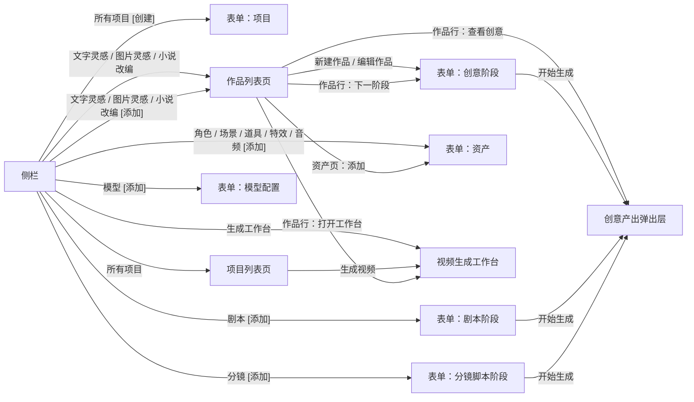

# 页面与表单设计

本文说明 AI Video Studio（智影）有哪些页面、每个页面怎么布局，以及每个需要提交的表单的字段、控件、校验和写库规则。数据结构见 [database-design.md](database-design.md)，整体架构见 [ARCHITECTURE.md](ARCHITECTURE.md)。

视觉数值（尺寸、颜色、间距、状态）一律采用项目的页面与表单样式基线，本文只规定“放什么、怎么交互”。控件、对话框和弹出页面的具体用法见 [ui-components.md](ui-components.md)。

## 1. 页面清单与入口



| 编号 | 页面 | 形态 | 用途 |
|---|---|---|---|
| P1 | 侧栏 | 侧栏 Webview | 全部入口，只做导航 |
| P2 | 项目列表页 | 编辑器区 Webview | 浏览、搜索、创建、编辑、删除项目 |
| P3 | 作品列表页 | 编辑器区 Webview（每种素材来源一个标签页） | 列出所有项目中该素材来源的作品，新建、编辑、删除作品，推进各阶段 |
| P4 | 表单弹出页面 | 来源页内的弹出页面 | 承载 F1 至 F7 及内容编辑表单，不单独打开标签页 |
| P5 | 视频生成工作台 | 编辑器区 Webview | 绑定、参数、提交、队列、结果 |
| P6 | 模型配置页 | 编辑器区 Webview | 服务商、模型与文本生成设置，采用设置页规格 |
| P7 | 阶段产出层 | 来源页内的弹出层（不单独打开标签页） | 查看生成进度，检查、编辑并确认采用创意、剧本、分镜脚本的产出 |

## 2. 通用规则

### 2.0 页面标题栏

编辑器区的每个页面（项目列表、作品列表、剧本列表、模型设置等，不包括侧栏和页内弹出的页面）最上面有标题栏：第一行是页面名称（与标签页标题一致）和描述，都用小字体（名称 13px 加粗，描述 11px 淡色），在同一行，窄宽度时描述换行；第二行左对齐放页面的工具控件（搜索框、筛选下拉），没有工具控件的页面不显示这一行；没有分隔线。标题栏由宿主的页面外壳渲染（`createPageHtml`），页面入口打开面板时提供名称和描述，页面脚本不再自己显示页面标题，而是把工具控件放进外壳提供的 `#page-toolbar`。

### 2.1 表单容器

- 表单在来源页内以弹出页面打开（模态，可拖动标题行、可调整大小），**不单独打开编辑器标签页**；标题为“新建项目”“编辑项目”“新建作品-文字灵感”“分镜脚本”等。
- 侧栏的“创建”“添加”入口没有可承载弹窗的页面时，先打开对应的列表页，再在其中自动弹出表单；页面已打开则聚焦并直接弹出。
- 单列布局，弹出页面默认宽 560px 且可调整，左对齐，不拉伸控件。
- 按钮区放在表单内容里，紧跟最后一个字段，随内容一起滚动，弹出页面变大时也跟着内容走、不固定在页面底部；两个按钮等宽，顺序为“取消”“保存”；阶段类表单（F3 至 F5）的主按钮是“开始生成”，没有单独的“保存”。
- 弹出页面是模态的，同一时间只有一个表单；在来源页里重复点击创建不会叠出多个。

### 2.2 字段布局

- 标签独占一行，紧跟一行描述文字，再是控件。
- 必填字段在描述文字开头写“必填，”；不用星号或仅靠颜色区分。
- 占位符只给示例，不代替标签或描述。
- 页面内的所有控件、确认框、删除确认和弹出页面必须使用界面组件库（见 2.6），不使用 VS Code 内置的弹窗和浏览器原生控件外观。
- 下拉列表为自绘下拉；选项含“其他（手动输入）”时，选中后在下拉列表下方出现输入框。
- 相互依赖的字段（例如素材来源决定素材控件）用显示/隐藏切换；隐藏的字段不参与校验和提交，但保留其已输入的值，切回时恢复。

### 2.3 校验

| 项 | 规则 |
|---|---|
| 时机 | 字段失去焦点时校验该字段；点击保存时校验全部，并把焦点移到第一个错误字段 |
| 展示 | 错误文字显示在字段下方，与控件用 `aria-describedby` 关联，控件标记 `aria-invalid`；表单顶部另有错误数量摘要 |
| 文字 | 指出字段和修正方法，例如“每章最多字数至少比最少字数多 50 字（不小于 1050）” |
| 输入中 | 用户仍在输入时不弹出错误 |
| 唯一性 | 名称类字段失去焦点时向宿主查询是否重名，重名给出错误 |
| 宿主复核 | 宿主对提交内容重复校验一次，Webview 校验只是体验层 |

### 2.4 提交与状态

| 状态 | 表现 |
|---|---|
| 初始 | 保存按钮可用；必填未填时也可点击，点击后触发校验 |
| 提交中 | 保存按钮文字变为“保存中…”并禁用，取消按钮可用；禁止重复提交 |
| 成功 | 关闭弹出页面；来源页的列表随数据变化自动刷新 |
| 失败 | 表单顶部显示失败原因，保留全部已输入内容，按钮恢复可用 |
| 未保存关闭 | 有修改时点击“取消”、右上角 × 或按 Esc，弹出页内确认对话框：“放弃未保存的修改？”（确定按钮为红色，初始焦点在“继续编辑”）；没有修改则直接关闭 |

### 2.5 可访问性与主题

- 每个控件用 `<label for>` 关联；图标按钮提供可访问名称。
- 键盘可完成全部操作，焦点顺序与视觉顺序一致，焦点可见。
- 状态（等待、生成中、成功、失败）用文字加图标表示，不只靠颜色。
- 亮暗主题都使用主题令牌，不写单主题硬编码。
- 窄屏（面板宽度小于 420px）时按钮区允许换行，长描述允许单行截断，但必填标记与错误文字不截断。

### 2.6 界面组件库与对话框

所有页面（含侧栏）统一使用页内自绘的界面组件库，用法、接口和扩展方法见 [ui-components.md](ui-components.md)。规则：

- 控件、确认、删除确认、提示和弹出页面都用组件库；**不使用 VS Code 内置的确认框、输入框和消息弹窗**，也不使用浏览器原生表单控件的外观。唯一例外是扩展激活时数据库无法打开，此时没有页面可用，只能用 VS Code 的错误提示。
- 按钮用组件库的“添加”“修改”“删除”预设（带图标，文字可覆盖）；所有控件都有可用和禁用两种外观；对话框和弹出页面可按住标题行拖动；可滚动区域使用自绘滚动条（悬停时才显示，无箭头无背景）。
- 新增页面时，样式与脚本清单在 `src/app/panels/page-resources.ts` 中登记，页面代码直接调用 `aiUi`。
- 数据表格用 `aiUi.table`（列描述加行数据），配合 `aiUi.tableMainCell`、`aiUi.chip`；页面不手写 `table`、`tr`、`td` 与类名。
- **可复用界面询问机制**：开发中发现要写的界面结构与已有页面重复、且组件库里没有对应组件时，先向用户询问是否做成组件（说明重复位置、拟定的组件名与接口），得到同意后再新增到 `ui-kit/src` 并改用组件；不直接复制结构和类名手动拼接。做法与判断标准见 [ui-components.md](ui-components.md) 12.2。

**表单字段与控件对应**

| 字段类型 | 组件 | 提交的文本形式 |
|---|---|---|
| 单行文字 | `textInput` | 原文本 |
| 多行文字 | `textArea` | 原文本 |
| 下拉选择 | `select` | 所选值，未选为空串 |
| 下拉加手动输入 | `select`（`allowCustom`） | 所选值或输入的文本 |
| 单选 | `radioGroup` | 所选值 |
| 单个复选 | `checkbox` | `true` 或 `false` |
| 多选 | `checkboxGroup` | JSON 数组文本 |
| 开关 | `switchControl` | `true` 或 `false` |

**对话框使用场景**

| 场景 | 用法 |
|---|---|
| 表单有未保存修改时取消 | `confirm`（危险样式，“放弃修改”与“继续编辑”） |
| 删除项目、作品、资产等 | `confirmDelete`：红色提示要求输入名称，输入一致才可点删除；同时列出影响范围 |
| 重新生成会覆盖或合并已有内容 | `confirm`，说明受影响的范围 |
| 功能尚未开放、操作失败等提示 | `alert` |
| 选择资产、预览结果等需要较大空间的内容 | `openPage`（可调整大小；需要边看边操作时用非模态） |

**删除类操作的两步协议**：页面先请求 `prepareDelete` 取得名称和影响范围并显示删除确认对话框；用户确认后再请求 `delete` 并带上 `confirmName`，宿主核对一致才删除。项目删除已按此实现。

## 3. 页面设计

### 3.1 P1 侧栏

#### 3.1.1 定位与原则

- 侧栏只做导航和快捷入口，不放列表、表单、进度和计数；这些内容在作品列表页和工作台中查看。
- 分区自上而下与制作顺序一致：项目 → 创作 → 脚本 → 资产 → 视频 → 设置。
- 命名规则：分区名按制作阶段或类别命名，行名按对象命名（名词），不带“生成”“制作”“创作”等动词。这样“添加：角色”“添加：分镜”读起来通顺，也与“主入口 = 查看该类内容”的语义一致。
- 每行一个主入口，至多一个尾部操作。语义固定：
  - 主入口 = 进入或查看该类内容。
  - 尾部操作 = 新建，或对该类内容执行一个动作（创建、添加）。
- 主入口与尾部操作是两个同级按钮，互不嵌套，点击范围不重叠。
- 行文案简短：主入口 2 至 7 字，尾部操作 2 字动词。

#### 3.1.2 结构

| 分区（id） | 表面 | 行（id） | 尾部操作 | 主入口 | 尾部操作 |
|---|---|---|---|---|---|
| 项目（`project`） | 平面 | 所有项目（`project-list`） | 创建 | 打开 P2 项目列表页 | 打开 F1 |
| 创作（`creation`） | 阶段 | 文字灵感（`text-inspiration`） | 添加 | 打开 P3 作品列表页（素材来源“文字灵感”） | 打开 P3 并弹出 F3，素材来源为“文字灵感” |
| | | 图片灵感（`image-inspiration`） | 添加 | 打开 P3 作品列表页（“图片灵感”） | 打开 P3 并弹出 F3，素材来源为“图片灵感” |
| | | 小说改编（`novel-adaptation`） | 添加 | 打开 P3 作品列表页（“小说原文”） | 打开 P3 并弹出 F3，素材来源为“小说原文” |
| 脚本（`script`） | 阶段 | 剧本（`screenplay`） | 添加 | 打开 P3 的“剧本”列表（跨素材来源，见 3.3） | 打开“剧本”列表并弹出“选择作品”，选好后打开 F4 |
| | | 分镜（`storyboard-script`） | 添加 | 打开 P3 作品页签 | 打开 F5 |
| 资产（`asset`） | 阶段 | 角色（`character`） | 添加 | 打开 P3 资产页签，按“角色”筛选 | 打开 F6，类型为角色 |
| | | 场景（`scene`） | 添加 | 同上，按“场景”筛选 | 打开 F6，类型为场景 |
| | | 道具（`prop`） | 添加 | 同上，按“道具”筛选 | 打开 F6，类型为道具 |
| | | 特效（`effect`） | 添加 | 同上，按“特效”筛选 | 打开 F6，类型为特效 |
| | | 音频（`audio`） | 添加 | 同上，按“音频”筛选 | 打开 F6，类型为音频 |
| 视频（`video`） | 阶段 | 生成工作台（`video-workbench`） | 无 | 打开 P5 工作台 | — |
| 设置（`settings`） | 平面 | 模型（`model-settings`） | 添加 | 打开 P6 模型设置页 | 打开 F7（尚未实现，点击提示“该功能尚未开放”） |
| | | 数据备份（`data-backup`），带“预览”标签 | 无 | 页内提示对话框“该功能尚未开放” | — |

- “生成工作台”没有尾部操作：进入工作台就是它唯一的动作，再放一个“打开”会与主入口重复。
- “预览”标签显示在行名后，表示对应功能尚未开放。点击主入口或尾部操作只在侧栏内弹出提示对话框“该功能尚未开放”，不打开页面；功能开放后去掉标签。同样，没有注册动作的入口（尚未实现的功能）也弹出该提示。
- 表面含义：“阶段”表示按制作阶段分组的卡片，亮主题带轻微阴影；“平面”表示项目、设置这类管理入口，无阴影。

#### 3.1.3 创作入口与项目

创作入口按素材来源组织，不再先选项目，也没有“最近使用的项目”的概念：

- 主入口打开该素材来源的作品列表页（P3），列出所有项目中该来源的作品，用页面顶部的项目下拉和关键字搜索缩小范围；页面已打开时聚焦。
- 尾部操作（添加）打开同一个列表页，并在页内弹出该素材来源的新建作品表单（F3）；“所属项目”在表单里选择。默认值：列表页已筛选某个项目时选它；没有筛选且只有一个项目时自动选中它；否则留空让用户选。
- 还没有项目时，表单打不开，页内提示“还没有项目，请先在“所有项目”中创建项目。”。

#### 3.1.4 布局与样式

- 页面为单列卡片栈，卡片间距、内边距、圆角、分区标题、分隔线、菜单行尺寸与悬停、按压色，全部采用页面样式基线中的“分阶段菜单行与行内操作”，本文不重复数值。
- 每个分区：一个卡片，卡片内先是分区标题，标题下一条 `1px` 分隔线，然后是连续的菜单行；不给每一行再套卡片。
- 菜单行：主入口占满第一列，文字左对齐，超长用省略号并在悬停时显示完整文案；尾部操作按内容宽度靠右，使用链接色文字。
- “预览”标签：位于主入口按钮内、行名之后，字号 `11px`、行高 `16px`、水平内边距 `4px`、左外边距 `6px`、`1px` 边框、圆角 `3px`；文字和边框都用正文色按比例混合透明（文字 70%，边框 24%），不引入主题色；悬停提示为“行名（预览）”。
- 亮暗主题通过 `body.vscode-light`、`body.vscode-dark` 切换，不用系统媒体查询。
- 窄宽度（侧栏宽度小于 200px）：主入口文字省略，尾部操作不省略、不换行。

#### 3.1.5 交互与可访问性

- 主入口整行可点（尾部操作占用的区域除外）；悬停时整行高亮，悬停尾部操作时按钮自己再高亮。
- 主入口按下时整行短暂高亮，尾部操作按下时只有按钮高亮；松开、取消、丢失指针捕获时都清除按压态。
- 键盘：Tab 顺序为“主入口 → 尾部操作 → 下一行”，Enter 或空格激活；焦点轮廓始终可见。
- 尾部操作的可访问名称为“动作：行名称”，例如“添加：文字灵感”，读屏时能区分各行的同名操作。
- 目标面板已经打开时聚焦已有面板，不重复打开（新建表单除外，见 2.1）。

#### 3.1.6 配置与实现

- 分区和行由配置描述：分区有 `id`、标题、表面；行有 `id`、标题、可选的尾部操作文案、可选的标签文案（如“预览”）。页面按配置渲染，新增入口只改配置，不改页面代码。
- 交互接通后，页面通过消息把点击交给宿主：`sidebar.open`，携带行 `id` 和点击位置（主入口或尾部操作）；宿主按 `id` 和位置路由到对应的页面或表单。
- 接通进度：已接通“所有项目”（主入口、创建）、“文字灵感”“图片灵感”“小说改编”（主入口、添加）、“剧本”（主入口、添加）和“模型”（主入口）；尚未实现的入口不注册动作，点击时侧栏提示“该功能尚未开放”，随各功能实现逐个接通。

#### 3.1.7 相对旧结构的变化

| 项 | 旧 | 新 |
|---|---|---|
| 分区名 | 任务 | 创作 |
| 分区顺序 | 项目、任务、资产、拍摄、配置 | 项目、创作、脚本、资产、视频、设置 |
| 拍摄分区 | 拍摄（剧本创作、拍摄脚本制作） | 改名为“脚本”（剧本、分镜脚本） |
| 资产分区位置 | 在拍摄之前 | 在脚本之后：资产可由剧本设定创建 |
| 资产分区内容 | 角色生成、场景生成、道具生成、特效生成 | 角色、场景、道具、特效，并增加“音频” |
| 行名 | 动词式（创意写作、角色生成、拍摄脚本制作） | 对象名词式（文字灵感、角色、分镜脚本） |
| 创作入口 | 创意写作、图片灵感写作、小说重创作 | 文字灵感、图片灵感、小说改编（按素材来源并列） |
| 视频分区 | 无 | 新增，含“生成工作台”，无尾部操作 |
| 配置分区 | 配置：模型配置（预览）、数据库备份（预览） | 改名为“设置”：模型、数据备份，“预览”改为行名后的小标签 |
| 项目入口 | 项目管理 | 所有项目（避免与分区名重复） |
| 尾部操作 | 只有“添加”“创建” | 不变 |

从侧栏进入的创作表单，“所属项目”在表单里选择（默认值见 3.1.3）；剧本、分镜脚本表单再选择“所属作品”。从作品列表页、工作台进入时，这些字段已预填并锁定，见各表单说明。

### 3.2 P2 项目列表页

- 搜索框（按项目名称过滤）在标题栏的工具行（标题下一行，左对齐），没有“创建项目”工具栏按钮；标题栏显示名称“所有项目”与描述，创建从侧栏入口进入，项目列表为空时页内的空状态提示带“创建项目”按钮。
- 主体：可选择表格。

| 列 | 内容 |
|---|---|
| 项目名称 | |
| 视觉风格 | 项目视觉风格，空则显示“未设置” |
| 作品数 | |
| 资产数 | |
| 更新时间 | 相对时间，悬停显示完整时间 |
| 操作 | 生成视频、编辑、删除 |

- “生成视频”打开 P5 并定位到该项目。
- “删除”弹出页内删除确认对话框：列出将同时删除的作品数、资产数、视频结果数，红色提示要求输入项目名称，输入一致才能点“删除”；宿主再次校验确认名称。
- 空状态：说明“还没有项目”，提供“创建项目”按钮。
- 加载与错误：加载中显示状态文字；读取失败显示原因和“重试”。
- 排序：默认按更新时间倒序，表头点击可切换名称、更新时间排序。

### 3.3 P3 作品列表页

形态：编辑器区 Webview，每种素材来源（文字灵感、图片灵感、小说改编）一个标签页，列出**所有项目**中该素材来源的作品；标签页标题与侧栏行名一致，同一素材来源只有一个页面。

标题栏的工具行（标题下一行，左对齐）：搜索框（按作品名称过滤）和“按项目筛选”下拉（默认“全部项目”），没有工具栏的新建按钮；新建作品从侧栏“添加”进入，列表为空时空状态带“新建作品”按钮。

主体是表格（设计目标）：

| 列 | 内容 |
|---|---|
| 作品名称 | 带形态说明（单个短视频 / 多集短片） |
| 所属项目 | |
| 创意 | 阶段状态：未开始、生成中、待确认、已确认、失败、已取消；上游变更时加“上游已变更”标记；点击弹出 P7 |
| 剧本 | 状态同上 |
| 分镜脚本 | 已确认集数 / 总集数；点击弹出 P7 |
| 视频 | 已采用镜头数 / 总镜头数 |
| 创建时间 | 相对时间，悬停显示完整时间 |
| 操作 | 下一阶段、打开工作台、修改、删除 |

- “下一阶段”按钮根据进度自动变成“创意”“剧本”“分镜脚本”，点击打开对应表单并预填作品，前一阶段未确认时该按钮不出现。
- 资产（角色、场景、道具、特效、音频）后续也按同样的方式做成跨项目的列表页，项目是筛选条件，“添加”弹出对应表单。

**当前实现**：

- 侧栏创作分区的主入口打开对应素材来源的列表页（已打开时聚焦）；“添加”打开列表页并弹出 F3（页面已打开时直接弹出）。页面绑定一种素材来源，请求载荷不带来源与项目。
- “按项目筛选”选中某个项目时，打开 F3 会把它作为所属项目的默认值；项目清单变化时下拉重建，项目被删除后筛选回到“全部项目”。
- 表格列：作品名称（带形态说明）、所属项目、创意（“v版本号 + 状态”，生成中附带进度）、剧本（同上；上游创意被修改后附“，上游已变更”）、创建时间、操作（查看创意、修改、删除）。“查看创意”在本页内弹出 P7 弹出层，不单独打开页面。来源列表里没有“生成剧本”“查看剧本”按钮，剧本的生成、查看都在“剧本”列表中进行。
- “修改”弹出编辑表单（`work.edit`）：可改作品名称（项目内唯一）和形态；剧本确认过后形态锁定，表单只剩名称。改名同步跟着作品名的第 1 集标题；“单个短视频”与“多集短片”互改时，增删单个短视频的第 1 集。灵感图片作品还会带出已有的灵感图片（缩略图），可点击查看原图、删除、重新添加和调整顺序，保存时整体替换（至少 1 张）；修改图片不会自动重新生成创意，需要点“重新生成”才会采用新图片。所属项目和素材来源不能修改。
- 删除要在页内对话框中输入作品名称确认，宿主再次校验；删除前会先取消正在进行的生成。创意产出请求只校验作品存在。
- 作品、项目、阶段的变化由面板统一推送，页面收到后刷新；作品被删除（或随所属项目一起删除）时，它的 P7 弹出层自动关闭。
- 分镜脚本、视频列和资产类列表页随对应阶段实现。

**剧本列表**（侧栏“脚本 › 剧本”，面板键 `work-list:screenplay`，与素材来源列表复用同一个页面和处理函数，只是视图不同）：

- 跨素材来源列出作品，只列创意已确认（可以生成剧本）或已有剧本记录的作品；没有时空状态提示“请先在“创作”列表中新建作品并确认创意”。
- 顶部一行：搜索框、按项目筛选、按剧本状态筛选（状态下拉比项目下拉窄；未开始、生成中、待确认、已确认、失败、已取消）。
- 表格列：作品名称（带形态说明）、所属项目、素材来源、剧本（“v版本号 + 状态”，上游已变更时加标记）、内容（“N 集 · M 个实体”，已合并时按作品的集和实体统计，否则按抽取结果统计，没有时显示破折号）、创建时间、操作（生成剧本或查看剧本）。不提供修改、删除作品，这两个操作留在素材来源列表。
- “添加”先弹出“选择作品”表单（`screenplay.pick`）：只有一个下拉“所属作品”，选项标签为“项目 › 作品”，只列创意已确认的作品（不做两级联动下拉，因为表单引擎不支持），筛选了项目时限定在该项目内，只有一个候选时预选；点“下一步”后关闭当前表单，再打开该作品的 F4。没有可选作品时表单打不开，提示“没有可生成剧本的作品”。

### 3.4 P5 视频生成工作台

#### 布局

```
┌────────────────────────────────────────────────────────────────┐
│ 项目 ▾  >  作品 ▾  >  集 ▾            步骤：绑定 → 参数 → 提交   │
├────────────┬───────────────────────────────┬───────────────────┤
│ 镜头树      │ 镜头列表（中栏）                │ 检查器（右栏）      │
│ 状态徽标    │ 镜头卡片，实体高亮              │ 绑定 / 参数 / 提交   │
│            │                               │                   │
├────────────┴───────────────────────────────┴───────────────────┤
│ 生成队列与结果（可折叠）                                          │
└────────────────────────────────────────────────────────────────┘
```

| 区域 | 说明 |
|---|---|
| 顶部面包屑 | 三个下拉依次选择项目、作品、集；切换时若有未保存修改先确认；单个短视频隐藏“集” |
| 步骤条 | “绑定”“参数”“提交”三个步骤，对应检查器的三个页签；每步显示完成标记（完成、有警告、未完成），可随时点击切换，但“提交”在存在阻断错误时不可进入 |
| 左栏：镜头树 | 列出本集全部镜头，每项显示序号、景别、状态徽标；点击定位到中栏对应卡片；宽度可拖动，最小 200px，可折叠 |
| 中栏：镜头列表 | 每个镜头一张卡片，见下文；顶部有“新增镜头”按钮和多选操作条 |
| 右栏：检查器 | 三个页签，内容依赖左栏或中栏当前选中的镜头；宽度可拖动，最小 300px |
| 底部：队列与结果 | 默认折叠为一行摘要（生成中 n、失败 n、已完成 n），展开后见 3.4.3 |

窄屏（宽度小于 900px）时：左栏折叠为中栏顶部的镜头下拉框；右栏改为中栏下方的页签区。

#### 3.4.1 镜头卡片

| 部分 | 内容 |
|---|---|
| 头部 | 复选框、序号、场次、景别与视角、状态徽标（文字加图标）、展开按钮 |
| 摘要 | 画面与主体动作，最多 3 行，超出省略 |
| 声音摘要 | 按条目列出对白、旁白、音效、配乐，每条用图标加文字标识（如“对白·林夏”），最多显示 2 条，其余显示“另有 n 条”；被关闭的条目置灰 |
| 实体标签 | 出场实体，已绑定为普通样式，未绑定显示“未绑定”文字标识与警告样式 |
| 参数摘要 | 时长、首帧来源、声音模式、本镜头是否覆盖了参数 |
| 展开后 | 显示镜头编辑表单（F11） |

状态徽标取值：未配置、待绑定、可生成、等待前序、排队中、生成中、已完成、失败、已取消。

#### 3.4.2 检查器三个页签

**绑定页签**（表单 F9）

- 列表按类型分组：角色、场景、道具、特效。每个实体一行：名称、类型、绑定状态、已绑资产缩略图。
- 角色实体的行下方多一个“音色参考”子行，可选择一个音色参考音频（可试听），非必填；未绑定时只使用实体里的文字音色设定。
- 每行有“选择资产”，弹出资产选择列表（只显示同类型、本项目的资产，含搜索）；可为同一实体绑定多个资产，标记其中一个为主资产。
- “新建资产”入口直接打开 F6，并用该实体的设定预填名称和描述；保存后自动绑定。
- “按名称自动匹配”：按实体名称与别名匹配资产，先列出将建立的绑定，确认后才写入。
- 顶部汇总：已绑定 n / 共 n 个；有未绑定实体时给出警告。

**参数页签**（表单 F8）

- 顶部选择编辑范围：本作品默认、本集、当前镜头。
- 每个参数旁标注取值来源（“继承自作品”“继承自项目”“本集覆盖”“本镜头覆盖”），覆盖后出现“恢复继承”。

**提交页签**（表单 F10）

- 列出将提交的镜头（默认为选中的镜头，无选中则为本集全部可提交镜头）。
- 汇总表：镜头、模型、画幅、分辨率、时长、首帧来源、参考图数、声音（模式与将发送的内容）、问题。
- 问题分“阻断”和“警告”两级；有阻断问题时提交按钮禁用，并说明原因。
- 底部按钮：“提交所选镜头”。

#### 3.4.3 队列与结果

| 列 | 内容 |
|---|---|
| 镜头 | 序号，点击定位 |
| 模型 | |
| 状态 | 等待前序、排队中、生成中、已完成、失败、已取消，文字加图标 |
| 耗时 | 生成中显示已用时间 |
| 尝试 | 第几次提交 |
| 操作 | 取消（等待、排队、生成中可用）、重试（失败可用）、查看（已完成可用） |

- 失败行显示错误分类与原因，鉴权类错误提供“前往模型配置”。
- “查看”打开结果视图：视频播放器（带声音的结果显示“含声音”标识，提供静音开关）、该镜头的全部版本列表、“采用此版本”按钮；勾选两个版本可并排对比。
- 依赖尾帧的镜头处于“等待前序”时，行内显示等待的是哪个镜头；面板关闭期间无法截取尾帧，重新打开后自动继续。

#### 3.4.4 状态与空状态

| 情况 | 表现 |
|---|---|
| 未选择集 | 中栏提示“请选择项目、作品和集” |
| 集内没有镜头 | 提示“该集还没有分镜脚本”，提供“制作分镜脚本”按钮 |
| 没有配置模型 | 参数页签和提交页签提示“尚未配置视频模型”，提供“前往模型配置” |
| 保存参数失败 | 对应字段旁显示“保存失败”和“重试” |

### 3.5 P6 模型配置页

使用设置页规格。左侧为分组列表：“服务商”（每个服务商一项）和“文本生成”；右侧为所选项的设置。服务商的设置和模型列表见 F7，文本生成设置见 F7 的“文本生成设置”。

**当前实现**：单列两个分组——“文本生成”（Copilot 模型、小说分段方式、每段字数上限，即时保存，字段旁显示“保存中…”“已保存”“保存失败”）和“图像、音频、视频模型”（显示“尚未接入模型”）；服务商设置与模型列表随 F7 实现。Copilot 模型下拉的选项为“自动”加当前可用模型；未安装或未登录 Copilot 时列表只有“自动”并提示原因；已保存的模型不可用时仍保留为“（不可用）”选项并提示“所选模型不可用，将使用自动”。保存时宿主按规则校验，不合法的值直接拒绝（与读取时回退默认值不同）。

### 3.6 P7 阶段产出层

用于查看某个作品某个阶段（创意、剧本，或分镜脚本的某一集）的生成进度，检查并编辑产出，确认采用。确认规则见 [ARCHITECTURE.md](ARCHITECTURE.md) 6.3。

形态：在来源页（目前是 P3 作品列表页）内以弹出页面显示（模态、可拖动、可调整大小），**不单独打开编辑器标签页**；组件为 `resources/stage/stage.js`（外壳）的 `aiStage.open(workId, stage)`，各阶段的内容区由 `stage-creative.js`、`stage-screenplay.js` 登记；请求载荷带 `workId` 与 `stage`，宿主处理函数只校验作品存在，版本必须属于该作品和阶段。

入口：F3 至 F5 点“开始生成”并关闭表单后，在当前页弹出；P3 作品列表页中作品行的“查看创意”。同一（作品、阶段、集）只打开一个弹出层，重复打开时聚焦已有的。

**顶部状态栏**

| 元素 | 内容 |
|---|---|
| 标题 | 作品 › 阶段（› 集） |
| 版本 | 下拉列表，列出各版本及状态：待确认、已确认（当前）、历史、失败、已取消 |
| 状态 | 文字加图标：生成中、待确认、已确认、失败、已取消；上游变更时加“上游已变更”提示 |
| 按钮 | “确认采用”（仅待确认时可用）、“重新生成”（打开对应表单并预填上次输入）、“取消生成”（仅生成中）、“重试”（仅失败或已取消，从中断处继续） |

**状态与提示**

- 生成中：显示进度条和文字（如“正在生成第 3 / 12 章”），已完成的部分可先查看；生成中不可编辑、不可确认。
- 失败或已取消：显示原因，已完成的部分保留；失败时提供“查看原始输出”。
- 上游已变更：顶部提示“上游产出已修改，本产出可能已过期”，不自动重新生成。

**主体内容（按阶段）**

| 阶段 | 内容 | 可编辑 |
|---|---|---|
| 创意 | 左侧章节列表，右侧章节正文；顶部显示章数与总字数；生成结束后显示字数汇总（设定的大约范围、实际字数，不在范围内的章节说明原因），章节上也标注与设定的差值 | 章节标题与正文，按章保存 |
| 剧本 | 三个页签：剧本包正文、集、实体；正文页签有“重新抽取”按钮（用当前正文重新抽取集和实体，覆盖尚未确认的抽取结果） | 正文、集、实体；确认前编辑的是抽取结果，确认后编辑的是集和实体本身（F12） |
| 分镜脚本 | 镜头卡片列表（与工作台镜头卡片一致），显示出场实体、声音、提示词 | 镜头与声音条目（F11） |

**确认与编辑**

- 点“确认采用”弹出页内确认对话框：说明确认后下游即可使用；剧本阶段还要说明“将合并集和实体”，并在下游已有分镜脚本或视频结果时列出受影响的集数。
- 待确认时编辑并保存，仍是待确认；已确认的版本被编辑时，保存前页内提示“保存后将回到待确认，需要重新确认”，确定后才保存。
- 编辑提交经服务层，修订号与状态回退由服务层处理。

**当前实现（创意阶段）**：

- 弹出层标题为“作品 › 创意”，内容顶部小字行显示形态、素材来源、使用的模型和开始时间；每个作品的创意阶段一个弹出层，重复打开时聚焦；关闭时有未保存的章节修改会先询问；作品或其所属项目被删除时自动关闭。
- 版本下拉列出各版本（“v2 · 待确认”“v1 · 已确认（当前）”），默认显示最新版本；选择其他版本只读，只有最新版本可以编辑；出现新版本（如重新生成）时自动切换到新版本。
- 按钮：“确认采用”（待确认时可用，弹出确认对话框）、“取消生成”（生成中）、“重试”（失败或已取消，从中断处继续）、“重新生成”（弹出带上次参数的重新生成表单）、“查看原始输出”（失败且保留了原始输出时）。
- 生成中显示进度条与步骤文字，已完成的章节可先查看；失败、已取消时显示原因并说明已完成的章节保留。
- 左侧章节列表（标题、字数，字数不在设定范围内时加文字提示），右侧章节标题与正文编辑，“保存本章”按钮只在有修改时可点，保存后显示“已保存”（不可点），再次修改后恢复为“保存本章”；字数超出范围只提示不阻止保存；已确认的版本保存前提示“保存后将回到待确认”；切换章节、切换版本、重新生成时有未保存的修改会先询问是否放弃。

**当前实现（剧本阶段）**：外壳（顶部状态栏、版本、进度、确认采用、取消、重试、重新生成、查看原始输出）与创意阶段共用，下面是剧本自己的部分。

- 不使用页签：沿用创意阶段的“左侧列表、右侧编辑区”，左侧分三组——“剧本包正文”“集（N）”“实体（N）”，右侧显示所选条目的编辑区；集和实体抽取完成前，左侧只有“剧本包正文”，并提示“集和实体抽取完成后会显示在这里”。
- 生成结束后，状态栏下方显示“共 N 集、M 个实体”和编辑的影响范围：确认采用前提示“集和实体只是抽取结果，不影响作品已有的数据”，合并后提示“编辑将直接修改作品的集和实体”。上游创意被修改或不再是已确认版本时，显示“上游产出已修改，本产出可能已过期”。
- 剧本包正文：标题与梗概只读显示，正文可编辑；“重新抽取”按钮在最新版本、生成成功且尚未合并时出现，点击后先确认（会覆盖现有抽取结果，包括对集和实体的修改），再在后台重新抽取，进度显示在顶部。正文保存后提示“已抽取的集和实体不会自动更新”。
- 集：可编辑标题、梗概、目标时长（秒，可空）、本集剧本正文。
- 实体：类型不能修改；可编辑名称（同类型内不重名）、别名（逗号分隔）、设定摘要、按类型区分的设定字段（字段清单由宿主随视图下发）、是否启用。
- 编辑位置：确认采用前改的是剧本包上的抽取结果；确认采用（合并）之后改的是作品的集和实体本身，保存后该版本回到“待确认”，再次确认不重复合并。历史版本显示抽取结果的快照，只读。
- “重新生成”：已有已确认的剧本，或集和实体已合并时，先弹出确认对话框“重新生成不会立即改动已有的集和实体，确认采用新版本时才合并；已有绑定与参数保留”，再打开 F4。
- 确认采用时的对话框说明合并规则；“下游已有分镜脚本或视频结果时列出受影响的集数”留到分镜脚本阶段实现。
- 新增、删除集和实体，以及调整集的顺序，暂未实现。

## 4. 表单细则

字段表中的“键”是 Webview 提交给宿主的字段名；“写入”说明落库位置，表名见 [database-design.md](database-design.md)。

### F1 项目

| 键 | 标签 | 控件 | 必填 | 默认 | 校验 | 写入 |
|---|---|---|---|---|---|---|
| `name` | 项目名称 | 单行输入 | 是 | | 去首尾空白后 1 至 50 字；不与已有项目重名 | `projects.name` |
| `description` | 项目描述 | 多行文本 | 否 | | 最多 500 字 | `projects.description` |
| `visualStyle` | 视觉风格 | 下拉（含“其他（手动输入）”） | 否 | | 自定义内容 1 至 50 字 | `projects.visual_style` |
| `defaultAspectRatio` | 默认画幅 | 下拉 | 否 | | 取自选项集 | `projects.default_aspect_ratio` |
| `defaultResolution` | 默认分辨率 | 下拉 | 否 | | 取自选项集 | `projects.default_resolution` |

- 视觉风格描述：“项目内的角色、场景和分镜脚本默认沿用该风格”。
- 编辑时可修改全部字段；修改视觉风格只影响之后生成的内容，不改动已有记录。

### F3 创意阶段

创意阶段同时负责创建作品：从侧栏进入时新建作品；从作品行的“重新生成”进入时作品字段只读。

| 键 | 标签 | 控件 | 必填 | 默认 | 校验 | 写入 |
|---|---|---|---|---|---|---|
| `projectId` | 所属项目 | 下拉 | 是 | 上下文预填 | 必须选择；从上下文进入时锁定 | `works.project_id` |
| `workName` | 作品名称 | 单行输入 | 是 | | 1 至 60 字；同项目内不重名；重新生成时只读 | `works.name` |
| `kind` | 作品形态 | 单选：单个短视频 / 多集短片 | 是 | 单个短视频 | 已有多集数据时，不能改回单个短视频 | `works.kind` |
| `sourceType` | 素材来源 | 单选：文字灵感 / 图片灵感 / 小说原文 | 是 | 由入口预选 | | `works.source_type` |
| `idea` | 创作主题或灵感 | 多行文本 | 否 | | 最多 2000 字；仅“文字灵感”显示 | `input_json` |
| `images` | 灵感图片 | 多文件选择（缩略图预览，点击查看原图） | 图片灵感必填 | | 至少 1 张，最多 10 张；PNG、JPEG、WebP；每张不超过 10 MB；可前移、后移排序；编辑作品时同样出现并带出已有图片 | `work_sources` |
| `novelFile` | 原作文件 | 单文件选择 | 小说原文必填 | | TXT 或 Markdown；UTF-8；不超过 5 MB；读取后校验能否按 UTF-8 解码；生成时按设置中的分段方式分段处理（见 F7 “文本生成设置”） | `work_sources` |
| `genre` | 题材 | 下拉（含其他） | 否 | | | `input_json` |
| `tone` | 基调 | 下拉（含其他） | 否 | | | `input_json` |
| `chapterMinWords` | 每章大约最少字数 | 数字 | 是 | 100 | 整数，不小于 100；大致的下限 | `input_json` |
| `chapterMaxWords` | 每章大约最多字数 | 数字 | 是 | 2500 | 整数，至少比最少字数多 50；大致的上限 | `input_json` |
| `maxChapters` | 章节数上限 | 数字 | 是 | 20 | 整数，1 至 100 | `input_json` |
| `preserve` | 必须保留的内容 | 多行文本 | 否 | | 最多 1000 字；图片灵感显示为“图片中必须保留的元素”，小说原文显示为“必须保留的内容”，文字灵感不显示 | `input_json` |
| `adjust` | 允许调整的内容 | 多行文本 | 否 | | 最多 1000 字；仅“小说原文”显示 | `input_json` |
| `extra` | 补充要求 | 多行文本 | 否 | | 最多 2000 字 | `input_json` |

- 描述文字：“每章大约最少字数：大致的下限，最低 100 字；常规叙事推荐约 1000 字”；“每章大约最多字数：大致的上限，至少比最少字数多 50 字；Copilot 会根据内容实际情况生成，实际字数可能有出入，生成后会提示实际字数”；“章节数上限：内容不足时不会为达到上限而扩写”。
- 字数统计：每个汉字算 1 字，每个连续的英文字母或数字词算 1 字，不计标点和空白。模型返回的章节字数不在范围内时不会自动重试，也不算失败：章节照常保存，生成结束后在 P7 提示设定的大约范围、实际字数和原因。生成因输出格式不符而失败时也不自动重试（已完成的章节保留，可从中断处继续）。
- 主按钮为“开始生成”（新建作品时可显示为“创建并生成”）：校验通过后，新建时创建作品（`kind` 为“单个短视频”时同时创建第 1 集）和素材，写入 `stage_runs`（输入快照，状态为生成中），关闭表单后在当前页弹出 P7 显示进度。
- 生成结果为“待确认”，在 P7 检查、编辑并确认采用后，剧本阶段才能使用。

**当前实现与上述设计的差异**：

- “素材来源”不是表单字段，由入口固定（侧栏的“文字灵感 / 图片灵感 / 小说改编”），表单只显示该素材来源需要的字段（标题带素材来源）。“所属项目”是第一个字段（`projectName`，下拉，必填，创建后不能更改），字段值是项目名称（项目名称全局唯一）；默认值见 3.1.3。因为项目可能还没选，作品名称重名只在提交时检查。
- 作品形态用两个单选项“单个短视频 / 多集短片”；主按钮为“创建并生成”。多个错误（作品名称、文件、生成参数）一并返回到对应字段。
- 图片、小说文件使用文件选择控件（[ui-components.md](ui-components.md) 5.12），宿主按文件内容重新校验：图片按文件头识别 PNG、JPEG、WebP；小说必须是能严格按 UTF-8 解码的文本（去掉开头的 BOM）。
- 提交时先创建作品和素材，再启动生成；启动失败（如 Copilot 不可用）时撤销刚创建的作品并在表单中显示原因，输入保留，可以直接重试。
- “重新生成”使用独立的表单（`work.regenerate`）：作品、形态和素材沿用，只显示生成参数字段，初始值为上次使用的参数。
- “编辑作品”使用独立的表单（`work.edit`），见 3.3。
- 题材、基调为可自定义的下拉；字数与章节数为文本输入（按整数校验）。

### F4 剧本阶段

| 键 | 标签 | 控件 | 必填 | 默认 | 校验 | 写入 |
|---|---|---|---|---|---|---|
| `projectId` | 所属项目 | 下拉 | 是 | 上下文预填 | 必须选择 | 仅用于筛选作品 |
| `workId` | 所属作品 | 下拉 | 是 | 上下文预填 | 只列出创意阶段已确认的作品；无可选项时显示“请先在阶段产出层确认创意” | `stage_runs.work_id` |
| （只读）来源创意 | | 摘要文字 | | | 显示章节数、总字数、确认时间 | |
| `maxEpisodeDurationSeconds` | 单集最大时长（秒） | 数字 | 是 | | 整数，1 至 3600 | `input_json`、`episodes.target_duration_seconds` 的上限 |
| `maxEpisodes` | 集数上限 | 数字 | 多集时必填 | | 整数，1 至 100；单个短视频时该字段隐藏，值固定为 1 | `input_json` |
| `extra` | 补充要求 | 多行文本 | 否 | | 最多 2000 字 | `input_json` |

- 描述文字沿用旧提示：“单集最大时长是上限，剧本时长将按内容决定”。
- 开始生成时若该作品已有已确认的剧本，弹出页内确认对话框：“重新生成不会立即改动已有的集和实体，确认采用新版本时才合并；已有绑定与参数保留。”确认采用时，若下游已有分镜脚本或视频结果，对话框需列出受影响的集数。

**当前实现与上述设计的差异**：

- 表单名称为 `screenplay.start`，参数为 `{ workId }`，从“剧本”列表的“生成剧本”、“选择作品”表单的“下一步”和 P7 的“重新生成”打开；作品固定，没有所属项目、所属作品下拉（选择作品由独立的 `screenplay.pick` 表单完成，见 3.3），也没有“来源创意”摘要行。创意还没有已确认版本时不能打开，提示“请先确认创意”。
- 字段为单集最大时长（必填，1 至 3600 秒）、集数上限（仅多集短片，必填，1 至 100）、补充要求（最多 2000 字）；没有默认值，重新生成时初始值为上次使用的参数。单个短视频的集数上限固定为 1，只有 1 集，集标题取作品名称，本集正文取剧本包正文。
- 提交时校验参数并启动生成，输入不合法返回字段错误且不创建记录；生成成功后关闭表单并在当前页弹出 P7。
- 重新生成前的确认对话框在 P7 的“重新生成”按钮上弹出（见 3.6），首次生成没有已确认版本，不弹出。
- 确认采用时“列出受影响的集数”留到分镜脚本阶段实现。

### F5 分镜脚本阶段

| 键 | 标签 | 控件 | 必填 | 默认 | 校验 | 写入 |
|---|---|---|---|---|---|---|
| `projectId` | 所属项目 | 下拉 | 是 | 上下文预填 | | 仅用于筛选 |
| `workId` | 所属作品 | 下拉 | 是 | 上下文预填 | 只列出剧本阶段已确认的作品 | `stage_runs.work_id` |
| `episodeId` | 集 | 下拉 | 多集时必填 | | 单个短视频隐藏；可多选，一次为多集各生成一份 | `stage_runs.episode_id` |
| `modelId` | 目标视频模型 | 下拉 | 否 | | 只列出已启用的模型；未配置模型时禁用并提示“可稍后在参数页设置” | `generation_profiles`（作品级） |
| `aspectRatio` | 画幅比例 | 下拉 | 否 | 项目默认画幅 | 选了模型时，选项限于模型支持的画幅 | `generation_profiles`（作品级） |
| `resolution` | 分辨率 | 下拉 | 否 | 项目默认分辨率 | 同上 | `generation_profiles`（作品级） |
| `styleMode` | 画面风格 | 单选：沿用项目风格 / 本作品自定义 | 是 | 沿用项目风格 | 项目未设置风格时“沿用”仍可选，含义为不指定风格 | `input_json` |
| `visualStyle` | 自定义风格 | 下拉（含其他） | 自定义时必填 | | 仅在“本作品自定义”时显示 | `input_json` |
| `minShotSeconds` | 单镜头最短时长（秒） | 数字，支持 1 位小数 | 否 | | 大于 0；选了模型时不小于模型最小时长 | `generation_profiles.min_shot_seconds` |
| `maxShotSeconds` | 单镜头最长时长（秒） | 数字，支持 1 位小数 | 否 | | 大于 0；不小于最短时长；选了模型时不大于模型最大时长 | `generation_profiles.max_shot_seconds` |
| `maxShots` | 镜头总数上限 | 数字 | 否 | | 整数，1 至 200 | `input_json` |
| `continuity` | 镜头连贯策略 | 下拉：无 / 尾帧接首帧 / 由 AI 判断 | 是 | 由 AI 判断 | 选“尾帧接首帧”且模型不支持首帧输入时报错 | `shots.first_frame_mode` |
| `audioMode` | 声音模式 | 下拉：无声 / 模型原生生成 / 独立音轨（预留，禁用） | 是 | 模型原生生成 | 选了模型且模型不支持原生声音时，“模型原生生成”标注“该模型不支持”并不可选；“独立音轨”本阶段置灰，提示“暂未开放” | `generation_profiles.audio_mode` |
| `audioElements` | 声音内容 | 复选框组：角色对白、旁白、音效、背景音乐 | 声音模式不为无声时至少选 1 项 | 全选 | 仅在声音模式不为“无声”时显示；选了模型时，模型不支持的项标注“该模型不支持”，仍可勾选（用于生成脚本，提交时不发送） | `generation_profiles.audio_elements_json`，并作为生成声音条目的输入 |
| `extra` | 补充要求 | 多行文本 | 否 | | 最多 2000 字；描述文字提示“只写无法用上面字段表达的要求” | `input_json` |

- 画幅、分辨率、时长范围、声音、模型写入作品级生成参数，不随单次生成而变化；某一集需要不同取值时，在工作台的集级参数中覆盖。
- 声音内容决定分镜脚本中生成哪些类型的声音条目：勾选“旁白”才会生成旁白条目，取消“背景音乐”则不生成配乐条目。声音模式为“无声”时不生成任何声音条目。
- 连贯策略含义：“无”则所有镜头首帧来源为“无”；“尾帧接首帧”则第 1 个镜头以外的镜头都用上一镜头尾帧；“由 AI 判断”则由生成的分镜脚本按镜头逐个指定。
- 旧的“补充要求”里的镜头数量、字幕水印类限制，分别由“镜头总数上限”和补充要求承担。

### F6 资产（角色、场景、道具、特效、音频）

五种类型共用同一表单框架，类型由入口固定，编辑时只读。图像类型（角色、场景、道具、特效）使用“通用字段”；音频类型只使用所属项目、名称、补充要求，其余见“音频类型的字段”。

**通用字段**

| 键 | 标签 | 控件 | 必填 | 默认 | 校验 | 写入 |
|---|---|---|---|---|---|---|
| `projectId` | 所属项目 | 下拉 | 是 | 上下文预填 | 必须选择；编辑时只读 | `assets.project_id` |
| `name` | 角色/场景/道具/特效名称 | 单行输入 | 是 | 从实体预填时取实体名 | 1 至 50 字；同项目、同类型不重名 | `assets.name` |
| `composition` | 视角与构图 | 下拉（含其他） | 否 | | 选项按类型不同，见第 5 节 | `assets.composition` |
| `styleMode` | 画面风格 | 单选：沿用项目风格 / 自定义 | 是 | 沿用项目风格 | | 决定 `assets.style` 是否为空 |
| `style` | 自定义风格 | 下拉（含其他） | 自定义时必填 | | 仅在“自定义”时显示；选项按类型不同 | `assets.style` |
| `background` | 背景 | 下拉（含其他） | 否 | | 选项按类型不同 | `assets.background` |
| `referenceAspectRatio` | 参考图画幅 | 下拉 | 否 | | 选项按类型不同；描述文字写明“仅表示参考图的尺寸比例，与视频画幅无关” | `assets.reference_aspect_ratio` |
| `extra` | 补充要求 | 多行文本 | 否 | | 最多 1000 字 | `assets.extra_requirements` |

**按类型区分的字段**（均为多行文本，最多 500 字，非必填，写入 `assets.attributes_json`）

| 类型 | 键与标签 |
|---|---|
| 角色 | `characterType` 角色类型（下拉：人类、动物、怪物、丧尸、其他）、`appearance` 角色外观、`clothing` 装束、`expressionPose` 神态与姿态、`voiceDescription` 音色描述（描述音色、年龄感、语速、情绪特点，如“低沉沙哑的中年男声，语速偏慢”） |
| 场景 | `placeType` 地点类型、`layout` 空间布局、`environment` 环境与光线 |
| 道具 | `appearance` 外观特征、`state` 当前状态 |
| 特效 | `source` 特效来源、`appearance` 视觉表现、`motion` 触发与变化、`environmentInteraction` 环境交互 |

**附加区域**（折叠，默认收起）

| 键 | 标签 | 控件 | 说明 |
|---|---|---|---|
| `promptZh` | 中文提示词 | 多行文本 | 图像生成提示词，可手动编辑 |
| `promptEn` | 英文提示词 | 多行文本 | 同上 |
| `files` | 参考图 | 多文件选择 | PNG、JPEG、WebP；每张不超过 10 MB；可拖动排序；保存时生成缩略图 |

- 旧道具表单中重复的“道具名称”字段合并为一个。
- 附加区域的提示词字段旁有“生成提示词”按钮：用已填写的字段（及参考图）调用 Copilot，把中英文提示词填入对应字段，用户检查、修改并保存即视为确认；生成中按钮变为“取消”，失败时在字段旁显示原因。
- 参考图区域旁预留“生成图片”（音频类型为“生成音频”）按钮：未配置对应类型的模型时置灰，提示“请先在模型配置中添加图像模型”（音频类型对应“音频模型”）。模型接入后，生成的结果先作为候选展示，用户检查后“采用”才成为参考图或参考音频（见 database-design.md 4.9）。
- 从绑定页签的“新建资产”进入时，名称、外观、装束、音色等字段由实体设定预填，并记录来源实体（`assets.source_entity_id`）。

**音频类型的字段**

| 键 | 标签 | 控件 | 必填 | 默认 | 校验 | 写入 |
|---|---|---|---|---|---|---|
| `projectId` | 所属项目 | 下拉 | 是 | 上下文预填 | 编辑时只读 | `assets.project_id` |
| `name` | 音频名称 | 单行输入 | 是 | | 1 至 50 字；同项目、同类型不重名 | `assets.name` |
| `audioKind` | 音频类型 | 单选：音色参考 / 背景音乐 / 音效 | 是 | 音色参考 | 已被绑定或引用后不可修改 | `assets.attributes_json` |
| `description` | 描述 | 多行文本 | 否 | | 最多 500 字；描述风格、情绪或适用场景 | `assets.attributes_json` |
| `language` | 语言 | 下拉：中文 / 英文 / 其他 | 否 | | 仅“音色参考”显示 | `assets.attributes_json` |
| `files` | 音频文件 | 单文件选择 | 新建时必填 | | MP3、WAV、M4A；不超过 20 MB；时长不超过 60 秒；选择后显示时长并提供试听播放器 | `asset_files` |
| `extra` | 补充要求 | 多行文本 | 否 | | 最多 1000 字 | `assets.extra_requirements` |

- 音频类型不显示视角与构图、画面风格、背景、参考图画幅、提示词。
- 上传时从文件中读取时长并写入 `asset_files.duration_seconds`；无法解码的文件在表单中报错。

### F7 模型配置

使用设置对话框规格（控件高 28px）。

| 键 | 标签 | 控件 | 必填 | 校验 | 写入 |
|---|---|---|---|---|---|
| `providerId` | 服务商 | 下拉 | 是 | | 选择要配置的服务商 |
| `isEnabled` | 启用 | 开关 | 是 | | `providers.is_enabled` |
| `apiKey` | 访问密钥 | 密码输入 | 首次必填 | 不回显已保存的值；已配置时显示“已配置”，提供“更换”“清除”按钮 | VS Code `SecretStorage`，不入库 |
| `endpoint` | 接口地址或地域 | 单行输入或下拉 | 视服务商 | 地址需为 `https` 开头的合法 URL | `providers.settings_json` |

模型列表：表格，列为模型名称、类型（图像、音频、视频）、启用开关、能力摘要（按类型显示，如画幅、分辨率、时长范围、是否支持首帧）。当前阶段能力为只读，来自模型能力描述。本阶段没有接入任何具体模型，列表为空时显示“尚未接入模型”。

“测试连接”按钮：使用当前密钥向服务商发起一次轻量请求，显示成功或失败原因；模型逻辑落地前该按钮隐藏。

**文本生成设置**（P6 的“文本生成”分组，即时保存，写入 VS Code 用户设置，键见 [ARCHITECTURE.md](ARCHITECTURE.md) 6.5）：

| 键 | 标签 | 控件 | 必填 | 默认 | 校验 | 写入 |
|---|---|---|---|---|---|---|
| `copilotModelFamily` | Copilot 模型 | 下拉：自动 + 当前可用模型列表 | 否 | 自动 | 列表来自 Copilot 当前可用模型；未安装或未登录 Copilot 时列表为空，提示原因；已保存的模型不可用时显示“所选模型不可用，将使用自动” | `aiVideoStudio.copilot.modelFamily` |
| `novelSplitMode` | 小说分段方式 | 单选：按章节 / 按字数 | 是 | 按章节 | 描述文字“按章节时识别不到章节标题，会自动改为按字数” | `aiVideoStudio.novel.splitMode` |
| `novelMaxSegmentChars` | 每段字数上限 | 数字 | 是 | 20000 | 整数，2000 至 100000（建议值）；描述文字“按章节时，单章超过此值会在段落处再切分” | `aiVideoStudio.novel.maxSegmentChars` |

### F8 生成参数（工作台参数页签）

即时保存的表单，不设保存按钮。控件失去焦点或选择变化后保存，字段旁显示“保存中”“已保存”“保存失败，重试”。

| 键 | 标签 | 控件 | 作品级 | 集级 | 镜头级 | 说明 |
|---|---|---|---|---|---|---|
| `modelId` | 视频模型 | 下拉 | ✓ | ✓ | ✓ | 选项来自已启用模型 |
| `aspectRatio` | 画幅比例 | 下拉 | ✓ | ✓ | ✓ | 选项受模型能力限制 |
| `resolution` | 分辨率 | 下拉 | ✓ | ✓ | ✓ | 同上 |
| `minShotSeconds`、`maxShotSeconds` | 单镜头时长范围 | 两个数字 | ✓ | | | 仅作品级 |
| `durationSeconds` | 本镜头时长（秒） | 数字 | | | ✓ | 写入 `shots.duration_seconds`；须在时长范围和模型能力内 |
| `firstFrameMode` | 首帧来源 | 下拉：无 / 上一镜头尾帧 / 指定图片 | | | ✓ | 选“指定图片”时出现图片选择；第 1 个镜头不提供“上一镜头尾帧” |
| `audioMode` | 声音模式 | 下拉 | ✓ | ✓ | ✓ | 无声 / 模型原生生成 / 独立音轨（预留，禁用）；受模型能力限制 |
| `audioElements` | 声音内容 | 复选框组 | ✓ | ✓ | ✓ | 角色对白、旁白、音效、背景音乐；仅声音模式不为无声时显示；受模型能力限制 |
| `seed` | 随机种子 | 数字 | ✓ | ✓ | ✓ | 整数；模型不支持时隐藏 |
| `extraParams` | 模型专有参数 | 依模型渲染 | ✓ | ✓ | ✓ | 由模型能力描述驱动，当前阶段不提供 |

- 每个字段显示“继承自…”，空值表示继承；用户清空字段即恢复继承。
- 切换模型后，已选值若不在新模型范围内，字段标红并显示文字“超出所选模型范围”，不自动改值，由用户处理；提交页签会因此产生阻断问题。

### F9 资产绑定

见 3.4.2 的绑定页签。写入规则：

| 操作 | 写入 |
|---|---|
| 选择资产 | 在 `entity_bindings` 新增一行（`purpose = visual`）；资产类型必须与实体类型一致 |
| 选择音色参考 | 仅角色实体可用；在 `entity_bindings` 新增一行（`purpose = voice`），资产必须是音频类型且为“音色参考” |
| 设为主资产 | 该实体本集、同一用途下的其他绑定 `is_primary` 置 0 |
| 移除绑定 | 删除对应行 |
| 自动匹配 | 确认后批量新增绑定，已有绑定不覆盖 |

### F10 提交预览

只读汇总加确认，不含输入字段。

| 阻断问题（禁用提交） | 警告（可勾选“已了解”后提交） |
|---|---|
| 镜头出场实体存在未绑定项 | 资产没有参考图 |
| 参数不在所选模型能力内 | 镜头时长接近模型上限 |
| 参考图数量超过模型上限 | 前序镜头已有成功结果，本次会产生新版本 |
| 未选择模型或未配置密钥 | 对白条目的说话人没有音色设定（既无文字描述也无参考音频） |
| “上一镜头尾帧”的镜头缺前序或模型不支持首帧 | 声音内容中有模型不支持的项（提交时将被忽略，预览中列出） |
| 声音模式为“模型原生生成”，但模型不支持原生声音 | 角色绑定了音色参考音频，但模型不支持参考音频（只使用文字描述） |
| 参考音频数量或时长超过模型上限 | 启用的声音条目指定了音频资产，但模型不支持对应类型 |

提交成功后自动展开底部队列并定位到新任务；提交失败在按钮上方显示原因，保留选择。

### F11 镜头编辑

在镜头卡片展开区内编辑，含保存和取消按钮。

| 键 | 标签 | 控件 | 必填 | 校验 |
|---|---|---|---|---|
| `sceneLabel` | 场次 | 单行输入 | 否 | 最多 30 字 |
| `shotSize` | 景别 | 下拉（含其他） | 否 | 选项：远景、全景、中景、近景、特写、大特写 |
| `cameraAngle` | 机位与视角 | 单行输入 | 否 | 最多 50 字 |
| `action` | 画面与主体动作 | 多行文本 | 是 | 1 至 1000 字 |
| `cameraMovement` | 摄影机运动 | 单行输入 | 否 | 最多 50 字 |
| `sounds` | 声音 | 可重复的条目列表 | 否 | 见下方“声音条目” |
| `durationSeconds` | 时长（秒） | 数字 | 是 | 大于 0；须在作品级时长范围内（已设置时） |
| `transition` | 转场 | 单行输入 | 否 | 最多 50 字 |
| `continuityNote` | 连续性要求 | 多行文本 | 否 | 最多 300 字 |
| `entityIds` | 出场实体 | 多选（来自本作品实体） | 否 | 只能选启用的实体 |
| `promptZh` | 中文视频提示词 | 多行文本 | 否 | 最多 2000 字 |
| `promptEn` | 英文视频提示词 | 多行文本 | 否 | 最多 2000 字 |

另有“新增镜头”“上移”“下移”“复制”“删除”操作；序号由系统重排，用户不直接输入。已有生成任务的镜头被删除时，页内确认对话框说明将同时删除其结果。

**声音条目**

在“声音”区域中按行编辑，每行一条声音，操作为“添加声音”“上移”“下移”“删除”；只能添加当前声音内容范围内的类型（即 F5 或 F8 中勾选的内容），声音模式为“无声”时整个区域置灰并提示原因。

| 键 | 标签 | 控件 | 必填 | 校验 | 写入 |
|---|---|---|---|---|---|
| `kind` | 类型 | 下拉：角色对白 / 旁白 / 音效 / 背景音乐 | 是 | | `shot_sounds.kind` |
| `speakerEntityId` | 说话人 | 下拉（本作品的角色实体） | 角色对白必填 | 仅“角色对白”显示；只能选启用的角色 | `shot_sounds.speaker_entity_id` |
| `text` | 内容 | 多行文本 | 是 | 1 至 500 字；对白、旁白填台词，音效、背景音乐填描述 | `shot_sounds.text` |
| `delivery` | 说话方式或声音质感 | 单行输入 | 否 | 最多 100 字；如“低声、急促”“清脆的玻璃破碎声”“紧张的弦乐” | `shot_sounds.delivery` |
| `startOffsetSeconds` | 开始时间（秒） | 数字，支持 1 位小数 | 否 | 不小于 0，且不大于镜头时长；留空表示由模型安排 | `shot_sounds.start_offset_seconds` |
| `durationSeconds` | 持续时长（秒） | 数字，支持 1 位小数 | 否 | 大于 0；开始时间加持续时长不超过镜头时长 | `shot_sounds.duration_seconds` |
| `audioAssetId` | 指定音频 | 资产选择（可试听） | 否 | 按类型筛选：对白、旁白选音色参考，音效选音效，背景音乐选配乐 | `shot_sounds.audio_asset_id` |
| `isEnabled` | 启用 | 开关 | 是（默认开） | 关闭后不参与提交，但保留内容 | `shot_sounds.is_enabled` |

- 将图标按钮用于行内操作时，需提供可访问名称。
- 镜头时长被改小到小于某条声音的开始时间或结束时间时，该条目标记为错误，提示文字“声音时间超出镜头时长”，不自动修改。

### F12 实体、集与剧本编辑

| 表单 | 字段 | 说明 |
|---|---|---|
| 实体编辑 | 名称、别名（多个，逐个添加）、设定摘要、按类型区分的设定字段、是否启用 | 名称在同作品同类型内不重名；改名不影响已有绑定和镜头引用；角色实体设定字段包含“音色设定”（多行文本，最多 500 字），作为对白条目的默认声音描述 |
| 集编辑 | 集标题、本集梗概、本集目标时长、本集剧本正文 | 标题 1 至 60 字；目标时长为正整数；正文最多 20000 字 |
| 剧本包编辑 | 剧本包正文（大文本框） | 保存后原地更新，不产生新版本 |

## 5. 选项集

以下为选项的初始值；带“能力驱动”的项，在模型能力描述可用后，改由所选模型的能力决定。

| 选项集 | 值 |
|---|---|
| 视觉风格 | 写实电影风格、写实摄影、2D动漫插画、3D动画风格、游戏概念设计、水彩插画、黑白线稿；含“其他（手动输入）” |
| 题材 | 悬疑、爱情、科幻、奇幻、喜剧、现实题材、历史、武侠、冒险、恐怖；含“其他（手动输入）” |
| 基调（建议） | 紧张、温情、热血、轻松幽默、压抑、浪漫；含“其他（手动输入）” |
| 视频画幅（能力驱动） | 16:9、9:16、1:1、4:3、3:4 |
| 分辨率（能力驱动） | 480p、720p、1080p |
| 声音模式（能力驱动） | 无声（`none`）、模型原生生成（`native`）、独立音轨（`external`，预留，禁用） |
| 声音内容（能力驱动） | 角色对白（`dialogue`）、旁白（`narration`）、音效（`sfx`）、背景音乐（`music`） |
| 音频资产类型 | 音色参考（`voice`）、背景音乐（`music`）、音效（`sfx`） |
| 连贯策略 | 无、尾帧接首帧、由 AI 判断 |
| 角色类型 | 人类、动物、怪物、丧尸、其他 |

**资产的视角与构图、背景、参考图画幅**

| 类型 | 视角与构图 | 背景 | 参考图画幅 |
|---|---|---|---|
| 角色 | 正面全身像、三视图（正面、侧面、背面）、正面半身像、侧面全身像、面部特写 | 纯白背景、浅灰纯色背景、纯色背景、简洁渐变背景、与角色设定相符的环境背景 | 2:3、3:2、1:1、4:3、16:9、9:16 |
| 场景 | 平视广角全景、入口方向全景、俯视布局图、轴测空间图、局部区域特写 | 完整环境场景、与场景设定相符的环境背景、简洁纯色背景、简洁渐变背景、纯白背景 | 16:9、9:16、1:1、4:3、3:2、2.39:1 |
| 道具 | 单体居中展示、三视图（正面、侧面、背面）、正面图、45度产品视角、细节特写 | 纯白产品背景、浅灰产品背景、深色产品背景、简洁渐变背景、与道具用途相符的环境背景 | 1:1、4:3、3:2、2:3、16:9 |
| 特效 | 特效主体居中、中近景、广角全景、关键帧主体特写 | 透明背景、纯黑背景、深色渐变背景、中性纯色背景、与特效场景相符的环境背景 | 16:9、9:16、1:1、4:3、3:2、2.39:1 |

**资产的画面风格选项**

| 类型 | 选项 |
|---|---|
| 角色 | 同“视觉风格” |
| 场景 | 写实电影风格、写实摄影、建筑可视化、3D场景渲染、游戏概念设计、2D动漫背景、水彩插画 |
| 道具 | 同“视觉风格”，另加产品摄影、微距摄影 |
| 特效 | 写实电影特效、科幻能量特效、魔法粒子特效、烟雾与火焰特效、2D动漫特效、3D特效渲染、游戏特效概念设计 |

视频画幅选项中去掉了 2.39:1：多数视频模型不支持该比例，待能力描述可用后按模型决定；资产的参考图画幅是图片比例，与视频模型无关，保留。

## 6. 表单与宿主的交互

Webview 只发送“意图”，宿主完成校验、写库并返回结果。

| 表单 | 意图 | 宿主处理 |
|---|---|---|
| F1 | `project.save` | 校验重名，写 `projects` |
| F3 | `creative.start` | 校验重名与素材，新建或更新 `works`，写 `work_sources`、`stage_runs`；新建单个短视频时创建第 1 集；启动创意生成 |
| F4 | `screenplay.start` | 校验前置阶段已确认，写 `stage_runs`，启动剧本生成 |
| F5 | `storyboardScript.start` | 校验前置阶段已确认与模型能力，写作品级 `generation_profiles` 与 `stage_runs`，启动分镜脚本生成 |
| P7 | `stage.load`、`stage.approve`、`stage.cancel`、`stage.retry`、`stage.rawOutput`、`stage.saveChapter`、`stage.saveScreenplayText`、`stage.saveEpisode`、`stage.saveEntity`、`stage.reextract` | 载荷都带 `workId` 与 `stage`；读取视图、确认采用（剧本阶段在同一事务内合并集和实体）、取消、重试、读取原始输出、保存章节、剧本包正文、集、实体的编辑，重新抽取；分镜脚本的镜头、声音编辑沿用 F11 的意图，均经服务层保存 |
| F6 | `asset.save`、`asset.generatePrompt`、`asset.generateFile`（预留） | 校验重名，写 `assets`、`asset_files`，音频类型需读取并写入时长；生成提示词调用 Copilot 并返回结果，不写库；生成文件待模型接入后实现 |
| F7 | `provider.save`、`textGeneration.save` | 写 `providers`，密钥写 `SecretStorage`；文本生成设置写 VS Code 用户设置 |
| F8 | `profile.save` | 写 `generation_profiles` 或 `shots.duration_seconds` |
| F9 | `binding.add`、`binding.remove`、`binding.setPrimary`、`binding.autoMatch` | 写 `entity_bindings` |
| F10 | `job.submit` | 合并参数、校验、写 `video_jobs` 并入队 |
| F11 | `shot.save`、`shot.add`、`shot.move`、`shot.delete` | 写 `shots`、`shot_entities`、`shot_sounds` |
| F12 | `entity.save`、`episode.save`、`screenplay.saveText` | 写对应表；剧本阶段已实现为 P7 的 `stage.saveEntity`、`stage.saveEpisode`、`stage.saveScreenplayText`：确认采用前写剧本包的抽取结果，合并之后写集和实体表 |

宿主到 Webview 的事件：`recordChanged`（数据变化后刷新列表）、`jobUpdated`（生成任务状态变化）、`assetChanged`、`stageRunUpdated`（阶段生成的状态、进度、确认状态变化）。

阶段类表单（F3、F4、F5）只有“开始生成”，没有单独的保存：生成方式、确认流程见 [ARCHITECTURE.md](ARCHITECTURE.md) 第 6 节。

## 7. 待确认事项

已确定：

- **内容生成方式。** 创意、剧本、分镜脚本和资产提示词都由 Copilot 生成，扩展直接调用；生成后必须人工确认，可编辑保存（见 [ARCHITECTURE.md](ARCHITECTURE.md) 第 6 节）。
- **资产图片来源。** 由图像模型（音频由音频模型）根据提示词生成，本阶段只预留接口和按钮，用户也可以手动上传参考图。

待确认：

1. **图像、音频、视频模型的服务商。** 未定，接入前确认接口与能力描述。
2. **资产生成结果的确认。** 图片和音频先作为候选，检查后才采用，是否按此实现（见 database-design.md 4.9）。
3. **跳过创意阶段。** 是否允许用户直接导入自己的剧本，不经过创意阶段？如果允许，F4 需要增加“导入剧本”入口。
4. **时长与字数的上限。** 本文中的字数、时长、文件大小上限为建议值，请确认或调整。
5. **删除的保护强度。** 删除项目要求输入项目名称，是否也用于删除作品，请确认。
6. **对白语言。** 模型原生生成对白时，对白语言是否固定为中文？如需按角色区分语言，需在角色音色设定中增加“语言”字段。
7. **声音默认值。** F5 中声音模式默认为“模型原生生成”，内容默认全选；如果希望默认无声以控制成本，请说明。
